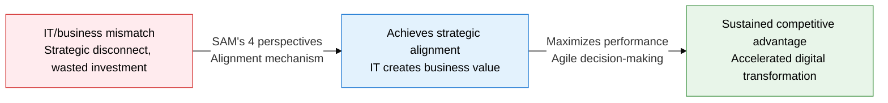
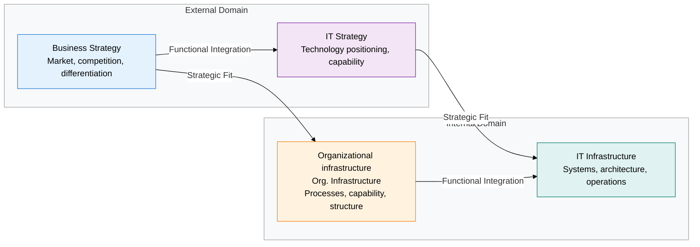
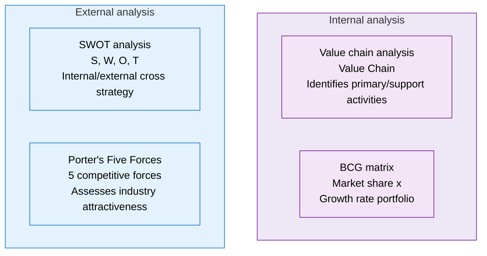

## 1. Synchronizing IT and Business Goals Across 4 Perspectives, Overview of Strategic Alignment

**Definition**: A strategic management framework that aligns 4 perspectives — business strategy, IT strategy, organizational infrastructure, and IT infrastructure — so that IT investment directly contributes to management goals.
- Uses the SAM (Strategic Alignment Model) proposed by MIT Sloan researchers as its core theoretical basis
- Performs environmental diagnosis in conjunction with management strategy analysis tools such as SWOT, Porter's Five Forces, the value chain, and the BCG matrix
- The higher the level of strategic alignment, the greater the IT ROI and the higher the digital transformation success rate

**Characteristics**:
- **Dual alignment structure**: Pursues both strategic fit between business and IT and functional integration across external and internal environments at the same time
- **Bidirectional leadership**: The alignment type — IT leading business, or business driving IT — can be chosen to fit the organization's situation
- **Linkage to management analysis tools**: Combines SWOT, Porter, the value chain, and BCG in stages to diagnose the internal and external environment from multiple angles

---

## 2. Core Structure of Aligning IT and Business Strategy

### A. The Strategic Alignment Model's 4 Perspectives and Alignment Types

| Alignment Type | Driving Perspective | Alignment Direction | Characteristics and Applicable Situations |
|---|---|---|---|
| **Strategy execution** | Business strategy | BS → OI → II | Most common, top-down where business directs IT |
| **Technology potential** | IT strategy | IS → BS → OI | Bottom-up, where IT innovation creates a new business model |
| **Competitive potential** | IT strategy | IS → BS → II | Redefines competitive strategy with new technology (during digital transformation) |
| **Service level** | Organizational infrastructure | OI → II → IS | Operational alignment centered on improving internal IT service quality |

---

### B. Comparing 4 Management Strategy Analysis Tools

| Analysis Tool | Purpose | Object of Analysis | Key Output | Stage of Use |
|---|---|---|---|---|
| **SWOT** | Derives a cross strategy from internal and external factors | Strengths, weaknesses, opportunities, threats | 4 strategies: SO, ST, WO, WT | Setting initial direction during strategy formulation |
| **Porter's Five Forces** | Assesses industry structure and profitability | Existing competitors, new entrants, substitutes, suppliers, buyers | Industry attractiveness, competitive intensity index | Deciding market entry and positioning |
| **Value Chain** | Identifies the source of cost advantage or differentiation | Primary activities (operations, logistics, marketing), support activities (HR, infrastructure) | Identifies core competencies and outsourcing candidates | Prioritizing operational efficiency and digitalization |
| **BCG matrix** | Allocates resources across the business portfolio | Market growth rate × relative market share | Classifies into Star, Cash Cow, Question Mark, Dog | Deciding invest/hold/divest portfolio actions |

---

## 3. Expected Benefits and Practical Applications of Aligning IT and Business Strategy

| Category | Key Benefits | Practical Applications |
|---|---|---|
| **Strategic** | IT investment priorities tie directly to business goals, maximizing ROI | Apply a SAM 4-perspective alignment checklist when composing the annual IT budget |
| **Analytical** | Integrated SWOT/Porter/value-chain analysis improves the accuracy of environmental awareness | Apply the 4 tools sequentially to support decision-making when reviewing new business entry or M&A |
| **Operational** | Reallocating IT resources based on the BCG portfolio reduces wasteful systems | Minimize maintenance on Cash Cow systems, concentrate new investment on Star areas |
| **Organizational** | Forming a common language between IT and business units strengthens a culture of collaboration | Hold a regular quarterly IT-business alignment review meeting, manage performance tied to KPIs |
