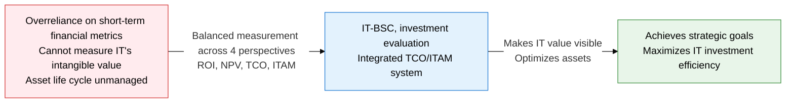
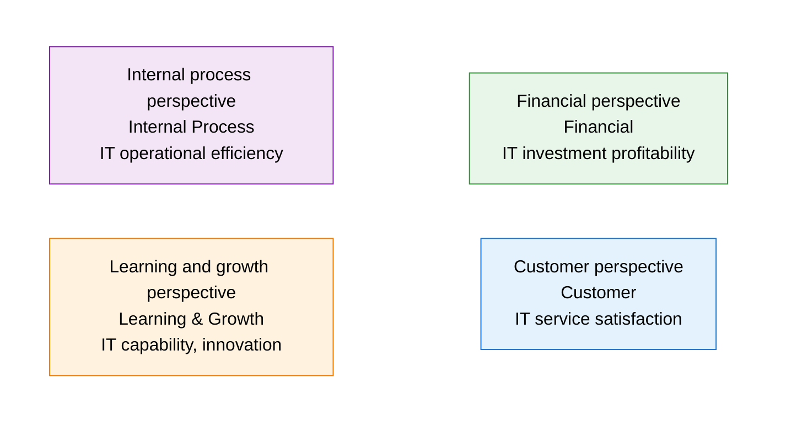
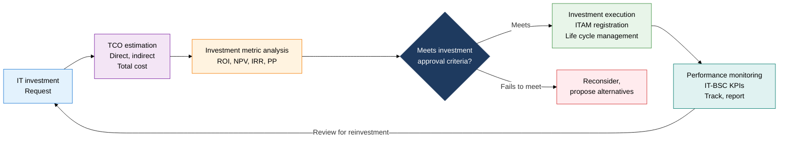

## 1. Balancing IT Value Invisible to Financial Metrics Alone Across 4 Perspectives, Overview of IT-BSC

**Definition**: A performance management framework that measures and manages IT strategic goals in a balanced way across 4 perspectives — financial, customer, internal process, and learning and growth.
- A strategic performance management tool that applies Kaplan and Norton's BSC to an IT organization, specialized as IT-BSC
- Combines ROI, NPV, IRR, and PP financial metrics with TCO analysis to evaluate IT investment feasibility from multiple angles
- Manages the full life cycle of hardware, software, and cloud assets with ITAM (IT Asset Management)

**Characteristics**:
- **Balanced performance measurement**: Tracks short-term financial performance and long-term capability indicators simultaneously, giving a complete picture of IT value
- **Causal linkage**: Makes the strategic causal chain visible in the order learning and growth → internal process → customer → financial
- **Investment optimization**: Combines TCO-based total cost analysis with ITAM to identify and eliminate unnecessary IT spending

---

## 2. Core Structure of IT-BSC, Investment Evaluation, TCO, and ITAM

### A. BSC's 4 Perspectives and Their Application in IT-BSC

| BSC Perspective | IT-BSC Strategic Goal | Key Performance Indicator (KPI) | Measurement Method |
|---|---|---|---|
| **Financial perspective** | Reduce IT investment cost, improve ROI | IT budget execution rate, ROI, TCO savings, NPV | Financial statements, IT cost analysis |
| **Customer perspective** | Improve IT service quality and user satisfaction | Service availability, SLA compliance rate, user satisfaction | SLA reports, user surveys |
| **Internal process** | Improve IT operational efficiency, strengthen security/compliance | Incident resolution time, change success rate, number of security incidents | ITSM tools, security log analysis |
| **Learning and growth** | Strengthen IT staff capability, establish a culture of technical innovation | IT staff training hours, certification holder rate, number of innovation proposals | HR system, training completion records |

---

### B. IT Investment Feasibility Analysis: ROI, NPV, IRR, PP Metrics and TCO, ITAM

| Metric | Formula / Composition | Decision Criterion | Usage Scenario |
|---|---|---|---|
| **ROI** (Return on Investment) | (Net profit / investment cost) × 100% | Investment justified if above 0% | Post-project profitability evaluation for IT projects |
| **NPV** (Net Present Value) | Sum of the present value of future cash flows - initial investment | Investment justified if above 0 | Long-term IT infrastructure investment decisions |
| **IRR** (Internal Rate of Return) | The discount rate at which NPV = 0 | Justified if it exceeds the cost of capital | Prioritizing among multiple IT investment options |
| **PP** (Payback Period) | Initial investment / annual net cash flow | Within the target period | IT projects where fast payback matters |
| **TCO** (Total Cost of Ownership) | Acquisition cost + operating cost + disposal cost (full life cycle) | Minimized relative to alternatives | Cloud vs. on-premises comparison analysis |
| **ITAM** (IT Asset Management) | Hardware/software/cloud asset inventory + life cycle management | 100% license compliance | Responding to software audits, asset optimization |

---

## 3. Expected Benefits and Practical Applications of Adopting IT-BSC, Investment Evaluation, TCO, and ITAM

| Category | Key Benefits | Practical Applications |
|---|---|---|
| **Strategic** | Makes the causal link between IT investment and business strategy visible, raising executive awareness of IT value | Build an IT-BSC strategy map, establish a quarterly 4-perspective KPI report to executives |
| **Financial** | ROI/NPV/TCO analysis makes IT investment feasibility objective and prevents budget waste | Mandate NPV/IRR criteria in the new IT project approval process, operate a TCO comparison template |
| **Operational** | Ensuring ITAM-based IT asset inventory completeness eliminates audit risk | Adopt ITAM tools such as ServiceNow or Flexera, automate software license compliance |
| **Continuous improvement** | Tracking learning-and-growth KPIs continuously strengthens IT staff capability and an innovation culture | Establish an IT staff capability development roadmap, link an innovation-proposal points system to the BSC |
