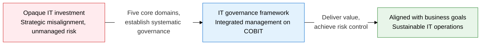
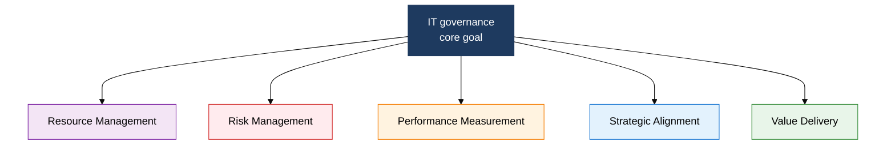
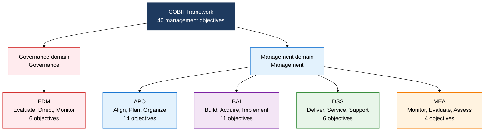

## 1. Overview of IT Governance, the Integrated Management System That Aligns IT Strategy with the Business

**Definition**: A management governance framework that aligns IT resources, processes, and performance with organizational strategy to deliver value and control risk.
- IT governance is a core component of corporate governance, owned by the board and executive management
- Structured around five core domains, built on international standards such as ISO/IEC 38500 and COBIT
- Manages IT investment decisions, risk tolerance criteria, and performance metrics in an integrated way

**Characteristics**:
- **Strategic alignment**: Links business goals with IT goals so IT generates real business value
- **Clear accountability**: Separates roles and responsibilities among the board, CIO, and IT managers to prevent decision delays
- **Continuous improvement**: Performance measurement mechanisms raise the level of IT governance over time

---

## 2. Core Structure of IT Governance and COBIT

### A. The Five Core Domains of IT Governance

| Core Domain | Definition | Key Activities | Key Question |
|---|---|---|---|
| **Strategic Alignment** | Aligning IT plans with business strategy | IT strategic planning, business-IT alignment roadmap | "Does IT support business goals?" |
| **Value Delivery** | Delivering the value IT investment promised, on time | Portfolio management, project ROI tracking | "Does IT deliver real value?" |
| **Resource Management** | Optimal use of IT infrastructure, people, knowledge, and applications | Capacity planning, outsourcing management, cloud strategy | "Are IT resources managed efficiently?" |
| **Risk Management** | Identifying, assessing, and treating IT-related risk | Risk register operations, security controls, BCP/DR | "Is IT risk managed within tolerance?" |
| **Performance Measurement** | Measuring and reporting whether IT governance goals are met | Setting KPIs/KGIs, applying the BSC, reporting to management | "Is IT governance working effectively?" |

---

### B. COBIT Framework: Governance vs. Management Domain Structure

| Domain | Category | Key Management Objectives | Number of Objectives |
|---|---|---|---|
| **EDM** (Evaluate, Direct, Monitor) | Governance | EDM01 Ensure governance framework, EDM02 Ensure benefits delivery, EDM03 Optimize risk, EDM04 Optimize resources | 6 |
| **APO** (Align, Plan, Organize) | Management | APO01 Manage the management framework, APO04 Manage innovation, APO07 Manage human resources, APO12 Manage risk | 14 |
| **BAI** (Build, Acquire, Implement) | Management | BAI01 Manage programs, BAI03 Identify and build solutions, BAI06 Manage IT changes, BAI10 Manage configuration | 11 |
| **DSS** (Deliver, Service, Support) | Management | DSS01 Manage operations, DSS02 Manage service requests and incidents, DSS05 Manage security services | 6 |
| **MEA** (Monitor, Evaluate, Assess) | Management | MEA01 Monitor performance and conformance, MEA02 Assess the internal control system, MEA03 Ensure compliance with external requirements | 4 |

---

## 3. Expected Benefits and Practical Applications of IT Governance and COBIT Adoption

| Category | Key Benefits | Practical Application |
|---|---|---|
| **Strategic** | Aligns business goals with IT investment, making IT value visible | Build IT strategic plans on COBIT APO02, establish a board-level IT governance reporting structure |
| **Operational** | Applying the 40 management objectives raises IT process maturity | Assess current maturity with the COBIT maturity model (CMM), then run a phased improvement roadmap |
| **Technical** | Integrates operations with other standards such as ISO/IEC 38500, ITIL, and ISO 27001 | Map COBIT domains to ISO 27001 controls to eliminate redundant audits |
| **Regulatory** | Applying the EDM03 and MEA03 domains secures legal and regulatory compliance | Map financial-sector IT oversight rules and personal data protection requirements to COBIT objectives |
