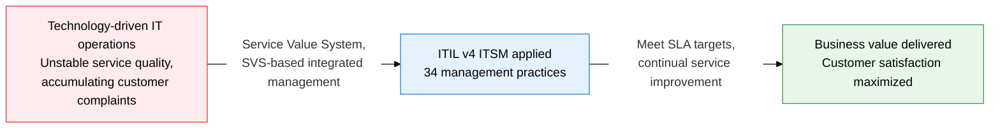
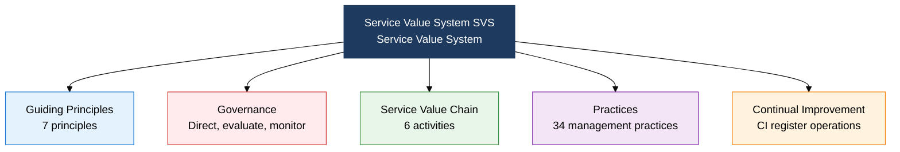
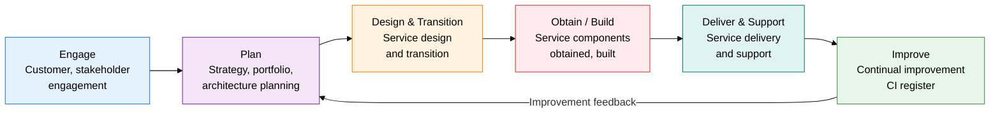

## 1. Overview of ITIL v4, the Framework That Redefines Service as Co-Created Value Rather Than a Product

**Definition**: A service management framework that systematically plans, designs, transitions, operates, and improves IT services to co-create business value.
- ITSM (IT Service Management) consists of four elements: People, Process, Technology, and Partner
- ITIL v4 integrates the six Service Value Chain (SVC) activities and 34 practices under the Service Value System (SVS)
- Used as an IT service certification framework aligned with the ISO/IEC 20000 international standard

**Characteristics**:
- **Value co-creation**: Adopts service-dominant logic (SDL), where the service provider and consumer create value together
- **Holistic thinking**: Manages organization, information, partners, and value streams as an integrated whole across four dimensions (4 Dimensions)
- **Flexible application**: Centers on practices rather than prescriptive procedures, so organizations can select and apply what fits their context

---

## 2. Core Structure of ITIL v4

### A. Structure of the ITIL v4 Service Value System (SVS)

| SVS Component | Definition | Key Content |
|---|---|---|
| **Guiding Principles** | Universal recommendations that apply to every organizational situation | Focus on value, start where you are, progress iteratively with feedback, collaborate and promote visibility, think and work holistically, keep it simple and practical, optimize and automate |
| **Governance** | The system that evaluates, directs, and monitors the organization's direction | Establishes board and executive governance of IT services, applied in conjunction with COBIT |
| **Service Value Chain** | The operating model of six core activities that generate service value | Engage, Plan, Design & Transition, Obtain/Build, Deliver & Support, Improve |
| **Practices** | The set of organizational capabilities and resources for achieving a specific purpose | 14 general management, 17 service management, 3 technical management practices, 34 in total |
| **Continual Improvement** | Continuously improves services and practices at every level | Tracks, prioritizes, and executes improvement opportunities through the CI register |

---

### B. The Six Service Value Chain (SVC) Activities, 34 Practices, and SLA/SLM

| Category | Key Practices | Description |
|---|---|---|
| **General Management (14)** | Knowledge management, measurement and reporting, portfolio management, project management, risk management, strategy management | Management practices, including non-IT areas, applied across the whole organization |
| **Service Management (17)** | Incident management, problem management, change enablement, service desk, SLM, availability management, IT asset management | Core practices specific to IT service delivery, directly tied to SLA fulfillment |
| **Technical Management (3)** | Deployment management, infrastructure and platform management, software development and management | Technology-specific practices, integrated with DevOps and CI/CD pipelines |
| **SLA/SLM** | Service level agreement (SLA), service level management (SLM) | SLA: a document agreeing service targets between provider and customer (specifies availability, response time, recovery time); SLM: the activity of monitoring, reporting on, and improving SLA fulfillment |

---

## 3. Expected Benefits and Practical Applications of ITSM and ITIL v4 Adoption

| Category | Key Benefits | Practical Application |
|---|---|---|
| **Strategic** | Turns IT services into a driver of business value, raising executive awareness | Manage the IT service portfolio on the SVS, build a service value dashboard for CIO reporting |
| **Operational** | Applying incident, problem, and change management practices cuts service downtime | Integrate ITSM tools (ServiceNow, Jira Service Management), track SLA compliance as a KPI |
| **Technical** | Integrating DevOps and Agile with ITIL v4 practices improves deployment speed and stability together | Apply change enablement and deployment management practices to govern the CI/CD pipeline |
| **Customer Satisfaction** | SLM-based visibility into service levels builds trust with internal and external customers | Build a service catalog, operate an SLA structure linked to OLAs (operational level agreements) and UCs (underpinning contracts) |
