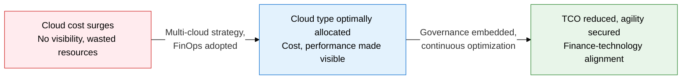
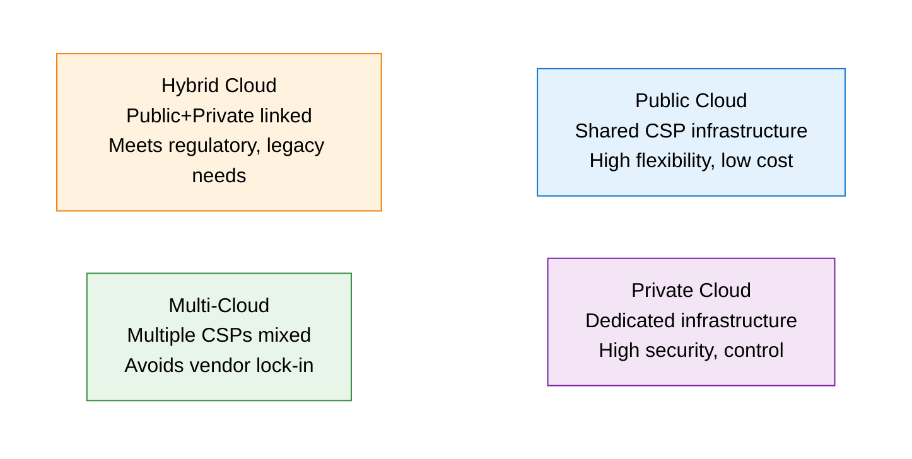
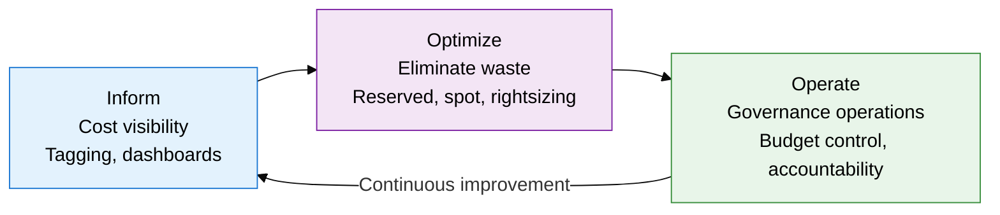

## 1. Overview of Cloud Sourcing Strategy and FinOps, Which Turns Cloud Cost into a Financial Responsibility

**Definition**: An operating model that strategically selects a cloud sourcing type (Public, Private, Hybrid, Multi) and uses the FinOps framework to optimize and govern cloud cost as a unit of financial accountability.
- Moves away from single-CSP dependence and mixes optimal cloud environments to fit each workload's characteristics
- FinOps (Financial Operations) is a shared responsibility for cloud spend across engineering, finance, and the business
- Combines technical optimization, such as tagging strategy, reserved instances, and spot usage, with organizational governance

**Characteristics**:
- **Type optimization**: Chooses the best fit among Public, Private, Hybrid, and Multi based on workload security, cost, and flexibility needs
- **Financial visibility**: Makes cloud spend visible by team, service, and project to identify and remove wasted resources
- **Cultural shift**: FinOps is not a tool but an organizational culture change driven by the Inform -> Optimize -> Operate cycle

---

## 2. Core Structure of Cloud Sourcing and FinOps

### A. Multi-Cloud and Hybrid Cloud Adoption Strategy and Type Comparison

| Type | Cost | Security | Flexibility | Governance Complexity | Best Fit |
|---|---|---|---|---|---|
| **Public Cloud** | Low (pay-as-you-go) | Shared responsibility with CSP | Highest | Simple | Startups, dev, and test environments |
| **Private Cloud** | High (capital expense) | Full control | Low | Simple | Regulated finance, healthcare, defense environments |
| **Hybrid Cloud** | Medium | Varies by domain | High | Medium | Legacy integration, regulatory compliance needs |
| **Multi-Cloud** | Optimizable | Varies by CSP | Highest | Complex | Avoiding vendor lock-in, best-of-breed service mix |

---

### B. FinOps Framework and Cloud Cost Optimization

| Optimization Technique | Description | Savings | Applicable Conditions |
|---|---|---|---|
| **Reserved Instances (RI)** | Purchased at a discount versus on-demand under a 1-3 year commitment | Up to 72% savings | Stable baseline workloads |
| **Spot Instances** | Purchased at low prices via auction from spare CSP capacity | Up to 90% savings | Interruption-tolerant batch and CI/CD workloads |
| **Rightsizing** | Adjusts instance size based on actual utilization analysis | 20-30% savings | Resources with under 30% CPU/memory utilization |
| **Tagging Strategy** | Separates cost accountability by team, service, and environment tags | Makes waste visible | Standardized from early in cloud adoption |
| **Auto Scaling** | Removes over-provisioning through automatic load-based scaling | 15-25% savings | Web and API services with high traffic variability |

---

## 3. Expected Benefits and Practical Applications of Cloud Sourcing and FinOps Adoption

| Category | Key Benefits | Practical Application |
|---|---|---|
| **Cost Optimization** | Reserved, spot, and rightsizing combined cut cloud spend by 30-50% | Build a FinOps team, run a monthly cost review cycle, operate CSP cost analysis tools (Cost Explorer, Cloud Billing) |
| **Strategic Flexibility** | Multi-cloud breaks vendor lock-in, selects the optimal CSP per workload | Secure portability via containers and Kubernetes, design CSP-neutral APIs, architect to minimize data egress cost |
| **Stronger Governance** | Clarifies cost accountability by team and project, alerts on budget overruns in advance | Standardize tagging policy, adopt cloud policy engines (OPA, SCP), automate anomalous spend alerts |
| **Regulatory Compliance** | Hybrid cloud satisfies data sovereignty and personal data protection requirements together | Place sensitive data in Private, place regulated workloads on-premises, automate cloud security compliance checks |
