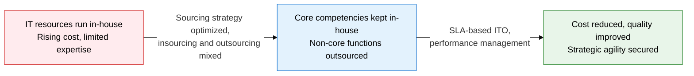
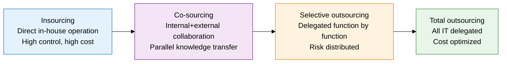
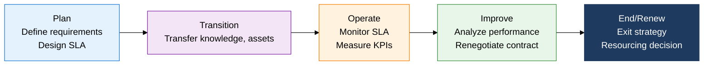

## 1. Overview of IT Sourcing Strategy, Which Balances Core Competency Focus Against Access to Expertise

**Definition**: A strategic decision framework that allocates an organization's IT functions between in-house delivery (insourcing) and external delivery (outsourcing) based on core-competency status, cost, and risk.
- Pursues strategic flexibility, access to technology, and risk distribution together, not just cost reduction
- ITO (IT Outsourcing) measures and manages service levels quantitatively through SLA-based contracts
- Combines geographic strategies, such as offshoring, onshoring, and nearshoring, with outsourcing types by design

**Characteristics**:
- **Strategic alignment**: Keeps core competencies in-house and outsources non-core functions to specialist vendors to concentrate on competitive advantage
- **Type diversity**: Multiple models, such as co-sourcing, total outsourcing, and selective outsourcing, can be chosen to fit the organization's situation
- **Performance-based operations**: SLA and KPI contracts quantify quality, letting vendor performance be evaluated and controlled objectively

---

## 2. Core Structure of IT Sourcing Strategy

### A. Insourcing and Outsourcing Types and Comparison of Geographic Strategies

| Sourcing Type | Control Level | Cost | Key Risk | Best Fit |
|---|---|---|---|---|
| **Insourcing** | Highest | High | Lack of internal expertise | Core competencies, security-sensitive functions |
| **Co-sourcing** | High | Medium | Failed knowledge transfer | Transitional capability building, large projects |
| **Selective Outsourcing** | Medium | Medium | Complex coordination across multiple vendors | Function-specific expertise needs, risk distribution |
| **Total Outsourcing** | Low | Low | Vendor lock-in, knowledge leakage | All non-core IT, severe cost pressure |
| **Offshoring** | Low | Lowest | Quality and cultural differences | High-volume repetitive work, cost minimization |
| **Nearshoring** | Medium | Low | Minimal time-zone difference | Leveraging nearby countries with similar time zone, language |
| **Reshoring** | High | High | Cost rises again | Supply chain risk, data sovereignty requirements |

---

### B. IT Outsourcing (ITO) Management Structure and Risk Management

| Risk Type | Description | Response Strategy |
|---|---|---|
| **Vendor Lock-in** | Locked into a specific vendor's technology or contract, switching cost spikes | Multi-sourcing strategy, standard API contracts, written exit strategy |
| **Knowledge Leakage** | Core IT know-how transfers to the vendor, in-house capability disappears | Establish a knowledge management plan, keep core technology insourced |
| **Quality Degradation** | SLA shortfalls and broken communication lower service quality | SLA penalty clauses, regular performance reviews, escalation procedures |
| **Transition Failure** | Incomplete knowledge transfer during the transition stage disrupts service | Prepare a transition plan, secure a parallel run period |

---

## 3. Expected Benefits and Practical Applications of IT Sourcing Strategy Adoption

| Category | Key Benefits | Practical Application |
|---|---|---|
| **Cost Optimization** | Outsourcing non-core functions cuts IT operating cost by 20-40%, converts capital expense to operating expense | Insource/outsource decisions based on TCO analysis, apply a total-cost comparison model |
| **Strategic Focus** | Concentrates internal resources on core competencies, speeds up technology innovation | Classify core and non-core functions with a business impact matrix, design selective sourcing |
| **Risk Management** | Prevents vendor lock-in, distributes supply risk through multi-sourcing | Write SLA penalty and exit-strategy clauses into contracts, run two or more vendors in parallel |
| **Operational Quality** | SLA-based quantitative performance management secures consistent service levels | Monthly KPI reviews, apply ITIL-based service management processes to vendors |
