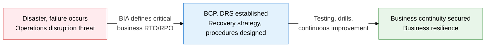
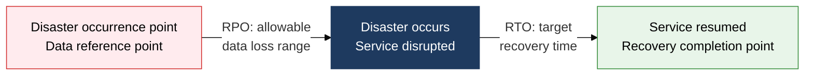

## 1. Overview of BCP and DRS, the Framework That Sustains Critical Operations After a Disaster

**Definition**: A management framework that systematizes advance planning, procedures, and recovery systems to guarantee the continuity of critical operations when a disaster or failure occurs.
- Built on the ISO 22301 (business continuity management system) international standard
- BIA (business impact analysis) quantifies the priority of critical operations and the recovery targets (RTO/RPO)
- The disaster recovery system (DRS) is implemented as one of four forms: Mirror, Hot, Warm, or Cold Site

**Characteristics**:
- **Proactive prevention**: Documents recovery procedures, roles, and contact structures before a disaster occurs, minimizing confusion
- **Quantitative targets**: Sets recovery targets in measurable form using RTO (recovery time objective) and RPO (recovery point objective)
- **Continuous improvement**: Regular testing, drills, and reviews keep the plan valid and up to date

---

## 2. Core Structure of BCP and DRS

### A. BCP Establishment Procedure (ISO 22301) and BIA Critical Business Process Identification

```mermaid
%%{init: { 'theme': 'base', 'themeVariables': { 'edgeLabelBackground': '#fff' }}}%%
flowchart LR
    S1["Define scope<br/>Organization, service<br/>boundary defined"] --> S2["Run BIA<br/>Identify critical operations<br/>Derive RTO/RPO"]
    S2 --> S3["Assess risk<br/>Threats, vulnerabilities<br/>analyzed"]
    S3 --> S4["Build strategy<br/>Recovery approach<br/>prioritized"]
    S4 --> S5["Develop plan<br/>Procedures, roles<br/>documented"]
    S5 --> S6["Test, drill<br/>Live validation<br/>Gaps checked"]
    S6 --> S7["Review, improve<br/>Plan updated<br/>Recertified"]
    S7 -->|"PDCA repeats"| S2
    style S1 fill:#E3F2FD,stroke:#1976D2,color:#000
    style S2 fill:#1E3A5F,stroke:#1E3A5F,color:#fff
    style S3 fill:#FFEBEE,stroke:#D32F2F,color:#000
    style S4 fill:#F3E5F5,stroke:#7B1FA2,color:#000
    style S5 fill:#FFF3E0,stroke:#F57C00,color:#000
    style S6 fill:#E8F5E9,stroke:#388E3C,color:#000
    style S7 fill:#E0F2F1,stroke:#00796B,color:#000
```

| BIA Analysis Item | Description | Deliverable |
|---|---|---|
| **Critical Operations Identified** | Lists processes and services that would seriously affect the organization if disrupted | Critical operations priority list |
| **Maximum Allowable Outage (MAO)** | The maximum time an operation may be disrupted before unrecoverable damage occurs | MAO threshold definition |
| **RTO (Recovery Time Objective)** | The target time by which operations must resume after a disaster (set within the MAO) | RTO target value (in hours) |
| **RPO (Recovery Point Objective)** | The maximum allowable point of data loss during data recovery (based on backup cycle) | RPO target value (in hours) |
| **Operational Dependency Analysis** | Maps the IT systems, personnel, and supply chain dependencies that critical operations require | Dependency matrix |
| **Financial Impact Estimation** | Quantifies financial loss and regulatory-violation cost per hour of disruption | Hourly loss cost report |

---

### B. Comparison of the Four DRS Operating Forms and the RTO/RPO Concept

| Category | Mirror Site | Hot Site | Warm Site | Cold Site |
|---|---|---|---|---|
| **RTO** | Immediate (seconds) | Within hours | Hours to days | Days to weeks |
| **RPO** | 0 (no loss) | Minutes to hours | Hours to days | A day or more |
| **Data Synchronization** | Real-time mirroring (bidirectional) | Real-time to near-real-time replication | Periodic backup replication | Manual restore from tape/snapshot |
| **Facility Operating State** | 100% always-on (Active-Active) | System always running (Active-Standby) | Only core equipment on standby | Only space and power secured |
| **Cost** | Highest (2x operating cost) | High | Medium | Low |
| **Applicable To** | Zero-downtime-critical services such as financial transactions, flight bookings | Core business systems, ERP | Internal operations, medium-priority systems | Archives, non-core systems |

---

## 3. Expected Benefits and Practical Applications of BCP and DRS Adoption

| Category | Key Benefits | Practical Application |
|---|---|---|
| **Business Continuity** | Minimizes critical-operation downtime during a disaster, maintains customer trust | Earn ISO 22301 certification to demonstrate continuity capability to business partners and regulators |
| **Data Protection** | RPO-based backup cycle optimization controls the data loss range numerically | Achieve RPO targets with Hot Site real-time replication (DB log shipping, AWS DRS) |
| **Cost Optimization** | Balances recovery level against cost by choosing the site type | Cut costs by moving from Cold to Warm on cloud-based DRS (AWS, Azure Site Recovery) |
| **Regulatory Compliance** | Meets business continuity requirements in finance, healthcare, and public-sector fields | Run annual drills (tabletop exercises, full-scale drills) to satisfy regulatory audits |
