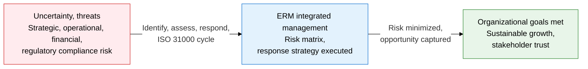
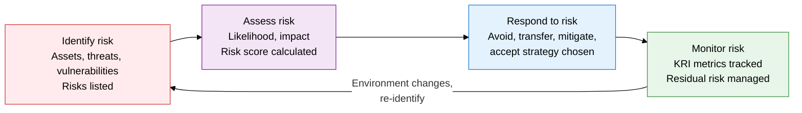
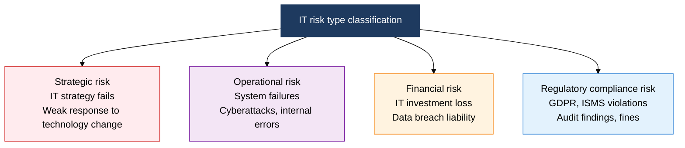

## 1. Overview of ERM, the Framework That Balances Uncertainty as Both Opportunity and Threat

**Definition**: An integrated management framework that systematically identifies, assesses, responds to, and monitors risk across the whole organization to support strategic goal achievement.
- Operates on the principles, framework, and process structure of ISO 31000 (the international risk management standard)
- Integrates IT risk (cyberattacks, system failures, regulatory violations, etc.) into the enterprise-wide risk management structure
- Selects the optimal response for each risk from four response strategies: avoid, transfer, mitigate, and accept

**Characteristics**:
- **Enterprise-wide integration**: Manages strategic, operational, financial, and regulatory risk under a single framework
- **Quantification-based**: Scores risk using a likelihood x impact risk matrix to set priorities
- **Continuous cycle**: Adapts to environmental change through a repeating identify -> assess -> respond -> monitor loop

---

## 2. Core Structure of ERM

### A. The Four Stages of the IT Risk Control Framework and Alignment with ISO 31000

| Stage | Key Activities | ISO 31000 Alignment | Key Deliverable |
|---|---|---|---|
| **Identify Risk** | List assets, derive threat scenarios, analyze vulnerabilities (CVSS scoring) | 5.4 Risk identification process | Risk register |
| **Assess Risk** | Score likelihood and impact, build the risk matrix, set priorities | 5.4.3 Risk analysis and evaluation | Risk matrix, risk priority list |
| **Respond to Risk** | Choose avoid, transfer, mitigate, or accept, design and implement controls | 5.5 Risk treatment | Risk treatment plan |
| **Monitor Risk** | Track KRIs (key risk indicators), review control effectiveness, reassess residual risk | 5.6 Monitoring and review | KRI dashboard, risk report |

---

### B. IT Risk Type Classification and Response Strategy

| Risk Type | Representative Cases | Response Strategy | Practical Controls |
|---|---|---|---|
| **Strategic Risk** | Failed cloud migration, accumulated technical debt, weak IT governance | Avoid (re-establish strategy) or mitigate (adjust roadmap) | Run an IT strategy committee, review the technology roadmap regularly |
| **Operational Risk** | Ransomware attacks, service outages, personal data leaks, insider misuse | Mitigate (strengthen technical controls) or transfer (cyber insurance) | Adopt SIEM/EDR, minimize access privileges, run regular simulated drills |
| **Financial Risk** | IT project budget overruns, data breach litigation cost, SLA violation damages | Transfer (insurance, contracts) or accept (secure contingency budget) | Manage projects with EVM, take out cyber liability insurance |
| **Regulatory Compliance Risk** | GDPR/personal data protection law/ISMS-P violations, unaddressed audit findings | Avoid (proactive compliance) or mitigate (build a compliance structure) | Run a regulatory monitoring program, automate internal audits, appoint a DPO |

---

## 3. Expected Benefits and Practical Applications of ERM Adoption

| Category | Key Benefits | Practical Application |
|---|---|---|
| **Strategic** | Reduces IT investment failure rate through risk-based decisions, captures opportunity risk proactively | Build a board and executive risk reporting structure, mandate risk assessment in strategic planning |
| **Operational** | Improves service availability by proactively blocking cyberattacks and system failures | Automate the KRI dashboard (integrated with SIEM/SOAR), update the risk register quarterly |
| **Financial** | Optimizes insurance premiums and recovery costs through risk quantification, improves loss predictability | Set investment priorities via ROI analysis of expected loss reduction against risk treatment cost |
| **Regulatory Compliance** | Meets multiple regulatory requirements together by aligning ISO 31000, COSO ERM, and ISMS-P | Adopt automated regulatory-change monitoring tools, run an annual compliance gap analysis |
