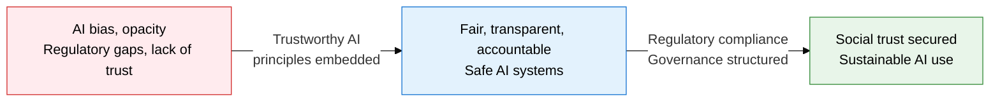
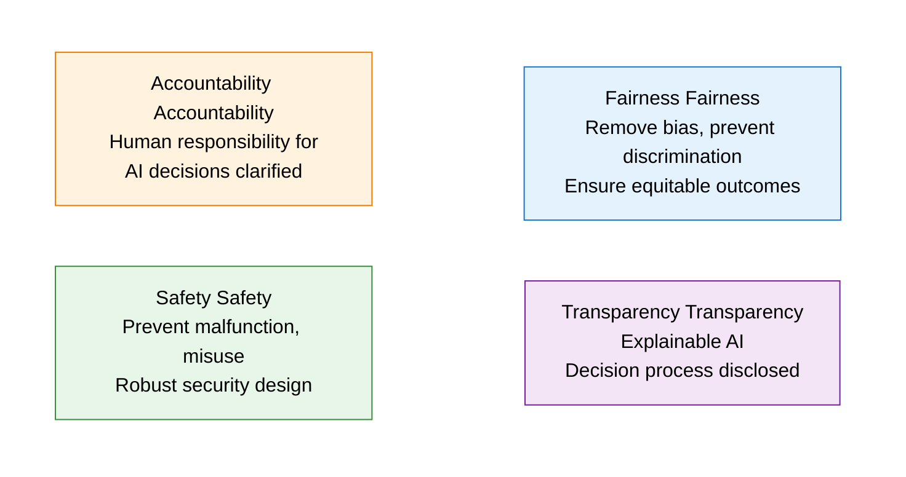
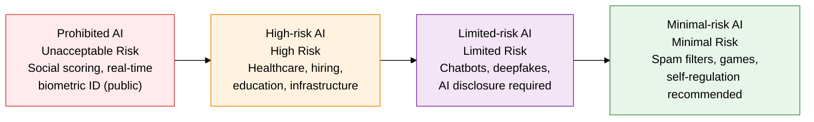

## 1. Overview of AI Governance, Which Achieves Ethical AI Design and Regulatory Compliance Together

**Definition**: A management framework that guarantees fairness, transparency, accountability, and safety across the full lifecycle of an AI system's design, development, and operation, and satisfies legal and ethical requirements.
- Legislation such as the EU AI Act and Korea's AI Basic Act has turned building governance into a mandatory corporate obligation
- Explainability (XAI) of AI decisions and an audit-trail structure are core components
- High-risk AI systems carry conformity assessment, registration, and monitoring obligations

**Characteristics**:
- **Principle-driven design**: An AI Ethics by Design approach that embeds ethical principles from the earliest development stage
- **Risk-proportionate regulation**: A proportionality principle that applies differentiated regulatory requirements based on an AI system's risk level
- **Multi-layered governance**: Structured across internal AI committees, government oversight bodies, and international standardization (ISO/IEC 42001)

---

## 2. Core Structure of AI Governance

### A. The Four Principles of Trustworthy AI and the Governance Structure

| Principle | Core Concept | Implementation Technique | Measurement Metric |
|---|---|---|---|
| **Fairness** | Removes discriminatory outcomes based on sensitive attributes such as race, gender, and age | Training-data bias audits, rebalanced sampling, fairness-constrained training | Equal opportunity, statistical parity |
| **Transparency** | Provides explanations of model predictions that stakeholders can understand | XAI (LIME, SHAP), model card publication, explanation logs retained | Explanation fidelity, stakeholder comprehension score |
| **Accountability** | Clarifies the responsible party (developer, operator, user) when harm results from an AI decision | AI governance committee established, audit-trail logs, human review gates | Accountability tracking coverage, appeal resolution rate |
| **Safety** | Protects the system and users from adversarial attacks, malfunctions, and unintended outcomes | Red-team testing, anomaly detection, fallback mechanisms, security-by-design | MTTR, false-positive rate, system availability |

---

### B. The EU AI Act Risk-Tier Framework and Korea's AI Basic Act Response

| Risk Tier | Covered AI Systems | Regulatory Requirements | Violation Penalty |
|---|---|---|---|
| **Unacceptable** | Social credit systems, indiscriminate facial recognition, subliminal manipulation | Complete market ban | Up to EUR 35 million or 7% of global revenue |
| **High Risk** | Medical devices, hiring/credit scoring, education, critical infrastructure | Conformity assessment, EU database registration, post-market monitoring | Up to EUR 15 million or 3% of revenue |
| **Limited Risk** | Chatbots, deepfake generation, AI-generated content | Transparency obligation disclosing AI use (AI labeling) | Up to EUR 7.5 million or 1.5% of revenue |
| **Minimal Risk** | Spam filters, AI games, inventory optimization | Voluntary code of conduct recommended (no legal obligation) | Not applicable |

**Key Provisions of Korea's AI Basic Act (Act on the Development of Artificial Intelligence and Establishment of a Foundation of Trust)**
- Guarantees advance-notice obligations and a right to appeal for high-impact AI systems
- Establishes an AI Safety Institute, sets up an AI incident reporting and investigation structure
- Runs AI industry self-regulation and certification in parallel (public-private cooperation)
- Mandates labeling of AI-generated output for generative AI services

---

## 3. Expected Benefits and Practical Applications of AI Governance Adoption

| Category | Key Benefits | Practical Application |
|---|---|---|
| **Trust Building** | Embedding Trustworthy AI principles raises AI trust among customers, regulators, and investors | Publish AI model cards, adopt explainability (XAI), systematize bias audits |
| **Regulatory Compliance** | Proactive response to the EU AI Act and AI Basic Act blocks fine risk and secures market access | Establish a conformity assessment process for high-risk AI, run an AI governance committee |
| **Risk Management** | Risk-tier-based differentiated controls minimize harm from AI malfunction, bias, and misuse | Run red-team testing, anomaly-detection monitoring, human review gates |
| **Competitive Advantage** | A leading image in AI ethics and governance strengthens global partnerships and procurement competitiveness | Earn ISO/IEC 42001 certification, publish regular AI transparency reports |
