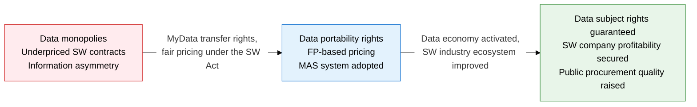
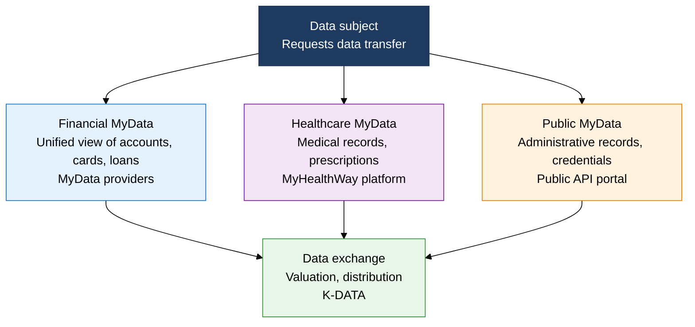

## 1. Overview of Data Regulation, MyData, and the Software Industry Promotion Act, Which Deliver Data Sovereignty and Fair SW Pricing

**Definition**: A legal and institutional framework that activates the data economy through the MyData portability right and a data valuation structure, and guarantees fair pricing for the software industry through FP-based pricing and the MAS system under the Software Industry Promotion Act.
- MyData is a rights framework letting data subjects directly manage, move, and use their own data in finance, healthcare, and public services
- Data valuation measures the economic value of a data asset using income, cost, and market approaches, providing a basis for trading and investment
- Amendments to the Software Industry Promotion Act strengthen SW ecosystem health through mandatory unbundled procurement, fair pricing, and commercial SW use

**Characteristics**:
- **Expanding data portability**: Spreads sequentially into finance (MyData), healthcare (MyHealthWay), and public services, accelerating API-based data transfer infrastructure
- **Legislated fair pricing**: Legally mandates function-point (FP) based SW project pricing, improving underpriced and dumping-style contracting
- **New data trading**: Forms a data distribution market through data exchanges, activating the data economy ecosystem

---

## 2. Core Structure of Data Regulation, MyData, and the Software Industry Promotion Act

### A. The MyData Ecosystem and Data Valuation

| Category | Description | Applicable Field | Legal Basis |
|---|---|---|---|
| **MyData Concept** | The right of a data subject to request that their personal data be transferred to a third party | Finance, healthcare, public sector, telecom | Personal Information Protection Act Article 35-2, Credit Information Act |
| **Financial MyData** | Unified lookup, analysis, and use of account, card, insurance, and loan information | Banking, cards, insurance, securities | Credit Information Act Article 22-9 |
| **Income Approach** | Valued at the present value of future income generated from data use | Financial, commerce data | Data Industry Promotion Act |
| **Cost Approach** | Valued as the sum of costs invested in collecting, cleansing, and building the data | Public data, databases | Data Industry Promotion Act |
| **Market Approach** | Valued by referencing market trading prices of similar data | Data exchange registration | Data Industry Promotion Act |

---

### B. The Software Industry Promotion Act, FP-Based Pricing, and the MAS System

```mermaid
%%{init: { 'theme': 'base', 'themeVariables': { 'edgeLabelBackground': '#fff' }}}%%
flowchart LR
    REQ["Procuring agency<br/>Establishes project plan"] --> PLAN["ISP/ISMP<br/>Defines project scope, requirements"]
    PLAN --> FP["Function point (FP)<br/>Measures functional size<br/>AFP x unit price"]
    FP --> PRICE["Price calculation<br/>Development, maintenance cost,<br/>direct expenses summed"]
    PRICE --> BID["Procurement, contract<br/>Unbundled procurement, MAS,<br/>fair-price contract"]
    BID --> EXEC["Project execution<br/>Quality, performance managed"]
    style REQ fill:#FFEBEE,stroke:#D32F2F,color:#000
    style PLAN fill:#FFF3E0,stroke:#F57C00,color:#000
    style FP fill:#1E3A5F,stroke:#1E3A5F,color:#fff
    style PRICE fill:#F3E5F5,stroke:#7B1FA2,color:#000
    style BID fill:#E3F2FD,stroke:#1976D2,color:#000
    style EXEC fill:#E8F5E9,stroke:#388E3C,color:#000
```

| System | Key Content | Purpose | Applies To |
|---|---|---|---|
| **Unbundled Procurement (SW Act)** | Mandates that HW, SW, and maintenance be procured under separate contracts | Prevents SW price erosion from bundled procurement | Public-sector SW projects |
| **Function Point (FP) Pricing** | Measures software functional size in FP, then multiplies by unit price to calculate cost (SW development cost = AFP x FP unit price) | Objective, scale-based pricing; prevents underpriced bids | Public SW development projects |
| **Multiple Award Schedule (MAS)** | Multiple suppliers sign unit-price contracts, and demanding agencies then purchase by choice | Streamlines repeat purchase of commercial SW, preserves negotiating room | Commercial SW, cloud services |
| **Mandatory Commercial SW Use** | Requires commercial products be considered first, even for SW that could be built in-house | Prevents duplicate development, supports the SW industry ecosystem | Public-sector SW adoption |
| **Fair Pricing Guarantee** | Sets a minimum maintenance rate (15%) and subcontractor payment deadline rules | Secures SW company profitability, maintains quality | SW maintenance contracts |

---

## 3. Expected Benefits and Practical Applications of Data Regulation, MyData, and the Software Industry Promotion Act

| Category | Key Benefits | Practical Application |
|---|---|---|
| **Data Sovereignty** | Strengthens data subject rights, builds a trusted data ecosystem, and activates the data economy | Build MyData API integration infrastructure, prepare to handle data transfer requests in finance and healthcare |
| **Data Monetization** | Adopting a data valuation structure recognizes the financial value of data assets and activates trading | Register with the K-DATA data exchange, secure a basis for investment after valuation via the income approach |
| **SW Ecosystem Improvement** | FP-based pricing improves underpriced bidding and raises SW quality and company profitability together | Build in-house function-point estimation expertise for public SW projects, run an SW Act compliance checklist |
| **Public Procurement Innovation** | Unbundled procurement, MAS, and commercial-SW-first priorities raise public IT investment efficiency and transparency | Build a public-market entry strategy through MAS registration, adopt ISMP-linked automated FP measurement tools |
