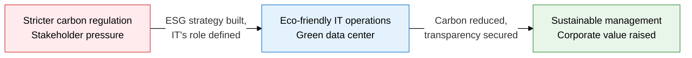
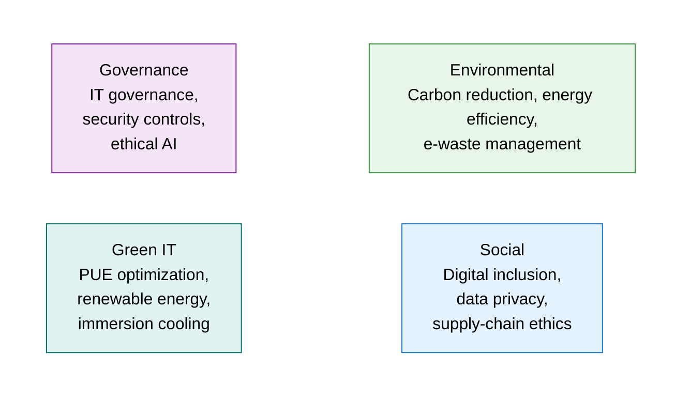
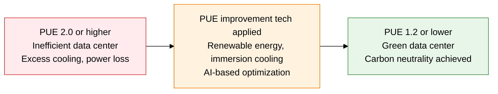

## 1. Overview of ESG and Green IT, the Management Strategy That Delivers Environmental, Social, and Governance Value Through IT

**Definition**: A management framework that embeds Environmental, Social, and Governance criteria into IT management to achieve sustainable digital operations and corporate value together.
- IT infrastructure's power consumption, carbon emissions, and e-waste are the core management targets in the E domain
- Data privacy, digital inclusion, and supply-chain ethics are the points where the S and G domains connect to IT
- Mandatory ESG disclosure (SEC, K-ESG, ISSB) has made building IT-based data collection and reporting systems essential

**Characteristics**:
- **Measurability**: Quantitative metrics such as PUE, WUE, and CUE turn IT environmental impact into numbers for the ESG report
- **Proactive regulatory response**: Integrates global environmental regulation, such as the EU Green Deal and the Carbon Border Adjustment Mechanism (CBAM), into IT strategy ahead of time
- **Business linkage**: A virtuous cycle where eco-friendly IT investment (renewable energy, efficiency) lowers operating cost and raises investor trust

---

## 2. Core Structure of ESG and Green IT

### A. The Three ESG Perspectives, IT's Role, and the Green IT Concept

| ESG Domain | IT Application | Key Examples |
|---|---|---|
| **Environmental** | Data center energy efficiency, carbon emission measurement and reduction, e-waste recycling | Transition to 100% renewable energy (RE100), immersion cooling adoption, PUE target of 1.2 or below |
| **Social** | Improved digital accessibility, personal data protection, compliance with IT supply-chain labor ethics | Web accessibility for people with disabilities (WCAG), GDPR/personal data protection law compliance, supply-chain due diligence |
| **Governance** | Stronger IT governance, cybersecurity transparency, board-level IT oversight | COBIT adoption, mandatory security-incident disclosure, CISO board reporting structure |
| **Green IT** | Extended hardware lifespan, virtualization/cloud consolidation, carbon inventory built | Server virtualization rate over 80%, cloud migration, GHG Protocol applied |

---

### B. Data Center PUE Metrics and Green Technology

**PUE (Power Usage Effectiveness) Formula**

> PUE = Total data center power consumption / IT equipment power consumption
> - PUE = 1.0: Ideal (only IT equipment consumes power)
> - PUE = 1.2 or lower: Excellent (global hyperscale level)
> - PUE = 2.0 or higher: Inefficient (excess cooling, distribution loss)

| Green Technology | Overview | PUE Improvement | Adoption Example |
|---|---|---|---|
| **Renewable Energy (RE100)** | Replaces fossil fuel with solar and wind power purchase agreements (PPA) | Contributes zero carbon emissions | Google, Microsoft, Naver Cloud |
| **Immersion Cooling** | Immerses servers directly in cooling fluid, tens of times more heat-transfer efficient than air cooling | Can reach a PUE of 1.03-1.1 | Global HPC and AI clusters |
| **AI-Based Cooling Optimization** | Uses ML to predict and adjust cooling load in real time, as in the DeepMind-Google collaboration | Cuts cooling energy by 40% | Google data centers |
| **Carbon-Neutral Design** | Integrated design combining building insulation, free cooling, and waste-heat recovery | Targets a PUE of 1.15 or lower | Microsoft's underwater data center (Natick) |

---

## 3. Expected Benefits and Practical Applications of ESG and Green IT Adoption

| Category | Key Benefits | Practical Application |
|---|---|---|
| **Environmental** | Cuts data center carbon emissions and improves PUE, contributing to climate goals | Build an RE100 transition roadmap, run immersion-cooling and AI-optimization pilots |
| **Economic** | Cuts operating cost through energy efficiency, attracts ESG investors and gains procurement advantage | Run ROI analysis on energy savings, link to green bond issuance |
| **Regulatory Response** | Responds proactively to mandatory K-ESG and ISSB disclosure, meets global supply-chain requirements | Build an automated ESG data collection and reporting system, apply the GHG Protocol |
| **Trust and Brand** | Disclosing eco-friendly IT operations transparently strengthens trust with customers, investors, and employees | Strengthen the IT chapter of the ESG report, obtain third-party verification (DNV, EY) |
