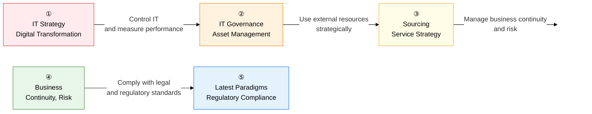

IT management is **"the macro-level management system that turns technology into business value."**  
From IT strategy setting, governance control, sourcing optimization, and business continuity through to ESG, AI governance, and data regulation, this section systematically covers the management insight every Professional Engineer must have.

## Learning Roadmap: A Five-Stage Flow

---

## ① IT Strategy and Digital Transformation

> **"The strategic planning domain that aligns business goals with IT and innovates the digital business model."**  
> The four SAM perspectives, the four ISP stages, the four EA architectures, and the five DX maturity stages are high-frequency essay topics.

| Order | Topic | Key Keywords | Importance |
|:---:|---|---|:---:|
| 1 | [Aligning IT and Business Strategy](01-it-strategy/strategic-alignment) | SAM, SWOT, Porter's Five Forces, value chain, BCG matrix | ★★★ |
| 2 | [ISP, ISMP, and EA](01-it-strategy/isp-ea) | Four ISP stages, 3C/PEST/7S, four EA architectures (BA, DA, TA, AA), six reference models | ★★★ |
| 3 | [Digital Transformation (DX)](01-it-strategy/digital-transformation) | DX framework, servitization, subscription economy, five-stage digital maturity model | ★★★ |

**-> Key Study Method**: Summarize the differences between ISP and ISMP in **purpose, deliverables, and linked systems** as a table, and draw the four EA architectures (business -> data -> technology -> application) as a **layered relationship** connecting them to the reference models.

---

## ② IT Governance and Asset Management

> **"The mechanism by which the IT organization maximizes business value and controls risk."**  
> The five COBIT domains, the ITIL v4 SVS structure, the four IT-BSC perspectives, and ROI/NPV/IRR calculations are high-frequency topics.

| Order | Topic | Key Keywords | Importance |
|:---:|---|---|:---:|
| 4 | [IT Governance and COBIT](02-it-governance/it-governance-cobit) | Five governance domains, COBIT (EDM, APO, BAI, DSS, MEA), 40 management objectives | ★★★ |
| 5 | [ITSM and ITIL v4](02-it-governance/itsm-itil) | ITSM 4Ps (People, Process, Technology, Partner), SVS, SVC, 34 practices, SLA, SLM | ★★★ |
| 6 | [BSC, IT Investment Evaluation, TCO, ITAM](02-it-governance/bsc-investment) | Four IT-BSC perspectives, ROI/NPV/IRR/PP formulas, TCO components, ITAM | ★★★ |

**-> Key Study Method**: Draw the ITIL v4 SVS's **five components** (guiding principles, governance, SVC, practices, continual improvement), and calculate the **decision criteria** for ROI, NPV, and IRR (ROI %, positive NPV, IRR vs. discount rate) with numeric examples.

---

## ③ Service and Sourcing Strategy

> **"The strategy of operating IT services by optimally combining internal capability and external resources."**  
> Comparing outsourcing types, the three-stage FinOps cycle, and multi-cloud/hybrid-cloud selection criteria are frequent essay topics.

| Order | Topic | Key Keywords | Importance |
|:---:|---|---|:---:|
| 7 | [IT Sourcing Strategy and Outsourcing Management](03-sourcing-strategy/it-sourcing) | Insourcing vs. outsourcing, co-sourcing/total/selective, offshoring/reshoring, ITO transition management | ★★★ |
| 8 | [Cloud Sourcing and FinOps](03-sourcing-strategy/cloud-finops) | Multi-cloud, hybrid cloud, FinOps (Inform -> Optimize -> Operate), reserved instances, rightsizing | ★★★ |

**-> Key Study Method**: Compare outsourcing types (co-sourcing, total, selective) in a table by **control level, cost, and risk differences**, and connect FinOps's three stages, **Inform (visibility) -> Optimize (optimization) -> Operate (operations)**, to specific techniques.

---

## ④ Continuity and Risk Management

> **"The strategy of sustaining business through disasters and systematically controlling IT risk."**  
> RTO/RPO metrics, comparing the four DRS site types (Mirror -> Hot -> Warm -> Cold), and the ERM risk matrix are essential to know.

| Order | Topic | Key Keywords | Importance |
|:---:|---|---|:---:|
| 9 | [BCP, BIA, and Disaster Recovery Systems (DRS)](04-business-continuity/bcp-drs) | BCP (ISO 22301), BIA critical operations identification, RTO/RPO, Mirror/Hot/Warm/Cold Site | ★★★ |
| 10 | [Enterprise Risk Management (ERM)](04-business-continuity/erm) | ERM's four stages (identify -> assess -> monitor -> respond), ISO 31000, risk matrix, avoid/transfer/mitigate/accept | ★★☆ |

**-> Key Study Method**: Memorize the **RTO, RPO, cost, and data synchronization method** of Mirror, Hot, Warm, and Cold Site in a four-row comparison table, and explain how BIA results flow into the DRS site choice.

---

## ⑤ Modern IT Management Paradigms and Regulatory Compliance

> **"The macro-level IT management challenges arising from changes in the business environment."**  
> ESG PUE figures, the EU AI Act's four risk tiers, the MyData transfer right, and FP-based pricing are current, high-frequency topics.

| Order | Topic | Key Keywords | Importance |
|:---:|---|---|:---:|
| 11 | [ESG and IT Management (Green IT)](05-modern-paradigm/esg-green-it) | Three ESG perspectives, PUE (total power / IT power), immersion cooling, renewable energy, carbon neutrality | ★★☆ |
| 12 | [AI Governance and Trustworthy AI](05-modern-paradigm/ai-governance) | Trustworthy AI (fairness, transparency, accountability, safety), the EU AI Act's four tiers, Korea's AI Basic Act | ★★★ |
| 13 | [Data Regulation, MyData, and the Software Industry Promotion Act](05-modern-paradigm/data-sw-regulation) | MyData, data exchanges, valuation, the Software Industry Promotion Act, FP pricing, the MAS system | ★★★ |

**-> Key Study Method**: Map the EU AI Act risk tiers (prohibited -> high-risk -> limited -> minimal risk) to **application cases**, and explain why the SW Act's **unbundled procurement, FP pricing, and MAS system** were introduced, along with the policy background.

---

## Professional Engineer Exam Strategy

| Question Pattern | Key Response Strategy |
|---|---|
| **Using Management Frameworks** | Present an analysis table applying SWOT, BSC, BCG, and Porter's Five Forces to IT cases |
| **Calculating Financial Metrics** | Describe the ROI, NPV, IRR, and PP formulas and decision criteria with numeric examples |
| **Comparison Questions** | Insourcing vs. outsourcing, Hot vs. Warm Site, COBIT vs. ITIL, ISP vs. ISMP |
| **Current Trends** | FinOps cloud cost governance, the EU AI Act, the MyData transfer right, ESG PUE |
| **Legal and Regulatory Linkage** | Basis for SW Act FP pricing, mandatory ISMS-P certification targets, pseudonymized information under the Personal Information Protection Act |
