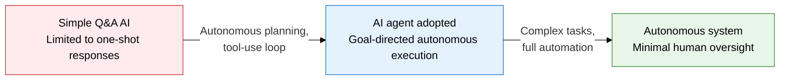
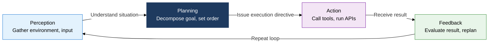
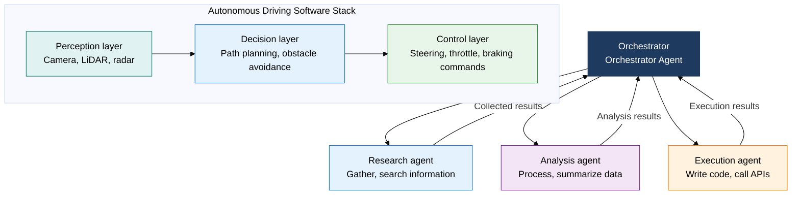

## 1. Overview of AI Agents, Which Achieve Autonomous Goals Through a Perceive-Plan-Act Cycle

**Definition**: An autonomous AI system that uses an LLM as its core reasoning engine to autonomously repeat a perceive-plan-act-feedback cycle, combining external tools, memory, and orchestration to achieve complex goals.
- Moves beyond the single prompt-response pattern to decompose, execute, and self-correct multi-step goals
- Interacts with the outside world through tool use: web search, code execution, API calls
- Overcomes the limits of a single agent through multi-agent collaboration, with parallel processing and role division

**Characteristics**:
- **Autonomous planning**: Planning capability that decomposes a goal into subtasks and dynamically adjusts execution order
- **Memory management**: Sustains conversation history and knowledge through short-term (context window) and long-term (vector DB) memory
- **Tool calling**: Performs external actions, such as code execution, search, and DB lookups, through a function-calling API

---

## 2. Core Structure of AI Agents and Autonomous Systems

### A. AI Agent Operating Cycle and Components

| Component | Role | Key Function | Implementation Example |
|---|---|---|---|
| **Reasoning engine** | Core LLM-based decision-making | Decompose goals, select next action | GPT-4o, Claude, Gemini |
| **Tool use** | Interacts with the outside world | Search, code execution, API calls | Function Calling, MCP |
| **Short-term memory** | Sustains current task context | Holds conversation history, intermediate results | Context window (128K-1M tokens) |
| **Long-term memory** | Stores persistent knowledge and experience | Past task results, user preferences | Vector DB (Pinecone, Weaviate) |
| **Orchestrator** | Controls agent execution flow | Task assignment, dependency management | LangGraph, AutoGen |

---

### B. Multi-Agent Collaboration Architecture and Autonomous Driving Software Stack

| Category | Single Agent | Multi-Agent |
|---|---|---|
| **Processing method** | Sequential, single-loop execution | Parallel, distributed task processing |
| **Scalability** | Complexity limited by context-window size | Handles large-scale tasks through role division |
| **Fault tolerance** | A single point of failure | Agent isolation allows partial failure |
| **Suited domains** | Simple, linear tasks, fast prototyping | Complex workflows, autonomous driving, robotics |

---

## 3. Expected Benefits and Practical Applications of Adopting AI Agents and Autonomous Systems

| Category | Key Benefits | Use and Practical Application |
|---|---|---|
| **Work automation** | Fully automates repetitive multi-step work, reduces human error | LangGraph-based workflow agents automate report collection, analysis, and distribution |
| **Autonomous driving, robotics** | Integrates perception, decision-making, and control for real-time autonomous decisions | Fuses ROS2-based robot middleware with LLM agents, adapts to dynamic environments |
| **Multi-agent collaboration** | Cuts processing time for large, complex tasks through parallel processing | Builds role-specialized agent teams with AutoGen, CrewAI, adds a verification agent |
| **Safety, reliability** | Human-in-the-loop design secures human approval before critical actions | Builds agent action logging and audit trails, inserts a confirmation step before irreversible actions |
