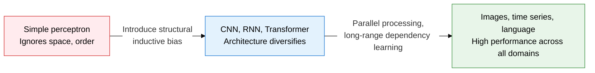
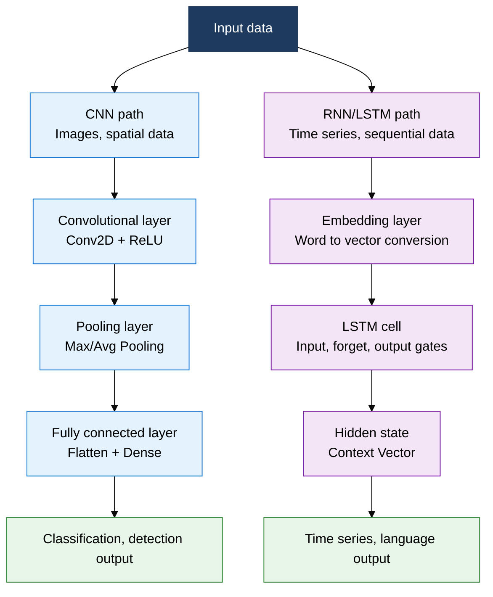
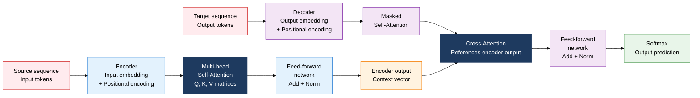

## 1. Overview of Foundational Deep Learning Architectures, Where Choosing the Architecture That Fits the Data Structure Is the Key to Performance

**Definition**: A system of neural network architectures that maximizes learning efficiency and performance through inductive bias reflecting the spatial (CNN), sequential (RNN/LSTM), or global (Transformer) structure of data.
- Grid-structured data such as images and video draws spatial features from the local receptive field of convolutional filters
- Time-series data such as text and speech is processed with order dependency remembered through hidden state
- The Transformer computes the relationship between every pair of positions in parallel using Attention weights, learning long-range dependencies

**Characteristics**:
- **Inductive bias**: Embeds assumptions about data structure into the architecture design, achieving fast convergence with less data
- **Modularity**: Composes networks from reusable units such as convolutional blocks, LSTM cells, and Attention heads
- **Transfer learning**: Fine-tunes weights pretrained on large-scale data for immediate application to small-scale tasks

---

## 2. Core Structure of Foundational Deep Learning Architectures

### A. CNN vs. RNN/LSTM Structure Comparison

| Item | CNN (Convolutional Neural Network) | RNN/LSTM (Recurrent Neural Network) |
|---|---|---|
| **Primary use** | Image classification, object detection, image segmentation | Natural language processing, speech recognition, time-series forecasting |
| **Core operation** | Convolution + Pooling | Hidden state recurrence + LSTM gates (forget, input, output) |
| **Space/order handling** | Extracts 2D spatial features via a local receptive field | Updates state in time order, remembering order dependency |
| **Parameter sharing** | Shares filter weights across all positions | Shares weights across time steps |
| **Parallel processing** | Convolution operations can be spatially parallelized | Sequential processing makes parallelization hard |
| **Limitations** | Cannot model order or context on its own | Long-range dependencies fade (vanishing gradient), slow training |

---

### B. Transformer Architecture and Its Advantages Over RNN

| Comparison Point | RNN/LSTM | Transformer |
|---|---|---|
| **Parallel processing** | Sequential processing slows training | Parallel processing of the full sequence speeds training |
| **Long-range dependency** | Vanishing gradient weakens relationships between distant tokens | Self-Attention connects every pair of positions directly |
| **Attention mechanism** | Adds Attention as an auxiliary mechanism | Self-Attention is the core operation (Q, K, V matrix dot products) |
| **Positional information** | Order itself carries positional information | Positional encoding is added separately |
| **Scalability** | Limited as model size grows | Performance improves as parameters scale, per scaling laws |
| **Primary use** | Legacy NLP, some speech recognition | GPT, BERT, ViT, and most modern LLM and vision models |

---

## 3. Expected Benefits and Practical Applications of Adopting Foundational Deep Learning Architectures

| Category | Key Benefits | Use and Practical Application |
|---|---|---|
| **Image processing** | CNN-based high-precision object recognition improves inspection and classification accuracy | Applied to manufacturing defect detection, medical image reading, CCTV anomaly detection systems |
| **Time-series analysis** | LSTM-based long-term pattern learning improves forecast model precision | Stock price and demand forecasting, equipment anomaly detection, network traffic analysis |
| **Natural language processing** | Transformer parallel training enables large-scale language understanding and generation models | Develops chatbots, document summarization, translation, and code-generation services |
| **Transfer learning** | Reusing pretrained weights achieves high performance even in small-data environments | Fine-tunes Hugging Face pretrained models, builds domain-specific models |
