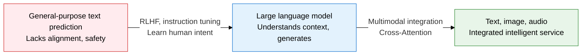
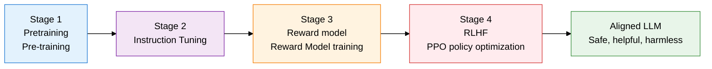
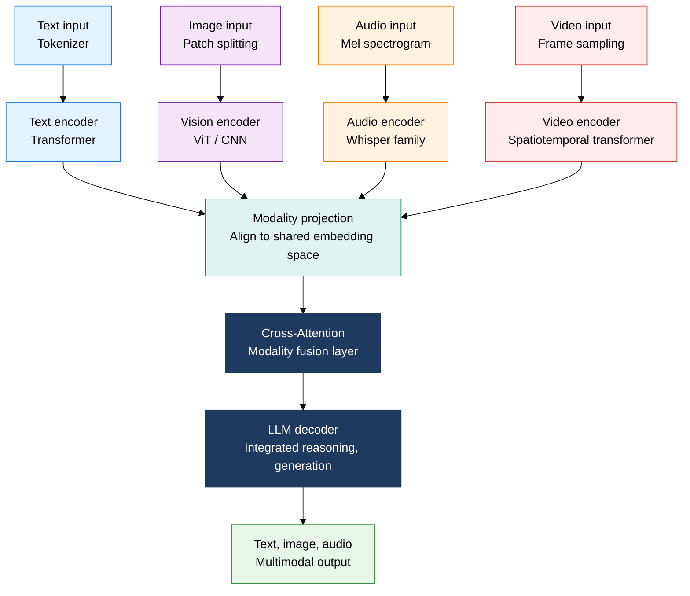

## 1. Overview of Generative AI and LLMs, Which Align Models with Human Feedback and Integrate Perception Through Multimodality

**Definition**: A generative AI system that pretrains a transformer with hundreds of billions of parameters on a large corpus, aligns it to human intent with RLHF, and integrates modalities beyond text through Cross-Attention.
- Decoder-only (or encoder-decoder) transformers such as GPT, LLaMA, and Gemini predict the probability of the next token
- RLHF uses a reward model and the PPO (proximal policy optimization) algorithm to suppress harmful output and improve helpfulness
- Multimodal models fuse image, audio, and video encoders into the text space, letting a single model handle mixed input

**Characteristics**:
- **Scaling laws**: Performance improves predictably as parameters, data, and compute grow, producing emergent capabilities
- **In-context learning**: Few-shot prompting performs a new task immediately, without updating parameters
- **Modal fusion**: Aligns heterogeneous modalities into a shared representation space using encoder projection and Cross-Attention

---

## 2. Core Structure of Generative AI and LLMs

### A. LLM Training Pipeline: Pretraining, Instruction Tuning, RLHF

| Stage | Purpose | Method | Output |
|---|---|---|---|
| **Pretraining** | Acquire the statistical patterns of language and world knowledge | Autoregressive training (next-token prediction) on trillions of tokens from the internet, books, and more | Base model (Base LLM) |
| **Instruction tuning** | Learn to respond in the format of user instructions | SFT (supervised fine-tuning) on high-quality instruction-response pairs | Instruction-tuned model (Instruct LLM) |
| **Reward model training** | Quantify human preference criteria | People rank multiple responses to the same prompt, then the model trains on the rankings | Reward score function (Reward Model) |
| **RLHF (PPO)** | Optimize response quality using the reward signal | Maximizes reward with the PPO algorithm, prevents over-optimization with KL divergence | Aligned LLM |

---

### B. Multimodal AI Architecture vs. Single-Modal LLM

| Comparison Point | Single-Modal LLM | Multimodal AI |
|---|---|---|
| **Input** | Handles text only (token sequence) | Handles mixed text, image, audio, video |
| **Encoder structure** | Single path for text embedding | Dedicated encoder per modality plus a projection layer |
| **Fusion method** | Not applicable | Cross-Attention or concatenation of encoder outputs |
| **Positional information** | 1D positional encoding | Adds 2D patch position (image), time-axis position (audio, video) |
| **Representative models** | GPT-4 (text), LLaMA | GPT-4o, Gemini 1.5, Claude 3 (image + text) |
| **Key limitation** | Cannot directly understand visual or auditory information | Modality-alignment training data and compute cost increase |

---

## 3. Expected Benefits and Practical Applications of Adopting Generative AI and LLMs

| Category | Key Benefits | Use and Practical Application |
|---|---|---|
| **Work automation** | Automating document writing, summarization, and code generation sharply lifts knowledge-work productivity | In-house RAG-based Q&A systems, automated code review, draft report generation |
| **Multimodal services** | Integrated text, image, and audio processing enables mixed-input UX | Image-based search and description, voice conversational AI agents, automatic video summarization |
| **Safety, alignment** | Applying RLHF minimizes harmful and biased output for trustworthy AI services | Customizing reward models, red-team testing, building output-filtering pipelines |
| **Domain specialization** | Instruction-tuning fine-tuning improves precision in specialized fields such as law, medicine, and finance | Domain-corpus SFT, RAG vector-DB integration, building compliance-verification pipelines for output |
