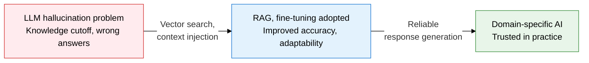
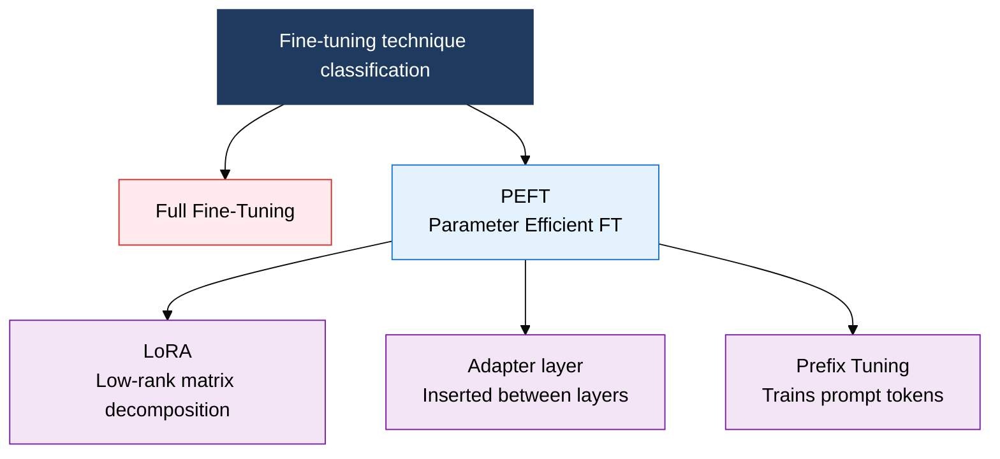

## 1. Overview of RAG and Fine-Tuning, Which Resolve Hallucination in Real Time Through Vector Search

**Definition**: An LLM enhancement technique that suppresses hallucination and generates domain-fit responses through external knowledge-base retrieval (RAG) or parameter updates (fine-tuning).
- LLMs hallucinate frequently on recent or specialized knowledge outside the pretraining data's scope
- RAG injects real-time context through vector-DB search without retraining, improving response reliability
- Fine-tuning adapts the model to a specific task or style with lightweight techniques such as PEFT and LoRA

**Characteristics**:
- **Knowledge freshness**: RAG can reflect the latest information just by updating the search index, without retraining
- **Parameter efficiency**: LoRA trains under 1% of total parameters, cutting GPU memory and time sharply
- **Prompt design**: Few-Shot, CoT, and ReAct techniques improve reasoning quality immediately, without modifying the model

---

## 2. Core Structure of RAG, Fine-Tuning, and Prompt Engineering

### A. RAG Architecture: Vector Search, Context Injection, LLM Generation Flow

| Category | RAG | Fine-Tuning |
|---|---|---|
| **Knowledge freshness** | Reflected immediately by updating the search index | Requires retraining, periodic updates |
| **Cost** | Search infrastructure cost (low to medium) | GPU training cost (medium to high) |
| **Response accuracy** | Depends on search quality, easy to trace sources | High accuracy for the specific task |
| **Update method** | Real-time refresh by adding or removing documents | Requires a model retraining and deployment cycle |

---

### B. Fine-Tuning Techniques and Three Prompt Engineering Techniques

| Technique | Method | Characteristics | Applicable Situations |
|---|---|---|---|
| **Few-Shot** | Includes 2 to 5 examples in the input | No extra training needed, applies immediately | Classification, translation, format-standardization tasks |
| **CoT (Chain of Thought)** | Prompts "let's think step by step" | Makes the intermediate reasoning process explicit | Math, logic, multi-step reasoning problems |
| **ReAct** | Repeats reason and act | Can combine with tool calls and search | Agent tasks, complex query answering |
| **LoRA** | Approximates weights with low-rank matrices | Trains 0.1-1% of parameters, cuts GPU cost | Domain specialization, style transfer |

---

## 3. Expected Benefits and Practical Applications of Adopting RAG, Fine-Tuning, and Prompt Engineering

| Category | Key Benefits | Use and Practical Application |
|---|---|---|
| **Improved reliability** | Reduces hallucination rate, enables information verification through source-grounded responses | Applies chunk-level source tagging in the RAG pipeline, displays a response confidence score |
| **Domain adaptation** | Secures response quality specialized to internal company knowledge, terms, and format | Uses LoRA fine-tuning to learn internal document style and terminology, minimizing cost |
| **Operational efficiency** | Refreshes knowledge without retraining, shortens the deployment cycle | Auto-indexes a vector DB (Pinecone, Weaviate) to reflect new documents in real time |
| **Reasoning quality** | Applying CoT and ReAct improves accuracy on complex multi-step problems | Builds a prompt-template library, standardizes LangChain and LlamaIndex chain design |
