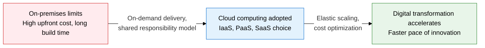
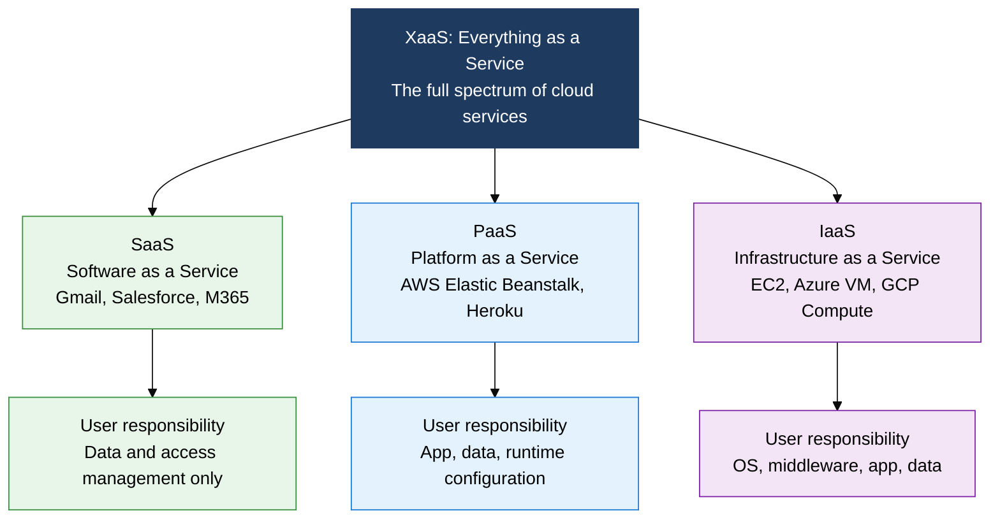
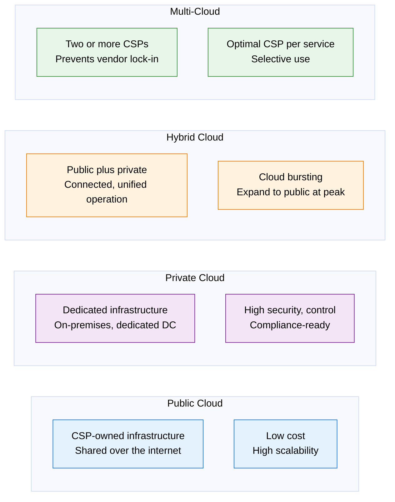

## 1. Overview of Cloud Computing, Where You Rent What You Need and Pay for What You Use

**Definition**: An IT infrastructure paradigm that delivers computing resources (servers, storage, network, software) on demand over the internet and bills based on usage.
- Defines five essential characteristics per NIST SP 800-145: on-demand self-service, broad network access, resource pooling, rapid elasticity, and measured service
- Classified into IaaS, PaaS, and SaaS service models, and Public, Private, Hybrid, and Multi-Cloud deployment models
- The shared responsibility model clearly divides security responsibilities between the CSP and the customer

**Characteristics**:
- **Elasticity**: Automatically scales resources up or down within minutes as demand changes, preventing overinvestment
- **Usage-based billing**: Pays only for the CPU, storage, and network traffic used, converting CapEx to OpEx
- **Global availability**: Achieves high availability (HA) and disaster recovery (DR) through multi-region, multi-availability-zone distribution

---

## 2. Core Structure of Cloud Computing

### A. The Four Cloud Service Models and the Shared Responsibility Model

| Service Model | CSP Responsibility | User Responsibility | Representative Services |
|---|---|---|---|
| **IaaS** | Physical servers, network, virtualization | OS, middleware, runtime, app, data | AWS EC2, Azure VM, GCP Compute Engine |
| **PaaS** | Everything in IaaS plus OS, middleware, runtime | Application code, data | AWS Beanstalk, Google App Engine, Heroku |
| **SaaS** | Everything in IaaS plus PaaS plus the application | Data entry, access permission management | Gmail, Salesforce, Microsoft 365 |
| **XaaS** | Delivered per service type | User configuration within the contract scope | DBaaS, FaaS, STaaS, SECaaS, and more |

---

### B. The Four Cloud Deployment Models and Intercloud Technology

| Deployment Model | Cost | Security, Control | Flexibility | Suited Domain |
|---|---|---|---|---|
| **Public** | Low (usage-based) | Low (shared environment) | High (instant scaling) | Startups, development, test environments |
| **Private** | High (dedicated infrastructure) | High (full control) | Low (limited resources) | Regulated industries: finance, healthcare, defense |
| **Hybrid** | Medium (mixed billing) | Medium (policy-based separation) | Medium (bursting available) | Separates sensitive on-premises data from general cloud workloads |
| **Multi** | Secures negotiating leverage | Independent control per CSP | Highest (vendor diversity) | Global enterprise, mission-critical services |

---

## 3. Expected Benefits and Practical Applications of Adopting Cloud Computing

| Category | Key Benefits | Use and Practical Application |
|---|---|---|
| **Cost optimization** | Eliminates CapEx and converts to OpEx, minimizes waste from idle resources | Blends reserved and spot instances, builds a cloud cost management (FinOps) practice |
| **Security, compliance** | Clarifies responsibility scope through the shared responsibility model, leverages CSP security certifications | IAM least-privilege policies, data encryption (at rest, in transit), CSPM tools detect misconfigurations |
| **Availability, resilience** | Multi-AZ, multi-region deployment secures 99.99%+ SLA availability | Cloud bursting handles traffic peaks automatically, shortens disaster-recovery RTO and RPO targets |
| **Development innovation** | PaaS and serverless remove infrastructure management burden, speed up development | Shifts to container and Kubernetes-based microservices, fully automates CI/CD pipelines |
