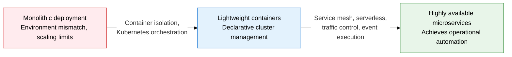
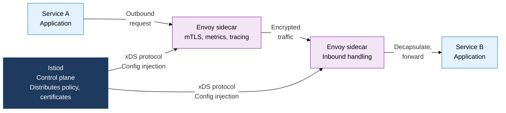

## 1. Overview of Containers, Kubernetes, and Service Mesh, Which Complete a Microservices Infrastructure Through Isolation, Orchestration, and Mesh

**Definition**: A cloud-native infrastructure system that combines namespace and cgroup-based container isolation with Kubernetes orchestration and an Istio service mesh to declaratively deploy and operate microservices applications.
- Docker image layer caching speeds up builds; the OCI standard guarantees runtime portability
- Kubernetes automates Pod scheduling, self-healing, and horizontal scaling, minimizing operational burden
- Combines service mesh and serverless FaaS to achieve communication security, traffic control, and cost optimization at once

**Characteristics**:
- **Environment consistency**: Isolates processes, network, and file system with namespaces and cgroups, guaranteeing identical development, staging, and production environments
- **Declarative orchestration**: Declares the desired state in a YAML manifest, and the control plane runs a reconciliation loop that continuously aligns actual state with it
- **Built-in observability**: A service mesh sidecar intercepts all inter-service traffic, automatically collecting metrics, traces, and logs without code changes

---

## 2. Core Structure of Containers, Kubernetes, and Service Mesh

### A. Docker Container Principles and Kubernetes Core Architecture

```mermaid
%%{init: { 'theme': 'base', 'themeVariables': { 'edgeLabelBackground': '#fff' }}}%%
flowchart TD
    CP["Control Plane<br/>The cluster's brain"]
    API["API Server<br/>Single entry point<br/>for all requests"]
    ETCD["etcd<br/>Distributed store<br/>for cluster state"]
    SCH["Scheduler<br/>Places Pods,<br/>selects nodes"]
    CM["Controller Manager<br/>Reconciles state,<br/>self-healing loop"]
    WN["Worker Node<br/>Runs the actual workload"]
    KUB["kubelet<br/>Pod lifecycle<br/>management agent"]
    POD["Pod<br/>Group of containers,<br/>smallest deployable unit"]
    SVC["Service<br/>Load-balances Pods,<br/>stable endpoint"]
    ING["Ingress<br/>External HTTP traffic<br/>routing rules"]
    CP --> API
    CP --> ETCD
    CP --> SCH
    CP --> CM
    WN --> KUB
    WN --> POD
    WN --> SVC
    WN --> ING
    style CP fill:#1E3A5F,stroke:#1E3A5F,color:#fff
    style API fill:#E3F2FD,stroke:#1976D2,color:#000
    style ETCD fill:#E3F2FD,stroke:#1976D2,color:#000
    style SCH fill:#E3F2FD,stroke:#1976D2,color:#000
    style CM fill:#E3F2FD,stroke:#1976D2,color:#000
    style WN fill:#1E3A5F,stroke:#1E3A5F,color:#fff
    style KUB fill:#F3E5F5,stroke:#7B1FA2,color:#000
    style POD fill:#F3E5F5,stroke:#7B1FA2,color:#000
    style SVC fill:#FFF3E0,stroke:#F57C00,color:#000
    style ING fill:#FFF3E0,stroke:#F57C00,color:#000
```

| Category | VM (Virtual Machine) | Container |
|---|---|---|
| **Isolation unit** | Full OS virtualization on a hypervisor | Shares the kernel, isolated by namespace and cgroup |
| **Boot time** | Tens of seconds to a few minutes | Under a few hundred milliseconds |
| **Image size** | Several GB (includes the full OS) | Tens to hundreds of MB (app plus libraries) |
| **Resource overhead** | Doubled: hypervisor plus guest OS | Minimal, thanks to sharing the host kernel |
| **Portability** | Depends on the hypervisor type | Runs on any runtime per the OCI standard |

---

### B. Service Mesh (Istio) Architecture and How Serverless/FaaS Works

| Category | Microservices (Container) | Serverless (FaaS) |
|---|---|---|
| **Execution unit** | An always-running container Pod | A function invoked on event trigger |
| **Cost model** | Hourly billing based on reserved resources | Billed by execution time and invocation count |
| **Cold start** | None (always running) | Initial instance-creation delay of hundreds of ms to a few seconds |
| **State management** | Can be stateful, keeps session state | Stateless by principle, relies on external storage |
| **Suited workload** | Persistent API servers, real-time processing | Event-driven batch jobs, intermittent tasks |

---

## 3. Expected Benefits and Practical Applications of Adopting Containers, Kubernetes, and Service Mesh

| Category | Key Benefits | Use and Practical Application |
|---|---|---|
| **Deployment consistency** | Eliminates deployment failures from environment mismatch, guarantees the same image from development to production | Links Docker multi-stage builds with a CI/CD pipeline to auto-build, scan, and push images |
| **Operational automation** | Pod self-healing and horizontal scaling sharply cut the burden on incident-response staff | Configures HPA (Horizontal Pod Autoscaler) to auto-scale out based on CPU and memory thresholds |
| **Stronger security** | Automatic mTLS between services, policy as code simplifies security audits | Declaratively manages least-privilege communication policy per service with Istio AuthorizationPolicy |
| **Cost optimization** | Serverless FaaS eliminates idle-resource cost, maximizes resource utilization | Shifts intermittent event-processing workloads to Knative or AWS Lambda to cut infrastructure cost |
