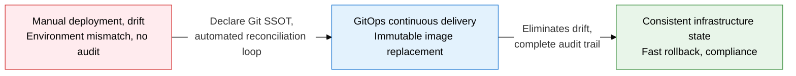
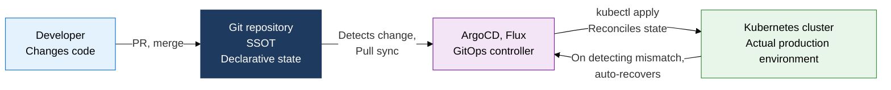
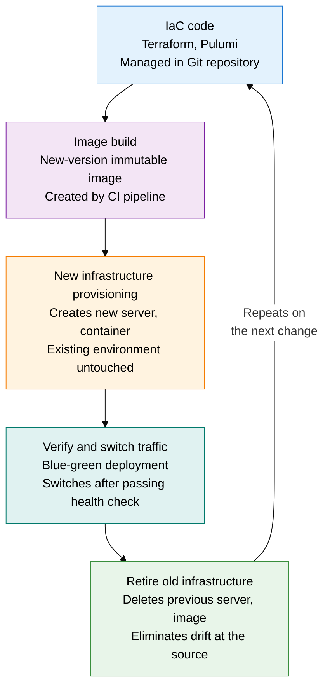

## 1. Overview of GitOps and Immutable Infrastructure, Which Automate Infrastructure and Deployment as Code with Git as the Single Source of Truth

**Definition**: An operating methodology that treats a Git repository as the single source of truth (SSOT), declaratively manages the desired state of infrastructure and applications, and uses an automated reconciliation agent to continuously align the actual environment with that Git state.
- GitOps controllers such as ArgoCD and Flux watch the Git repository from inside the cluster and deploy by pulling
- Immutable infrastructure never modifies a deployed server; it replaces it with a new image, blocking configuration drift at the root
- Combines with IaC (Terraform, Pulumi) to manage the entire process, from infrastructure provisioning to application deployment, as code

**Characteristics**:
- **SSOT-based auditing**: Every change is recorded as a Git commit, giving a complete audit trail of who changed what and when
- **Automated reconciliation**: When the actual cluster state diverges from the Git declaration, the controller automatically restores it, eliminating drift
- **Replace-based reliability**: Replaces servers with a new immutable image instead of repairing them, always guaranteeing consistency across environments

---

## 2. Core Structure of GitOps and Immutable Infrastructure

### A. GitOps Workflow and Push vs. Pull Deployment Comparison

| Category | Traditional CI/CD (Push) | GitOps (Pull) |
|---|---|---|
| **Deployment actor** | A CI server (Jenkins, GitHub Actions) pushes directly to the cluster | An in-cluster agent (ArgoCD, Flux) pulls from Git |
| **Cluster access** | The CI server needs kubeconfig and secrets | No credentials needed outside the cluster, stronger security |
| **Drift detection** | Cannot track state after deployment | The agent watches continuously, auto-recovers on mismatch |
| **Rollback** | Requires rerunning a previous pipeline | Restores the previous state instantly with a single Git revert |
| **Audit trail** | Scattered across CI logs | The Git commit history is a complete change record |

---

### B. Immutable Infrastructure Principles and IaC Integration

| Category | Traditional Mutable Infrastructure | Immutable Infrastructure |
|---|---|---|
| **Change method** | Patches and reconfigures a running server directly | Builds a new image, then replaces it, retiring the old server |
| **Drift** | Accumulated manual changes cause environment mismatch | Replacement blocks drift at the source |
| **Failure recovery** | Repairing and patching a server takes time, raises MTTR | Replaces instantly with a verified prior image, minimizes MTTR |
| **Consistency** | State differs per server, hard to reproduce | Created from the same image, fully consistent environments |
| **Security** | Accumulated patch history and vulnerabilities can persist | A clean image on every deployment prevents vulnerability buildup |

---

## 3. Expected Benefits and Practical Applications of Adopting GitOps and Immutable Infrastructure

| Category | Key Benefits | Use and Practical Application |
|---|---|---|
| **Operational stability** | Eliminating drift secures a consistent production environment, eases root-cause tracing | Enables ArgoCD auto-sync, wires a Slack alert for Git state mismatches |
| **Security, compliance** | Full Git audit trail for every change, removes credential exposure outside the cluster | Accesses the cloud with GitHub Actions OIDC tokens, minimizes deployment permissions with ArgoCD RBAC |
| **Deployment speed** | Automatic deployment completes within minutes from a declarative manifest change alone | Flux Image Automation auto-creates, merges, and deploys a PR when it detects a new image tag |
| **Failure recovery** | A single Git revert rolls back the entire environment instantly, sharply cuts MTTR | Combines blue-green deployment with immutable images for zero-downtime rollback |
