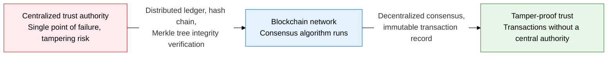
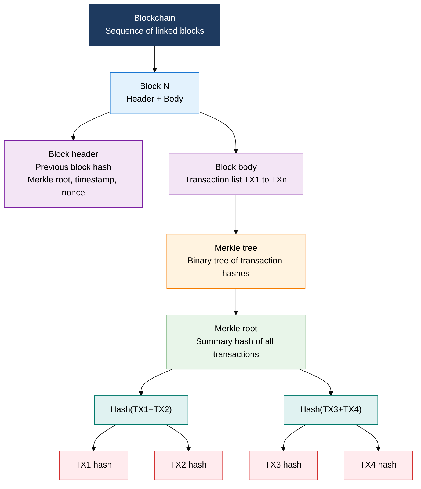
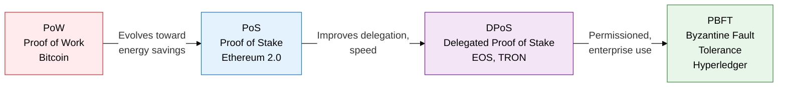

## 1. Overview of Blockchain Mechanism and Consensus Algorithms, Which Implement Tamper-Proof Distributed Trust Through a Merkle Tree Hash Chain

**Definition**: A distributed ledger technology (DLT) that combines a block chain structure, linked with cryptographic hash functions and a Merkle tree, with a distributed consensus algorithm so that all participating nodes agree on the integrity and order of transaction records without a central authority.
- Each block includes the hash of the previous block to form the chain; tampering with one block invalidates the entire chain that follows
- The Merkle tree summarizes transaction data into a binary hash tree, verifying whether a specific transaction is included in O(log n) complexity
- Consensus algorithms trade off the trilemma of decentralization, energy efficiency, and throughput, each in a different way

**Characteristics**:
- **Immutability**: Chains blocks with hash functions such as SHA-256; modifying a past transaction requires recomputing every subsequent block, making tampering effectively impossible
- **Decentralized consensus**: Network nodes decide the right to add a new block in a distributed way, following rules such as PoW or PoS, removing the need for a single trusted authority
- **Balance of transparency and privacy**: Public blockchains disclose the full transaction history; private and consortium chains admit only permissioned nodes, meeting enterprise requirements

---

## 2. Core Structure of Blockchain Mechanism and Consensus Algorithms

### A. Distributed Ledger Technology (DLT) and Block/Merkle Tree Structure

| Component | Content | Role |
|---|---|---|
| **Block header** | Previous block hash, Merkle root, timestamp, nonce, difficulty target | Links blocks into a chain, integrity anchor |
| **Block body** | The full list of transactions included in this block | Stores the actual transaction data |
| **Merkle root** | A single hash summarizing every transaction in the block as a binary hash tree | Lightweight verification of transaction inclusion (SPV) |
| **Previous block hash** | The SHA-256 hash of the entire preceding block header | Links the block chain, invalidates the entire chain that follows on tampering |
| **Nonce** | An arbitrary number a miner varies in PoW to satisfy a hash below the target value | Key field for adjusting proof-of-work difficulty |

---

### B. Comparison of Four Consensus Algorithms and the Blockchain Trilemma

| Category | PoW (Proof of Work) | PoS (Proof of Stake) | DPoS (Delegated Proof of Stake) | PBFT |
|---|---|---|---|---|
| **Selection method** | Hash-computation race, the first node to reach the target wins | Validators selected in proportion to stake held | Token holders vote to elect representative nodes | Three-round message exchange among preapproved nodes |
| **Energy efficiency** | Very low, massive power consumption | High, no computation race needed | High, only a few representative nodes compute | Very high, no wasted computation |
| **Throughput** | Low, around Bitcoin's 7 TPS | Medium to high, thousands of TPS | High, EOS reaches thousands of TPS | Very high, up to tens of thousands of TPS |
| **Decentralization** | High, but mining-pool concentration is a concern | Medium, large staking pools can concentrate power | Low, risk of oligarchy among a few representative nodes | Low, only permissioned nodes participate |
| **Use cases** | Bitcoin, Ethereum 1.0 | Ethereum 2.0, Cardano | EOS, TRON, Steem | Hyperledger Fabric, R3 Corda |

---

## 3. Expected Benefits and Practical Applications of Adopting Blockchain Mechanism and Consensus Algorithms

| Category | Key Benefits | Use and Practical Application |
|---|---|---|
| **Data integrity** | The Merkle tree hash chain blocks transaction tampering at the root, maximizes audit trust | Applies blockchain timestamping to supply-chain history, medical records, and proof of original electronic documents |
| **Decentralized trust** | Builds trust through consensus among network participants without a central authority, removes a single point of failure | Adopts a consortium blockchain for inter-bank payment and clearing infrastructure, cutting intermediary costs |
| **Energy/performance balance** | Choosing the consensus algorithm meets energy efficiency, throughput, and decentralization requirements | Uses PoS for public services and PBFT-based Hyperledger for internal enterprise processes, optimized per purpose |
| **Compliance** | Immutable transaction records and automatic smart-contract execution automate compliance evidence | Encrypts KYC and AML data on a private blockchain to meet financial regulatory requirements |
