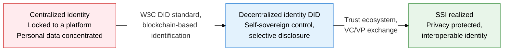
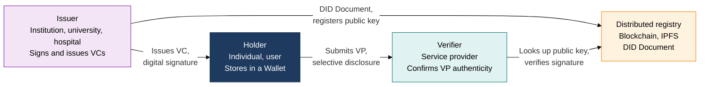
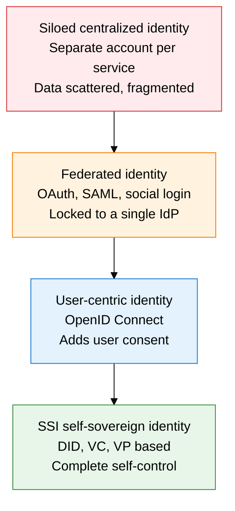

## 1. Overview of DID/SSI, a Decentralized Identity System Where You Control Your Own Identity Information

**Definition**: A decentralized identity system, built on the W3C DID standard, in which an individual creates, stores, and controls their own identifiers and identity credentials without a central authority.
- A DID Document is registered on a blockchain or distributed registry and includes a public key, authentication methods, and service endpoints
- A VC (Verifiable Credential) is an identity claim signed by an issuer; a VP (Verifiable Presentation) is a proof bundle the holder selectively assembles
- SSI (Self-Sovereign Identity) is the paradigm in which individuals fully reclaim identity sovereignty through the DID, VC, and VP ecosystem

**Characteristics**:
- **Decentralization**: Not locked to any specific corporate or government platform; identifiers are registered and managed directly on a blockchain registry
- **Selective disclosure**: ZKP (zero-knowledge proof)-based selective attribute disclosure presents only the minimum information a verifier needs
- **Interoperability**: Compliance with W3C and DIF standards enables credential exchange across different DID methods and platforms

---

## 2. Core Structure of DID/SSI

### A. The DID Three-Party Trust Model and VC/VP Structure

| DID Document Component | Description | Role |
|---|---|---|
| **@context** | W3C DID standard context URI (https://www.w3.org/ns/did/v1) | Defines the document's interpretation rules |
| **id** | The DID identifier (did:method:identifier format) | Globally unique identification |
| **verificationMethod** | Public key type, value, and controller information | Means of authentication and signature verification |
| **authentication** | Reference to the verificationMethod used to authenticate the DID subject | Login, access control |
| **service** | Associated service endpoints (DIDComm, Hub, and more) | Provides an interaction channel |
| **assertionMethod** | The verificationMethod used to sign issued VCs | Proof of credential issuance |

---

### B. The SSI Concept and the Evolution of Identity Models

| Comparison Point | Centralized Identity | Federated Identity | SSI (DID-based) |
|---|---|---|---|
| **Identity control** | Owned by the service provider | Owned by the IdP (Google, Kakao, and so on) | Fully owned by the individual |
| **Data storage** | Concentrated on a central server | Concentrated on the IdP's server | Personal wallet (local or cloud) |
| **Single point of failure** | The service server going down | The IdP server going down | Distributed registry (fault-tolerant) |
| **Personal data exposure** | Full disclosure per service | Full information shared with the IdP | Selective, minimal attribute disclosure |
| **Interoperability** | Disconnected between services | Limited to within the IdP's ecosystem | General-purpose, based on W3C standards |
| **Domestic use cases (Korea)** | Government i-PIN | Kakao, Naver login | Initial DID, mobile ID card |

---

## 3. Expected Benefits and Practical Applications of Adopting DID/SSI

| Category | Key Benefits | Use and Practical Application |
|---|---|---|
| **Privacy protection** | Selective disclosure and ZKP realize the principle of minimal information, prevent excessive personal-data collection | For age verification with a mobile driver's license (mDL), proves only adult status via ZKP instead of revealing the birth date |
| **Stronger security** | Removing the central database eliminates the target for large-scale personal-data breaches | Distributed wallet-based medical-record access control, building integrated DID authentication systems for public agencies |
| **Administrative efficiency** | VC-based automatic verification cuts document submission and manual review procedures by 90% or more | Instant verification of employment credentials via Initial DID, digital VC issuance for university diplomas |
| **Interoperability** | Cross-border credential exchange based on W3C and DIF standards, participation in the global digital identity ecosystem | Integrates with the EU eIDAS 2.0 EUDI Wallet, mutual authentication between domestic Initial/PASS DID apps and overseas services |
