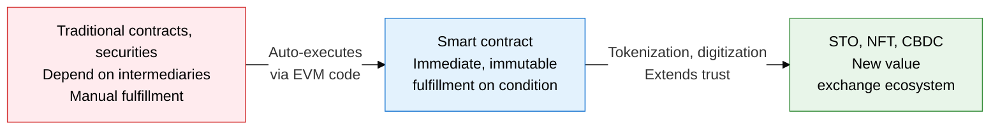
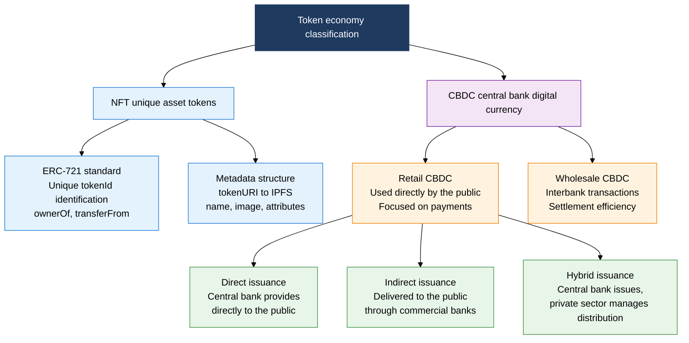

## 1. Overview of Smart Contracts and Token Economies, Where Code Is the Contract: Self-Executing Rules on the Blockchain

**Definition**: A self-executing program deployed on a blockchain, a piece of distributed code that automatically fulfills contract terms without an intermediary once predefined conditions are met.
- The EVM (Ethereum Virtual Machine) executes Solidity code as bytecode, and state changes are permanently recorded on the block
- STO, NFT, and CBDC are representative token-economy applications built on smart contracts, digitizing securities, unique assets, and fiat currency respectively
- Once contract code is deployed it cannot be changed (immutable), so a security audit before deployment is essential

**Characteristics**:
- **Trust minimization**: Fulfills contracts through code logic alone, without a third-party intermediary, removing human error and moral hazard
- **Transparency, traceability**: Every transaction is recorded on a public blockchain, enabling real-time audit
- **Programmable money**: Embeds business logic into money itself, such as conditional payments, maturity settings, and automatic distribution

---

## 2. Core Structure of Smart Contracts and Token Economies

### A. How Smart Contract Execution Works, and STO

```mermaid
%%{init: { 'theme': 'base', 'themeVariables': { 'edgeLabelBackground': '#fff' }}}%%
flowchart LR
    SC["Solidity code<br/>Writes contract logic"] --> COMP["Compiler<br/>Generates ABI<br/>+ bytecode"]
    COMP --> DEPLOY["Blockchain deployment<br/>Assigned a unique<br/>address"]
    DEPLOY --> TRIG["Transaction<br/>Condition met,<br/>function called"]
    TRIG --> EVM["EVM execution<br/>State change,<br/>gas consumed"]
    EVM --> BLOCK["Block finalized<br/>Permanently recorded,<br/>event emitted"]
    style SC fill:#E3F2FD,stroke:#1976D2,color:#000
    style COMP fill:#F3E5F5,stroke:#7B1FA2,color:#000
    style DEPLOY fill:#FFF3E0,stroke:#F57C00,color:#000
    style TRIG fill:#E0F2F1,stroke:#00796B,color:#000
    style EVM fill:#1E3A5F,stroke:#1E3A5F,color:#fff
    style BLOCK fill:#E8F5E9,stroke:#388E3C,color:#000
```

| Comparison Point | STO (Tokenized Security) | Traditional Securities |
|---|---|---|
| **Issuance method** | Automatically issued by smart contract, recorded on the blockchain | Brokered by a securities firm or exchange, registered on a central registry |
| **Trade settlement** | T+0 instant settlement (atomic swap) | T+2 settlement cycle, involves a clearinghouse |
| **Regulatory compliance** | KYC/AML and investor restrictions embedded in code (ERC-1400) | Regulatory compliance through paperwork and intermediaries |
| **Fractional ownership** | Can be split and owned in fractional token units | Fractional trading below one share is limited |
| **Cost** | Only smart-contract gas fees | Multi-layered underwriting, clearing, and custody fees |
| **Transparency** | All holdings and transfers disclosed on-chain | OTC trades are opaque, disclosure can be delayed |

---

### B. NFT Standards and CBDC Architecture

| Comparison Point | NFT (ERC-721) | CBDC |
|---|---|---|
| **Issuer** | Anyone (a project or an individual) | Issued exclusively by the central bank |
| **Fungibility** | Non-fungible (each token has a unique tokenId) | Fungible (1 KRW = 1 KRW, homogeneous) |
| **Primary use** | Digital art, game items, proof of real-estate share | Fiat currency replacement, payments, financial inclusion |
| **Technical standard** | ERC-721 (ownership), ERC-1155 (multi-token) | Permissioned blockchain or a CBDC-dedicated ledger |
| **Personal data** | Wallet address public, anonymity possible | Can be linked to real names, transaction tracing built into the design |
| **Regulatory status** | Varies by country, security-status debate | Legal Tender status |

---

## 3. Expected Benefits and Practical Applications of Adopting Smart Contracts and Token Economies

| Category | Key Benefits | Use and Practical Application |
|---|---|---|
| **Financial efficiency** | Adopting STO and CBDC shortens the settlement cycle to T+0, cuts clearing costs | Builds security-token platforms (KODA, KST), links to Bank of Korea CBDC pilot tests |
| **Asset liquidity** | Fractional NFT/STO ownership of illiquid assets like real estate and art expands investment access | Runs real-estate STO platforms, operates NFT-based digital copyright trading markets |
| **Contract automation** | Smart contracts automate dividend and interest payment and maturity processing, cutting operating costs by 90% or more | Applies DeFi protocol (Aave, Uniswap) design patterns, automates internal corporate payments |
| **Security, trust** | Code audits and formal verification preemptively remove vulnerabilities, protecting user assets | Applies Certik and OpenZeppelin audit tools, implements multisig governance |
