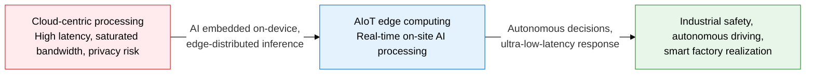
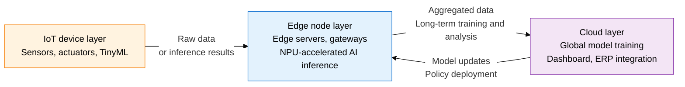
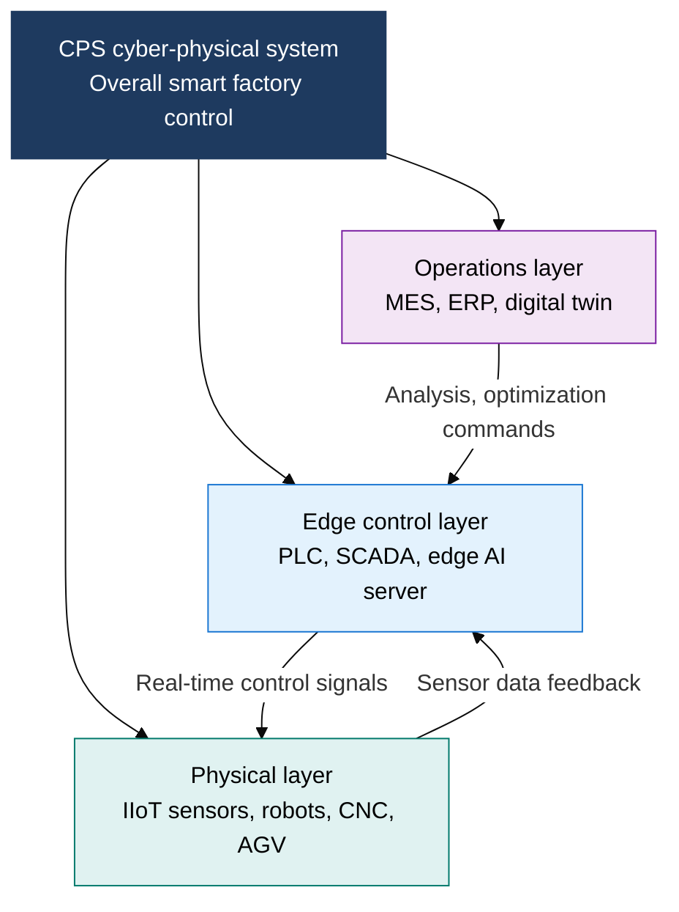

## 1. Overview of AIoT and Edge Computing, Redefining Industry Through Device Intelligence and Real-Time Connectivity

**Definition**: A distributed intelligence architecture that embeds AI inference capability in IoT sensors and actuators and performs real-time processing on edge nodes near the point of data generation, overcoming the limits of latency, bandwidth, and privacy.
- Delivers millisecond-scale inference results on-site, without a round trip to the cloud, feeding safety and control loops immediately
- Edge AI chips (MCUs with embedded NPUs/TPUs) run TinyML models at the device level
- Suited to fields where real-time response and data sovereignty matter, such as smart factories, autonomous driving, and medical IoT

**Characteristics**:
- **Ultra-low-latency processing**: Removing the cloud round trip achieves on-site response at the 1 ms level
- **Distributed intelligence**: Embedding AI models on individual devices enables autonomous operation even during network outages
- **Data sovereignty**: Processing and discarding sensitive data on-site strengthens privacy and regulatory compliance

---

## 2. Core Structure of AIoT and Edge Computing

### A. AIoT Data Flow and Edge vs. Cloud Comparison

| Comparison item | Cloud computing | Edge computing |
|---|---|---|
| **Processing latency** | 100 ms to several hundred ms (round trip required) | 1 ms to 10 ms (on-site processing) |
| **Bandwidth consumption** | Sends all raw data, high cost | Sends only aggregated data after on-site filtering |
| **Privacy** | Risk of transmitting personal/industrial data externally | Sensitive data can be processed and discarded on-site |
| **Availability** | Service disruption on network outage | Maintains autonomous operation even offline |
| **AI inference** | Large-scale model training and batch inference | Real-time inference with TinyML and lightweight models |

---

### B. V2X Communication Types and Smart Factory CPS Layer Structure

| V2X type | Communication target | Main purpose | Technology used |
|---|---|---|---|
| **V2V** | Vehicle to vehicle | Collision warning, platooning | DSRC, C-V2X PC5 |
| **V2I** | Vehicle to infrastructure | Signal optimization, road condition updates | WAVE, 5G NR-V2X |
| **V2P** | Vehicle to pedestrian | Protecting vulnerable road users | C-V2X device-to-device communication |
| **V2N** | Vehicle to network | Real-time traffic info, OTA updates | LTE/5G cellular |

---

## 3. Expected Benefits and Practical Applications of Adopting AIoT and Edge Computing

| Category | Key benefits | Practical applications |
|---|---|---|
| **Operational efficiency** | On-site AI analysis enables predictive maintenance and cuts defect rates by over 90% | Build real-time quality-inspection lines with IIoT sensors and edge AI servers, linked to a digital twin |
| **Safety and traffic** | V2X-based collision warnings cut traffic accidents by over 40% | Deploy C-V2X units in vehicles and RSUs at intersections, rolling out smart traffic infrastructure in stages |
| **Data sovereignty** | Meets GDPR and MyData regulations, protects industrial trade secrets on-site | Privacy-by-design: process data at the edge and send only anonymized, aggregated data to the cloud |
| **Cost reduction** | Cuts cloud traffic by over 70%, saving on communication and storage costs | Design an edge-cloud hybrid architecture with priority-based data tiering policies |
