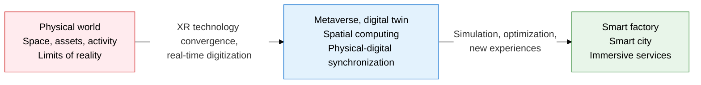
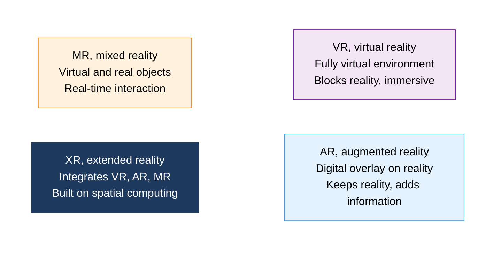
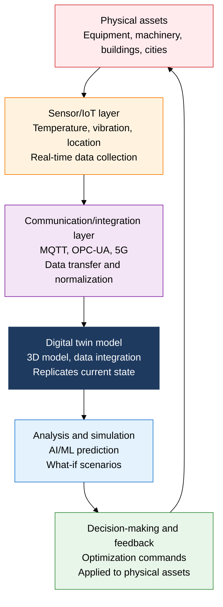

## 1. Overview of Metaverse, XR, and Digital Twin, a Spatial Computing Paradigm That Fuses Reality and the Virtual

**Definition**: A spatial computing paradigm that, on an XR environment fusing VR, AR, and MR technology, digitally replicates and links physical-world assets and activity in real time, delivering new experiences and optimization.
- The metaverse is a three-dimensional virtual world with persistence, interactivity, and an economic system, and XR technology provides the immersive interface
- A digital twin reflects real-time sensor data from a physical asset into a digital model to perform prediction, simulation, and optimization
- Applied across industries such as smart factories, smart cities, healthcare, and education to streamline operations and create new business models

**Characteristics**:
- **Physical-digital convergence**: Real-world data feeds the virtual space in real time, and decisions made in the virtual space feed back into the physical world
- **Immersive spatiality**: 3DoF/6DoF tracking, spatial audio, and haptic feedback let users experience presence
- **Prediction and optimization**: Digital-twin-based simulation detects defects before actual operation, reducing operating costs

---

## 2. Core Structure of Metaverse, XR, and Digital Twin

### A. XR Technology Framework and Core Metaverse Elements

| Comparison item | VR (virtual reality) | AR (augmented reality) | MR (mixed reality) |
|---|---|---|---|
| **Immersion** | Highest (fully blocks reality) | Low (keeps reality) | High (fuses reality and virtual) |
| **Hardware** | Dedicated HMD (Meta Quest, PSVR) | Smartphones, transparent glasses | Spatially aware HMD (HoloLens, Vision Pro) |
| **Reality awareness** | None (fully virtual) | 2D/3D overlay on a real background | 3D anchoring and physical interaction in real space |
| **Main applications** | Games, education, training simulation | Navigation, AR advertising, manufacturing guides | Surgical support, industrial maintenance |
| **Key technologies** | Room-scale tracking, eye tracking | ARCore, ARKit, WebAR | Spatial anchors, hologram rendering |

---

### B. Digital Twin Structure and Smart Factory Applications

| Application area | How the digital twin is used | Key expected benefits |
|---|---|---|
| **Smart factory** | 3D twin of the production line, real-time detection of equipment anomalies, predictive maintenance (PdM) | Cuts unplanned downtime by over 40%, reduces maintenance costs |
| **Smart city** | Twin of traffic, energy, and water infrastructure, city simulation and disaster response | Optimizes energy consumption by 15-20%, shortens emergency response time |
| **Healthcare** | Digital twin of a patient's body, pre-surgery simulation, personalized treatment plans | Reduces surgical error rates, improves realism in medical training |
| **Construction and real estate** | BIM-based building life-cycle twin, energy-efficiency simulation | Eliminates design errors upfront, optimizes building operating costs |

---

## 3. Expected Benefits and Practical Applications of Adopting Metaverse, XR, and Digital Twin

| Category | Key benefits | Practical applications |
|---|---|---|
| **Operational efficiency** | Digital-twin-based predictive maintenance raises equipment uptime, enables remote monitoring without site visits | Benchmark against Siemens Industrial Metaverse and GE Predix, build OPC-UA-based twins on the factory floor |
| **Training and education** | VR/MR simulation enables safety training in hazardous environments, cuts repeat-training costs by over 90% | VR safety training for nuclear/chemical plants, medical surgery simulators, military tactical training systems |
| **Innovative experience** | AR-based on-site work guides close skill gaps, MR remote collaboration cuts the cost of dispatching experts on-site | Microsoft HoloLens-based AR guides for equipment maintenance, adoption of XR remote-collaboration platforms (Spatial, Teamflow) |
| **Better decision-making** | City/factory simulation predicts outcomes before investment, What-if analysis minimizes risk | Integration with the Ministry of Land's smart-city digital-twin platform (Virtual Seoul), cloud twins built on AWS IoT TwinMaker |
