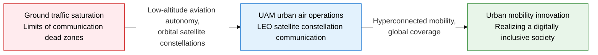
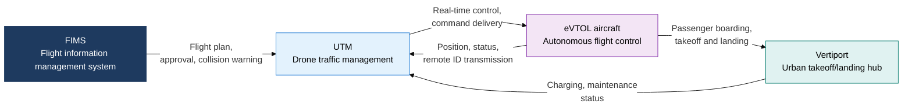
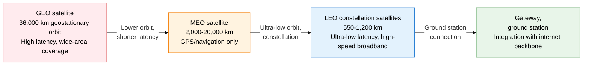

## 1. Overview of UAM and LEO Satellite Communication, Opening Urban Airways and Connecting the Globe via Orbital Satellites

**Definition**: A next-generation transportation and communication technology system that combines electric vertical takeoff and landing (eVTOL)-based urban air mobility (UAM) with low-earth-orbit small satellite constellations (LEO constellations) to realize hyperconnected mobility infrastructure spanning the ground, air, and space.
- UAM manages safe low-altitude flight paths through UTM (drone traffic management systems) and 5G C2 links
- LEO satellites deliver low-latency, high-speed broadband worldwide from an altitude dramatically lower than GEO
- Creates diverse value by relieving urban congestion, closing communication dead zones in remote and maritime areas, and backing up disaster-response communication

**Characteristics**:
- **Autonomous flight control**: UTM-FIMS integration manages thousands of drones and eVTOLs simultaneously without collisions
- **Ultra-low-latency satellites**: LEO's 550 km orbit cuts latency to about 1/40 of GEO
- **Dual connectivity**: A Non-Terrestrial Network (NTN) combining terrestrial 5G and LEO satellites secures uninterrupted coverage

---

## 2. Core Structure of UAM and LEO Satellite Communication

### A. UAM Ecosystem and UTM System Structure

| Core UAM component | Role | Key technology |
|---|---|---|
| **eVTOL aircraft** | Electric vertical takeoff/landing autonomous or piloted aircraft | Distributed electric propulsion, autonomous flight software, redundant control |
| **UTM system** | Separates low-altitude flight paths, prevents collisions, monitors traffic | U-Space, FAA UTM, remote ID (RID) |
| **FIMS** | Hub for information sharing across UTMs and airspace approval | REST API, real-time flight-plan coordination |
| **C2 link** | Command and control communication between ground control and aircraft | 5G NR, LDACS, satellite backup link |
| **Vertiport** | Urban hub for takeoff/landing, charging, and maintenance | Automated charging pads, passenger check-in system |

---

### B. Low-Earth-Orbit (LEO) Satellite Communication Principles and Orbit Comparison

| Category | GEO | MEO | LEO |
|---|---|---|---|
| **Altitude** | About 36,000 km | 2,000-20,000 km | 340-1,200 km |
| **Communication latency** | About 600 ms round trip | About 100-200 ms | 20-40 ms (Starlink baseline) |
| **Coverage** | 3 satellites cover the globe | Global navigation service | Requires a constellation (hundreds to thousands) |
| **Main services** | Broadcasting, weather, VSAT | GPS, Galileo, O3b | Starlink, OneWeb, KT SAT |
| **Launch cost** | Hundreds of millions of dollars each | Mid-range | Low-cost mass launch via Falcon 9, New Shepard |
| **Domestic trends** | Koreasat 7 (Mugunghwa) | GNSS reception infrastructure | Hanwha Systems and KT expanding LEO investment |

---

## 3. Expected Benefits and Practical Applications of Adopting UAM and LEO Satellite Communication

| Category | Key benefits | Practical applications |
|---|---|---|
| **Urban mobility** | Urban air routes can cut ground travel time by over 70% | Select vertiport sites in the greater Seoul area, build an integrated UTM-traffic-control system, run eVTOL pilot routes |
| **Closing the connectivity gap** | LEO satellites deliver broadband to islands, mountains, and maritime dead zones | Apply the NTN-based standard for direct satellite connection of non-satellite 5G devices (3GPP Release 17 NTN) |
| **Disaster response** | LEO satellites and UAM relay mobile communication if ground base stations are destroyed | Operate UAM logistics and relief drones in disasters, build a satellite emergency-broadband pop-up service system |
| **Aviation safety** | FIMS-UTM automation supports the goal of zero collisions in low-altitude airspace | Mandate remote ID, adopt the UTM-ATM integration standard (U-space) early, apply cybersecurity encryption to C2 links |
