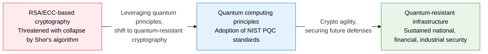
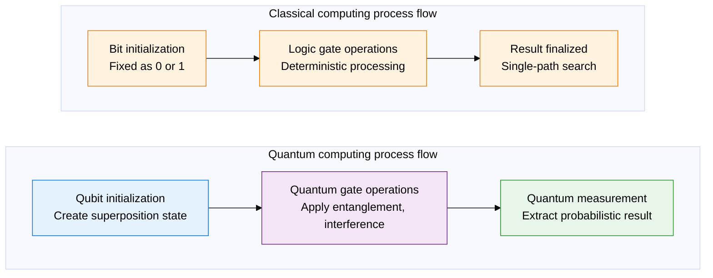
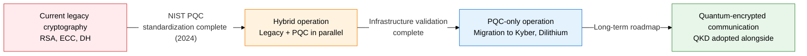

## 1. Overview of Quantum Information Technology and PQC, the Quantum Threat That Breaks Existing Cryptography and the Shift to Lattice-Based Cryptography

**Definition**: A technology system that combines quantum computing, which performs exponential parallel computation via the quantum-mechanical principles of superposition, entanglement, and interference, with PQC (Post-Quantum Cryptography), based on math problems unsolvable even by quantum computers, to reshape the future cryptographic ecosystem.
- Shor's algorithm can break RSA/ECC-based public-key cryptography in polynomial time on a large-scale quantum computer
- NIST finalized CRYSTALS-Kyber, Dilithium, and FALCON as PQC standards in 2024
- Fields requiring long-term secrecy, such as national infrastructure, finance, and healthcare, must establish an immediate transition strategy

**Characteristics**:
- **Exponential parallelism**: N qubits explore 2^N states simultaneously, giving an exponential speed advantage over classical computers
- **Quantum resistance**: Lattice-, hash-, and code-based math problems cannot be solved in polynomial time even by quantum algorithms
- **Crypto agility**: Existing PKI infrastructure can be kept while migrating gradually to PQC algorithms

---

## 2. Core Structure of Quantum Information Technology and PQC

### A. Basic Quantum Computing Principles and the Shor's Algorithm Threat

| Quantum principle | Definition | Computing use |
|---|---|---|
| **Superposition** | A qubit exists as 0 and 1 at the same time | N qubits search 2^N possible cases simultaneously |
| **Entanglement** | The states of two qubits correlate non-locally | Instant state synchronization between qubits accelerates parallel computation |
| **Interference** | Constructive and destructive interference of probability amplitudes highlights the correct path | Cancels wrong paths and amplifies the correct-answer probability to extract the right result |
| **Shor's algorithm** | Solves integer factorization in polynomial time via the quantum Fourier transform | Breaks 2048-bit RSA within hours on a quantum computer with thousands of qubits |

---

### B. NIST PQC Standard Algorithms and the Cryptographic Migration Roadmap

| Category | RSA-2048 | ECC-256 | CRYSTALS-Kyber | CRYSTALS-Dilithium |
|---|---|---|---|---|
| **Underlying problem** | Integer factorization | Elliptic curve discrete logarithm | Lattice LWE problem | Lattice MLWE/MSIS problem |
| **Quantum resistance** | Vulnerable to Shor's algorithm | Vulnerable to Shor's algorithm | Quantum-resistant | Quantum-resistant |
| **Use** | Key exchange, digital signature | Key exchange, digital signature | Key encapsulation (KEM) | Digital signature (DSA) |
| **Key size** | 2048 bit | 256 bit | 800-1568 byte | 1312-2592 byte |
| **NIST standard** | FIPS 186 (legacy) | FIPS 186 (legacy) | FIPS 203 (2024) | FIPS 204 (2024) |

---

## 3. Expected Benefits and Practical Applications of Adopting Quantum Information Technology and PQC

| Category | Key benefits | Practical applications |
|---|---|---|
| **National security** | Sustains long-term secrecy for national and military communications, preemptively blocks the quantum threat | Prioritize CRYSTALS-Kyber-based TLS 1.3 KEM adoption in government PKI, establish a crypto-agility policy |
| **Finance and fintech** | Quantum-resistant digital signatures and certificate systems keep financial transactions secure | Pilot Dilithium-based certificate issuance in banking apps and digital-signature systems, run hybrid authentication |
| **Industry and IoT** | Protects long-lived industrial equipment data and verifies firmware integrity over the long term | Apply a lightweight PQC library (liboqs) to IoT firmware OTA signing, protect the device life cycle |
| **Technology transition** | Hybrid PQC adoption preserves legacy compatibility and minimizes the risk of gradual migration | Use NIST-standard open-source tools (the OpenSSL 3.x PQC branch), conduct crypto-migration impact assessments |
