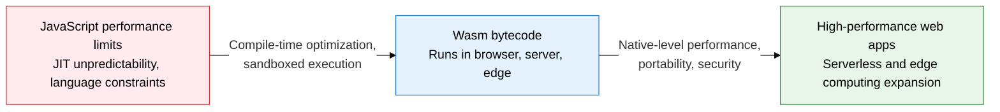
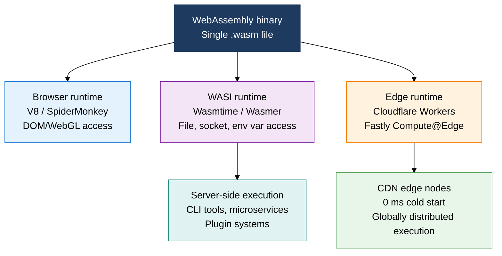

## 1. Overview of WebAssembly, a Universal Binary That Runs at Native Speed Anywhere — Browser, Server, or Edge

**Definition**: An open binary instruction format that converts code written in system languages such as C/C++ and Rust into bytecode optimized at compile time, and runs it in a sandbox at near-native speed across browser, server, and edge environments.
- Adopted as a W3C standard, running identically in every major browser — Chrome, Firefox, Safari, Edge
- Extends beyond the browser to server and edge through WASI (WebAssembly System Interface), which abstracts OS system calls
- Enables CPU-intensive workloads — game engines, video processing, AI inference, encryption — to run inside the browser

**Characteristics**:
- **Portability**: A single .wasm binary runs anywhere, regardless of CPU architecture or OS
- **Sandboxed security**: Memory, file, and network access are allowed only after explicit, capability-based permission
- **Language diversity**: Dozens of languages — C/C++, Rust, Go, Python, AssemblyScript, and more — can compile to Wasm

---

## 2. Core Structure of WebAssembly

### A. Wasm Compilation Pipeline and Comparison with JavaScript

```mermaid
%%{init: { 'theme': 'base', 'themeVariables': { 'edgeLabelBackground': '#fff' }}}%%
flowchart LR
    SRC["Source code<br/>C / C++ / Rust"] --"LLVM<br/>compiler"--> WAT["WAT text format<br/>Human-readable Wasm"]
    WAT --"wasm-opt<br/>binary conversion"--> WASM["Wasm bytecode<br/>.wasm binary"]
    WASM --"Browser<br/>JIT compilation"--> NATIVE["Native machine code<br/>Runs on V8, SpiderMonkey"]
    NATIVE --"DOM/JS API<br/>interop calls"--> WEB["Web app features<br/>Canvas, WebGL, WebGPU"]
    style SRC fill:#FFF3E0,stroke:#F57C00,color:#000
    style WAT fill:#E0F2F1,stroke:#00796B,color:#000
    style WASM fill:#1E3A5F,stroke:#1E3A5F,color:#fff
    style NATIVE fill:#E3F2FD,stroke:#1976D2,color:#000
    style WEB fill:#E8F5E9,stroke:#388E3C,color:#000
```

| Comparison item | JavaScript | WebAssembly |
|---|---|---|
| **Execution performance** | JIT-optimized, unpredictable type inference | Precompiled and optimized, about 10-20% of native |
| **Security model** | Same-origin policy, risk of prototype pollution | Linear-memory sandbox, capability-based access control |
| **Supported languages** | JavaScript/TypeScript only | Many languages: C, C++, Rust, Go, Python, and more |
| **File size** | Text-based source transfer, parsing cost | Binary format, fast parsing |
| **Main applications** | UI logic, DOM manipulation, lightweight computation | Game engines, video processing, AI inference, encryption |

---

### B. WASI Server-Side Extension and the Edge Runtime Execution Environment

| Category | Container (Docker) | WebAssembly + WASI |
|---|---|---|
| **Startup time** | Hundreds of ms to several seconds cold start | Under a few ms (Cloudflare Workers targets 0 ms) |
| **Image size** | Tens to hundreds of MB, includes an OS layer | Just a few KB to a few MB of binary |
| **Security isolation** | Based on Linux namespaces and cgroups | Capability-based sandbox, no OS kernel included |
| **Portability** | Requires an image build per OS/architecture | A single .wasm runs in every environment |
| **Standardization** | OCI container standard | W3C Wasm + WASI standard in progress |
| **Founder's remark** | Docker's founder: "If WASM+WASI existed in 2008, we would not have needed Docker" | Seen as the next-generation execution unit that could replace containers |

---

## 3. Expected Benefits and Practical Applications of Adopting WebAssembly

| Category | Key benefits | Practical applications |
|---|---|---|
| **Web performance** | Accelerates CPU-intensive workloads over 10x versus JavaScript, transforming user experience | Port a C++ rendering engine to Wasm the way Figma and AutoCAD Web do, integrate with WebGPU |
| **Serverless efficiency** | Eliminating cold starts and using lightweight binaries can cut edge-function costs by over 90% | Deploy Rust-compiled Wasm microservices on Cloudflare Workers and Fastly Compute@Edge |
| **Security isolation** | The capability-based sandbox blocks plugins and third-party code from compromising the host system | Apply a Wasm sandbox to a multi-tenant SaaS plugin architecture, use frameworks like extism and wasmtime |
| **Technology diversity** | Rust, Go, and Python developers can target web, server, and edge from a single binary | Port existing C/C++ libraries to Wasm with Emscripten, integrate into the front-end build pipeline |
