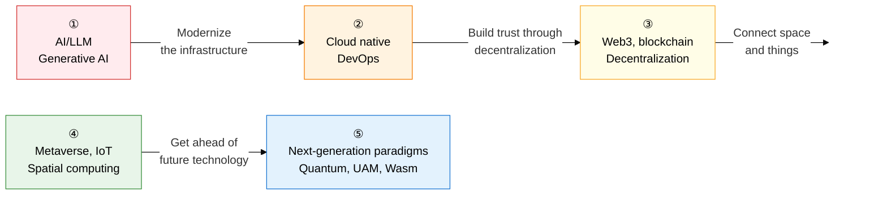

Emerging technology trends are **"the front line of technical innovation, where AI, cloud, Web3, spatial computing, and next-generation paradigms are reshaping industry."**  
From generative AI and cloud native to blockchain, the metaverse, and quantum computing, this section systematically covers the latest technology trends and practical applications that a Professional Engineer must master.

## Learning Roadmap — A 5-Stage Flow

---

## ① AI, LLM, and Generative AI

> **"The AI innovation domain where deep-learning-based large language models and generative AI are reshaping every industry."**  
> The Transformer's self-attention principle, RLHF alignment techniques, criteria for choosing RAG vs. fine-tuning, and the AI agent ReAct pattern are the most frequently tested topics.

| Order | Topic | Key keywords | Importance |
|:---:|---|---|:---:|
| 1 | [Deep Learning Architecture and Transformers](01-ai-llm/deep-learning-architecture) | CNN, RNN, LSTM, attention/self-attention, encoder-decoder, transfer learning | ★★★ |
| 2 | [Generative AI and LLMs](01-ai-llm/generative-ai-llm) | Pretraining, instruction tuning, RLHF/PPO/DPO, multimodal, vision-language | ★★★ |
| 3 | [RAG, Fine-Tuning, and Prompt Engineering](01-ai-llm/rag-finetuning) | RAG pipeline, PEFT/LoRA/adapter, CoT, few-shot, prompt optimization | ★★★ |
| 4 | [AI Agents and Autonomous Systems](01-ai-llm/ai-agent) | ReAct pattern, multi-agent orchestration, autonomous-driving perception/planning/control | ★★★ |

**→ Key study points**: Explain the Transformer's **self-attention matrix operation (Q, K, V)** as a "weighted sum by query-key similarity" flow, without equations, and compare the **application conditions, cost, and trade-offs** of RAG (retrieval-augmented) versus fine-tuning (weight update) in a table.

---

## ② Cloud Native and DevOps

> **"A strategy for building modern IT infrastructure and unifying development and operations through containers, orchestration, and GitOps."**  
> The IaaS/PaaS/SaaS shared-responsibility boundary, Kubernetes Control Plane structure, and the GitOps pull-based principle are frequent essay topics.

| Order | Topic | Key keywords | Importance |
|:---:|---|---|:---:|
| 5 | [Cloud Computing In Depth](02-cloud-native/cloud-computing) | IaaS/PaaS/SaaS/XaaS service models, public/private/hybrid/multi deployment models | ★★★ |
| 6 | [Containers, Kubernetes, and Service Mesh](02-cloud-native/container-kubernetes) | Docker namespaces/cgroups, K8s Control Plane/Pod/Service, Istio/Envoy, serverless cold start | ★★★ |
| 7 | [GitOps and Immutable Infrastructure](02-cloud-native/gitops-immutable) | Git as SSOT, ArgoCD/Flux pull-based delivery, immutable infrastructure (replace, not repair), IaC | ★★☆ |

**→ Key study points**: Diagram the role split between Kubernetes' **Control Plane (etcd, API server, scheduler, controller) vs. worker node (kubelet, kube-proxy, Pod)**, and explain the security and audit differences between GitOps's **push vs. pull** approach.

---

## ③ Web3, Blockchain, and Decentralization

> **"A trust-based digital economy built on distributed ledgers, smart contracts, and self-sovereign identity."**  
> Comparing consensus algorithms (PoW, PoS, PBFT), the EVM smart-contract execution principle, and the DID/VC/VP three-party trust model are frequent topics.

| Order | Topic | Key keywords | Importance |
|:---:|---|---|:---:|
| 8 | [Blockchain Mechanisms](03-web3-blockchain/blockchain-mechanism) | DLT, Merkle tree, hash chain, PoW/PoS/PBFT consensus algorithms, public vs. permissioned blockchain | ★★★ |
| 9 | [Smart Contracts, STOs, NFTs, CBDC](03-web3-blockchain/smart-contract-tokens) | EVM smart contracts, STO security tokens, NFT ERC-721, retail/wholesale CBDC | ★★★ |
| 10 | [DID and SSI Decentralized Identity](03-web3-blockchain/did-ssi) | W3C DID, VC/VP/holder/issuer/verifier, SSI self-sovereign identity, mobile ID | ★★☆ |

**→ Key study points**: Tabulate the **energy, scalability, and security trade-offs** of PoW (energy consumption, 51% attack), PoS (stake-based, economic penalty), and PBFT (permissioned, O(n²) message complexity), and diagram the three-part structure of a DID document — **DID subject, DID method, and verification method**.

---

## ④ Metaverse, IoT, and Spatial Computing

> **"Spatial computing technology that dissolves the boundary between virtual and real to build a physical-digital fusion environment."**  
> Comparing the four XR types (VR, AR, MR, XR), the digital twin's five maturity stages, and the AIoT edge-cloud layer structure are frequent essay topics.

| Order | Topic | Key keywords | Importance |
|:---:|---|---|:---:|
| 11 | [Metaverse and Digital Twin](04-metaverse-iot/metaverse-digital-twin) | XR (VR, AR, MR), digital twin's five maturity stages, spatial computing/metaverse platforms | ★★☆ |
| 12 | [AIoT, Edge Computing, V2X, Smart Factory](04-metaverse-iot/aiot-edge) | AIoT sensor networks, edge vs. cloud latency/bandwidth, V2X communication, IIoT/CPS | ★★★ |

**→ Key study points**: Connect the digital twin's **five maturity stages (technical replication → remote → simulation → autonomous → predictive)** to a real smart-factory case, and explain with numeric examples how edge computing improves **latency, bandwidth, and privacy** compared to the cloud.

---

## ⑤ Next-Generation Paradigms and New Growth Technology

> **"New growth drivers — quantum computing, UAM, WebAssembly, and more — forming the technology ecosystem of the future."**  
> The NIST PQC's four core algorithms (CRYSTALS-Kyber, Dilithium), the Wasm sandbox execution principle, and the UAM UTM system structure are the newest frequent topics.

| Order | Topic | Key keywords | Importance |
|:---:|---|---|:---:|
| 13 | [Quantum Information Technology and PQC](05-nextgen/quantum-computing) | Qubits, quantum superposition/entanglement/interference, Shor's algorithm's threat to RSA, CRYSTALS-Kyber/Dilithium/FALCON | ★★★ |
| 14 | [UAM and Low-Earth-Orbit Satellite Communication](05-nextgen/mobility-uam) | UAM eVTOL/UTM, LEO satellite broadband (Starlink, OneWeb), integrated satellite-terrestrial network | ★★☆ |
| 15 | [WebAssembly and WASI](05-nextgen/webassembly) | Wasm bytecode/sandbox, WASI system interface, server-side and edge Wasm | ★★☆ |

**→ Key study points**: Connect the principle behind quantum computing **breaking RSA/ECC via Shor's algorithm** to why NIST PQC standards achieve resistance through **lattice-based math structures**, and explain WebAssembly's differentiators in **security, portability, and performance versus the JVM and native code**.

---

## Professional Engineer Exam Strategy

| Question pattern | Key response strategy |
|---|---|
| **Explain the principle** | Describe Transformer self-attention, blockchain Merkle trees, and qubit superposition/entanglement in prose mechanism, without equations |
| **Comparison questions** | RAG vs. fine-tuning, PoW vs. PoS vs. PBFT, edge vs. cloud, VM vs. container vs. serverless |
| **Architecture explanation** | Diagram the K8s Control Plane, the DID three-party trust model, the AI agent ReAct cycle, and CBDC issuance models |
| **Latest trends** | NIST PQC CRYSTALS algorithms, GitOps pull-based deployment, NFT ERC-721 metadata, the UAM UTM system |
| **Legal and regulatory links** | The EU AI Act's high-risk AI systems, the W3C DID standard, the NIST PQC standardization timeline, blockchain regulatory sandboxes |
