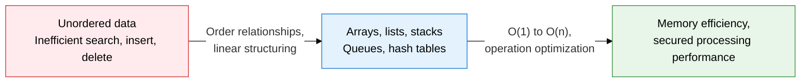
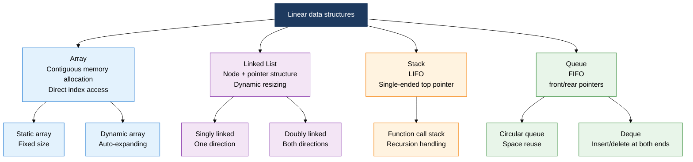
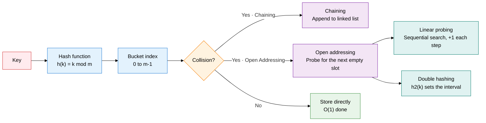

## 1. Overview of Linear Data Structures, Managing Ordered Data as Contiguous, Linked, LIFO, or FIFO

**Definition**: A basic classification of data structures that lines data up in a row and expresses order relationships through indexes, pointers, and access policies.
- Includes arrays (fixed index), linked lists (pointer links), stacks (LIFO), queues (FIFO), and hash tables (key-value mapping)
- Each data structure has different time-complexity characteristics for search, insert, and delete, so the choice depends on purpose
- The most basic building block of algorithm implementation, used extensively inside operating systems, compilers, and databases

**Characteristics**:
- **Varied access patterns**: Supports patterns from direct index access (arrays) to LIFO/FIFO policy access (stacks, queues)
- **Different memory layouts**: Arrays sit in contiguous memory and are cache-friendly; linked lists sit in scattered memory and resize dynamically
- **Hash-based O(1)**: A hash table averages O(1) search and insert, the core structure optimized for large-scale data processing

---

## 2. Core Structure of Linear Data Structures

### A. Structure and Time Complexity of Arrays, Linked Lists, Stacks, and Queues

| Data structure | Search | Insert (front) | Insert (back) | Delete | Memory |
|---|---|---|---|---|---|
| **Array** | O(1) | O(n) | O(1) amortized | O(n) | Contiguous allocation, high cache efficiency |
| **Linked list** | O(n) | O(1) | O(n) or O(1)* | O(1)** | Scattered allocation, pointer overhead |
| **Stack** | O(n) | — | O(1) push | O(1) pop | Array- or list-based |
| **Queue** | O(n) | O(1) enqueue | — | O(1) dequeue | Circular array for space reuse |
| **Deque** | O(n) | O(1) | O(1) | O(1) at both ends | Doubly linked list based |

*O(1) if a tail pointer is kept; **assumes a pointer to the node is already held

---

### B. Hash Table: Hash Function Principle and Collision Resolution

| Category | Chaining | Open Addressing |
|---|---|---|
| **Collision resolution** | Links entries into a list at the same bucket | Probes for an empty slot and relocates |
| **Space efficiency** | Load factor can exceed 1 | Load factor must stay below 1 |
| **Search performance** | Average O(1 + α), α = load factor | Performance drops sharply as load factor rises |
| **Implementation complexity** | Simple, easy to delete | Deletion requires tombstone marking |
| **Cache efficiency** | Low (pointer dereferencing) | High (contiguous-memory probing) |
| **Recommended load factor** | 0.7 or below | 0.5-0.7 or below |
| **Common probing methods** | — | Linear probing, quadratic probing, double hashing |

---

## 3. Expected Benefits and Practical Applications of Linear Data Structures

| Category | Key benefits | Practical applications |
|---|---|---|
| **Performance optimization** | Choosing the data structure that fits the operation minimizes time complexity | Use a hash table for frequent lookups, a queue for order processing, a stack for recursion |
| **Memory efficiency** | Mixing arrays and linked lists meets both static and dynamic memory needs | Use an array for fixed-size data, a linked list for frequent insert/delete |
| **System implementation** | Stacks and queues implement core OS scheduler and compiler functions | Managing the function call stack, process wait queues, BFS/DFS search engines |
| **Data access** | A hash table's average O(1) performance speeds up large-scale key-value lookups | DB indexes, cache implementations (Redis), language runtime symbol tables |
