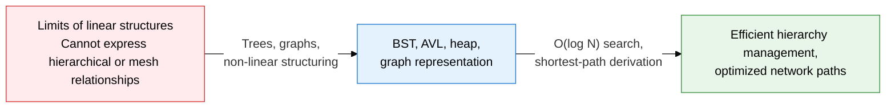
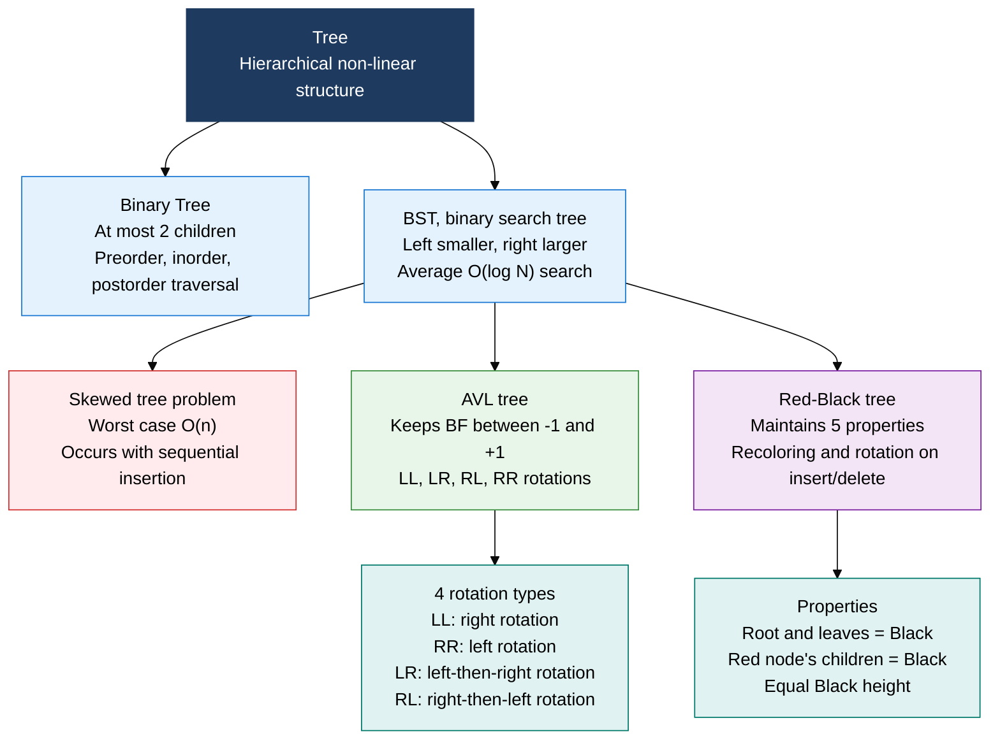
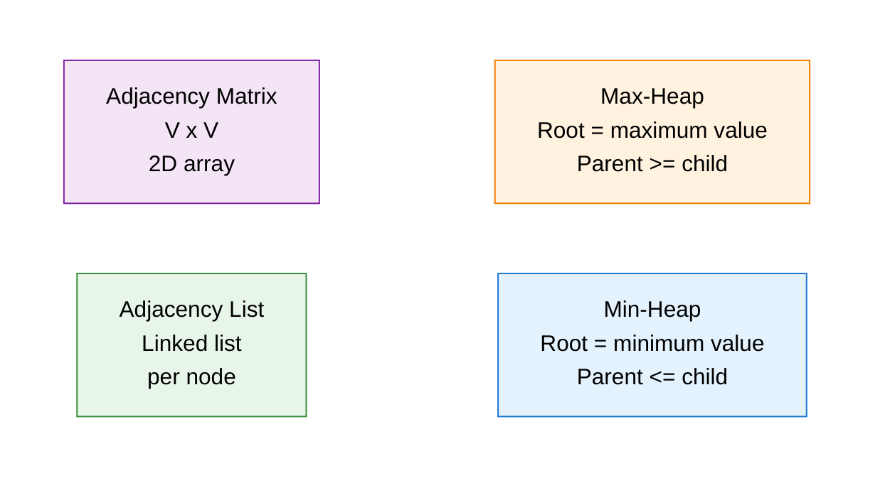

## 1. Overview of Non-Linear Data Structures, Representing Hierarchical and Connective Relationships as Trees and Graphs

**Definition**: A non-linear data structure that represents data through parent-child hierarchy (tree) or arbitrary connections (graph) between nodes.
- A tree is an acyclic hierarchy used for search, sorting, and priority management; a graph represents arbitrary connection relationships
- BST offers O(log N) search, a heap offers O(log N) insert/delete to implement a priority queue, and graphs support shortest-path algorithms
- A core foundation for many real-world systems: file systems, DB indexes (B-Tree), network routing, and social graphs

**Characteristics**:
- **Guaranteed self-balancing**: AVL and Red-Black trees use rotation operations to prevent skewed trees and guarantee O(log N)
- **Priority handling**: A heap structure gives O(1) access to the max/min value and O(log N) insert/delete, implementing schedulers and event queues
- **Representational flexibility**: A graph uses an adjacency matrix or adjacency list to represent sparse and dense graphs with a balance of memory and performance

---

## 2. Core Structure of Non-Linear Data Structures

### A. Tree Structures: Binary Tree, BST, AVL, Red-Black Tree

| Category | BST | AVL tree | Red-Black tree |
|---|---|---|---|
| **Average search** | O(log N) | O(log N) | O(log N) |
| **Worst-case search** | O(n) when skewed | O(log N) guaranteed | O(log N) guaranteed |
| **Insert cost** | O(log N) | O(log N) + rotation | O(log N) + recoloring |
| **Delete cost** | O(log N) | O(log N) + rotation | O(log N) + recoloring |
| **Balance condition** | None | BF strictly -1 to +1 | Equal Black height |
| **Rotation frequency** | None | Frequent on every insert/delete | Relatively rare on insert/delete |
| **Main use** | Basic search | Read-heavy systems | Linux kernel, Java TreeMap |

---

### B. Heap and Graph Representation Structures

| Category | Max-heap | Min-heap |
|---|---|---|
| **Root value** | Overall maximum | Overall minimum |
| **Insert** | O(log N) sift-up | O(log N) sift-up |
| **Delete (root)** | O(log N) sift-down | O(log N) sift-down |
| **Max/min access** | O(1) | O(1) |
| **Main use** | Max-priority queue, heap sort | Dijkstra's shortest path, task scheduler |

| Category | Adjacency matrix | Adjacency list |
|---|---|---|
| **Space complexity** | O(V²) | O(V + E) |
| **Edge check** | O(1) | O(degree) |
| **Full edge traversal** | O(V²) | O(V + E) |
| **Suited to** | Dense graphs (E close to V²) | Sparse graphs (E close to V) |
| **Memory efficiency** | Very wasteful on sparse graphs | Efficient on sparse graphs |
| **Implementation difficulty** | Simple (2D array) | Moderate (array of linked lists) |

---

## 3. Expected Benefits and Practical Applications of Non-Linear Data Structures

| Category | Key benefits | Practical applications |
|---|---|---|
| **Search performance** | AVL/Red-Black trees guarantee O(log N), preventing performance loss from skewed trees | DB indexes (B-Tree), Java TreeMap/TreeSet, the Linux kernel's process scheduler |
| **Priority management** | Heap-based O(1) min-value access enables real-time priority queue processing | OS process scheduling, Dijkstra's shortest path, event-driven systems |
| **Network modeling** | Graph structures efficiently represent complex connections and path search | Shortest-path routing protocols, social-network relationship analysis, building dependency graphs |
| **Space optimization** | Choosing an adjacency list or matrix to fit sparse or dense graph characteristics | Cutting memory on large-scale graphs, optimizing sparse-matrix operations, improving cache locality |
