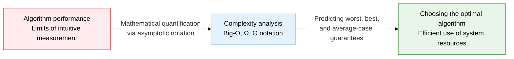
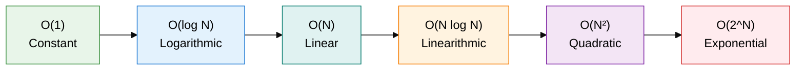
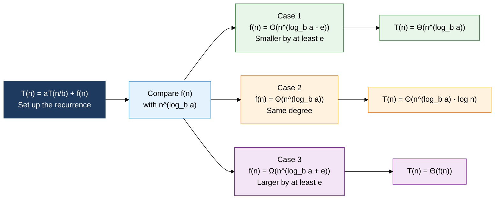

## 1. Overview of Complexity Analysis, Mathematically Expressing the Growth Rate of Resource Consumption as Input Size Grows

**Definition**: An analytical methodology that mathematically expresses, via asymptotic notation, how an algorithm's execution time and memory usage grow with input size n.
- Time complexity: expresses the operation count as a function of input size n
- Space complexity: expresses the memory an algorithm needs as a function of n
- Compares an algorithm's intrinsic performance abstractly, independent of hardware or environment

**Characteristics**:
- **Asymptotic analysis**: Ignores constant factors and lower-order terms, focusing on the growth trend as input becomes sufficiently large
- **Three notations**: Big-O (worst case), Ω (best case), and Θ (average, exact asymptotic bound) each carry a different performance guarantee
- **Recurrence analysis**: The Master Theorem derives a closed-form complexity for divide-and-conquer algorithms

---

## 2. Core Structure of Complexity Analysis

### A. Time/Space Complexity and the Three Asymptotic Notations

| Notation | Meaning | Description | Example |
|---|---|---|---|
| **Big-O (O)** | Asymptotic upper bound (worst case) | Positive constants c, n₀ exist such that f(n) ≤ c·g(n) | Bubble sort O(N²) |
| **Omega (Ω)** | Asymptotic lower bound (best case) | Positive constants c, n₀ exist such that f(n) ≥ c·g(n) | Linear search Ω(1) |
| **Theta (Θ)** | Asymptotic tight bound (average) | Both c₁·g(n) ≤ f(n) ≤ c₂·g(n) hold | Merge sort Θ(N log N) |
| **O(1)** | Constant time | Independent of input size, a single operation | Array index access, hash lookup |
| **O(log N)** | Logarithmic time | Search range halves at every step | Binary search, balanced BST |
| **O(N)** | Linear time | Operations grow proportionally to input size | Linear search, array traversal |
| **O(N log N)** | Linearithmic time | Optimal complexity for divide-and-conquer-based sorting | Merge sort, quicksort (average) |
| **O(N²)** | Quadratic time | Nested loops, inefficient sorting | Bubble, selection, insertion sort |
| **O(2^N)** | Exponential time | Exploring every subset, exponential blowup | Fibonacci (naive recursion), enumerating subsets |

---

### B. The Master Theorem and Deriving Recurrence Complexity

| Case | Condition | Result | Derivation example |
|---|---|---|---|
| **Case 1** | f(n) is smaller than n^(log_b a) by at least a polynomial degree e | T(n) = Θ(n^(log_b a)) | T(n)=8T(n/2)+n² → log₂8=3, f(n)=n²=O(n^(3-1)) → Θ(n³) |
| **Case 2** | f(n) is asymptotically the same degree as n^(log_b a) | T(n) = Θ(n^(log_b a) · log n) | Merge sort T(n)=2T(n/2)+n → log₂2=1, f(n)=n=Θ(n¹) → Θ(N log N) |
| **Case 3** | f(n) is larger than n^(log_b a) by at least a polynomial degree e (regularity condition holds) | T(n) = Θ(f(n)) | T(n)=T(n/2)+n → log₂1=0, f(n)=n=Ω(n^(0+1)) → Θ(N) |
| **Merge sort derivation** | T(n)=2T(n/2)+n, a=2, b=2, f(n)=n | n^(log₂2)=n¹ = f(n) → Case 2 | T(n) = Θ(N log N) — O(1) split + O(N) merge × log N levels |

---

## 3. Expected Benefits and Practical Applications of Complexity Analysis

| Category | Key benefits | Practical applications |
|---|---|---|
| **Design** | Comparing candidate algorithms' performance mathematically before implementation minimizes rework | Estimate the expected input-size range during requirements analysis, then set an acceptable complexity ceiling |
| **Optimization** | Identifying the complexity class of a bottleneck reveals the path from O(N²) to O(N log N) | Profile to find hotspots, swap in a better sorting/search algorithm, or adopt a hash-based structure |
| **Recurrence analysis** | The Master Theorem quickly derives a closed-form complexity for divide-and-conquer algorithms | Verify cases the Master Theorem cannot handle with the recursion-tree method or the substitution method |
| **Testing and validation** | Verifying both correctness and efficiency, theoretically and empirically, builds confidence | Measure execution time across input sizes and confirm the actual complexity class on a log-log plot |
