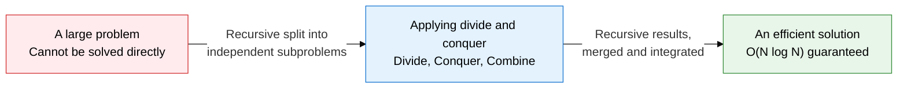
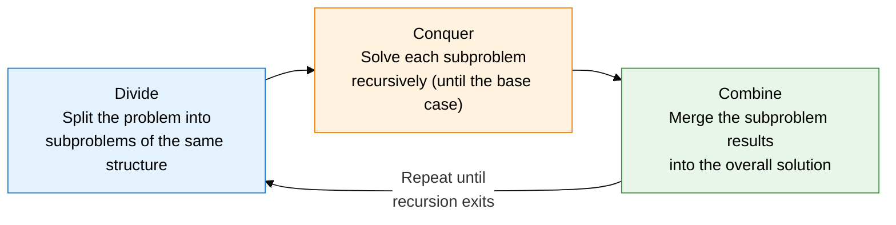
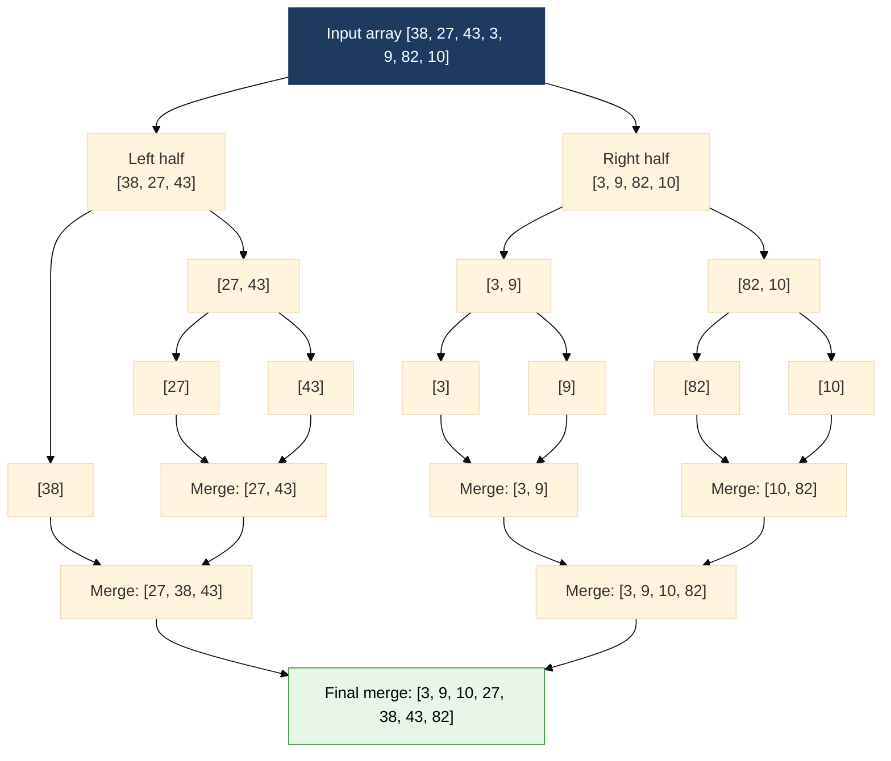

## 1. Overview of Divide and Conquer, Which Splits a Big Problem into Independent Subproblems, Solves Them Recursively, and Combines the Results

**Definition**: An algorithm design paradigm that divides a problem into independent subproblems of the same type, conquers each subproblem recursively, and combines the results into the overall solution.
- Applicability: the subproblems share the same structure as the original problem (recursiveness), and are independent of each other (no redundant computation)
- A base case must be defined: without a recursion exit condition, infinite recursion results
- Complexity is analyzed via the Master Theorem using the recurrence T(n) = aT(n/b) + f(n)

**Characteristics**:
- **Problem independence**: The split subproblems are solved independently with no redundant computation — the key difference from DP
- **Recursive structure**: Applying the same algorithm repeatedly to smaller inputs keeps the code concise and logically clear
- **Parallel scalability**: Independent subproblems can be processed in parallel, giving high scalability on multi-core and distributed systems

---

## 2. Core Structure of Divide and Conquer

### A. The 3-Stage Paradigm and How It Differs from DP

| Comparison item | Divide and Conquer | Dynamic Programming |
|---|---|---|
| **Subproblem relationship** | Independent — no redundant computation | Overlapping subproblems — results are reused |
| **Approach** | Top-down recursion | Top-down (memoization) + bottom-up (tabulation) |
| **Storing results** | Not stored | Stored in a memoization table |
| **Well-suited problems** | Sorting, search, matrix multiplication | Knapsack problem, longest common subsequence, shortest path |
| **Complexity analysis** | Master Theorem | Number of states × transition cost |
| **Representative algorithms** | Merge sort, quicksort, binary search | Fibonacci (memoized), Floyd-Warshall, DP knapsack |

---

### B. Analyzing Merge Sort, Quicksort, and Binary Search

| Algorithm | Splitting method | Time complexity (best, average, worst) | Space complexity | Stability | Key traits and cautions |
|---|---|---|---|---|---|
| **Merge sort** | Even split at the midpoint index | O(N log N) · Θ(N log N) · O(N log N) | O(N) extra space | Stable | Always guarantees O(N log N), needs an extra array, best for linked-list sorting |
| **Quicksort** | Split left/right around a pivot | O(N log N) · Θ(N log N) · O(N²) | O(log N) stack | Unstable | Worst case occurs with an already-sorted array plus a first-element pivot choice; excellent cache efficiency |
| **Why quicksort hits its worst case** | Extreme 1:(n-1) split when the pivot is always the minimum or maximum | - | - | - | Fix: random pivot selection, median-of-3 pivot strategy |
| **Binary search** | Compare against the middle element, discard half the search range | O(log N) · O(log N) · O(log N) | O(1) | - | Requires a sorted array; implement iteratively to avoid stack overflow |

---

## 3. Expected Benefits and Practical Applications of Divide and Conquer

| Category | Key benefits | Practical applications |
|---|---|---|
| **Performance** | Merge sort's and quicksort's guaranteed O(N log N) dramatically speeds up large-scale data processing versus O(N²) simple sorts | Adopt merge sort for database ORDER BY and external sort implementations; use quicksort for internal sorts where cache efficiency matters |
| **Scalability** | Subproblem independence makes horizontal scaling easy in distributed/parallel environments, maximizing multi-core utilization | Apply the divide-and-conquer pattern to MapReduce's split-processing stage; accelerate large-scale log sorting with parallel merge sort |
| **Reusability** | The same divide-and-conquer template solves sorting, search, matrix multiplication, FFT, and more with a consistent structure | Transform optimization problems using parametric search built on binary search |
| **Reliability** | Merge sort's guaranteed O(N log N) worst case delivers predictable response times | Random-pivot quicksort keeps average O(N log N); Java's Arrays.sort uses TimSort (a merge/insertion hybrid) for both stability and performance |
