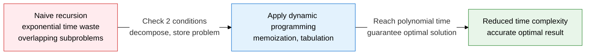
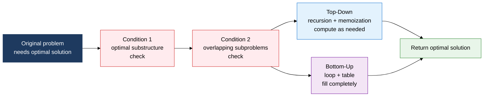
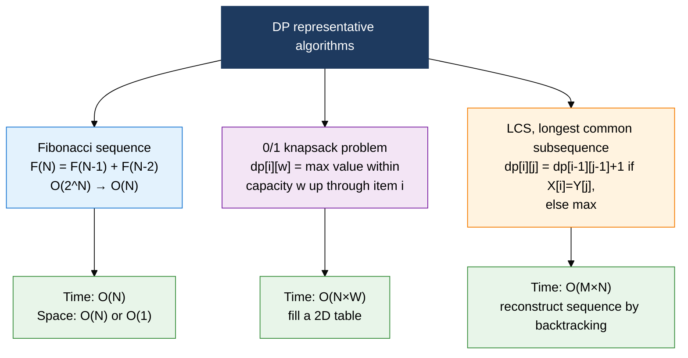

## 1. Overview of dynamic programming, an algorithm technique that removes redundant computation to derive an optimal solution

**Definition**: An algorithm design technique that stores and reuses solutions to subproblems to efficiently find the optimal solution to a problem that satisfies the two conditions of optimal substructure and overlapping subproblems.
- When the same subproblem recurs, cache the computed result to eliminate redundant calculations
- Applied through two implementation styles: Top-Down (memoization) and Bottom-Up (tabulation)
- Unlike greedy algorithms, its strength is a mathematically guaranteed optimum based on exhaustive search

**Characteristics**:
- **Optimal substructure**: the decomposability where the optimal solution to the overall problem is built from the optimal solutions of its subproblems
- **Overlapping subproblems**: the property where the same subproblem recurs repeatedly in the recursion tree, producing a caching effect
- **Polynomial-time guarantee**: cuts exponential-time naive recursion down to O(N) to O(N²), achieving practical optimization

---

## 2. Core structure of dynamic programming

### A. Two conditions for applying DP, and Top-Down vs. Bottom-Up implementation

| Comparison item | Top-Down (memoization) | Bottom-Up (tabulation) |
|---|---|---|
| **Approach** | Recursive calls from a big problem down to small subproblems | Fills the table sequentially starting from small subproblems |
| **Implementation** | Recursive function + cache array (dictionary) | Loop + DP table (array) |
| **Computation scope** | Computes only the subproblems actually needed (lazy) | Precomputes every subproblem (eager) |
| **Space use** | Recursion stack + cache (risk of stack overflow) | Uses only the table (no stack overflow) |
| **Code readability** | Close to the problem definition, intuitive | Needs order awareness, more complex initial design |
| **Suited to** | Cases where only some subproblems are needed | Cases where most subproblems are needed |

---

### B. Fibonacci, 0/1 knapsack, and LCS representative algorithms

| Algorithm | Problem type | State definition | Recurrence | Time complexity |
|---|---|---|---|---|
| **Fibonacci sequence** | Sequence optimization | dp[n]: the n-th Fibonacci number | dp[n] = dp[n-1] + dp[n-2] | O(N) |
| **0/1 knapsack problem** | Combinatorial optimization | dp[i][w]: max value for the i-th item, capacity w | max(dp[i-1][w], dp[i-1][w-wi]+vi) | O(N×W) |
| **LCS** | String comparison | dp[i][j]: LCS length of X[1..i], Y[1..j] | X[i]=Y[j]: dp[i-1][j-1]+1 / else: max(dp[i-1][j], dp[i][j-1]) | O(M×N) |

---

## 3. Expected benefits and practical applications of dynamic programming

| Category | Key benefits | Practical applications |
|---|---|---|
| **Performance optimization** | Cuts exponential-time recursion to polynomial time, securing a practical computation range | Apply memoization to Fibonacci and knapsack problems; prefer Bottom-Up where recursion depth is limited |
| **Optimal-solution guarantee** | Mathematically guarantees a global optimum even on problems where greedy algorithms fail | Applies to string/sequence optimization problems such as edit distance (Levenshtein) and longest increasing subsequence (LIS) |
| **Problem modeling** | Structures complex combinatorial optimization problems into clear recurrences and DP tables | Used in shortest-path (Floyd-Warshall), matrix chain multiplication, interval DP, and other algorithm designs |
| **Algorithm design** | Enables choosing the optimal technique per problem type using clear criteria against divide-and-conquer and greedy | Trains DP pattern recognition for coding tests and algorithm contests, and serves as a basis for practical optimization logic design |
