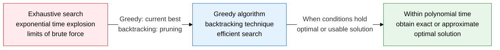
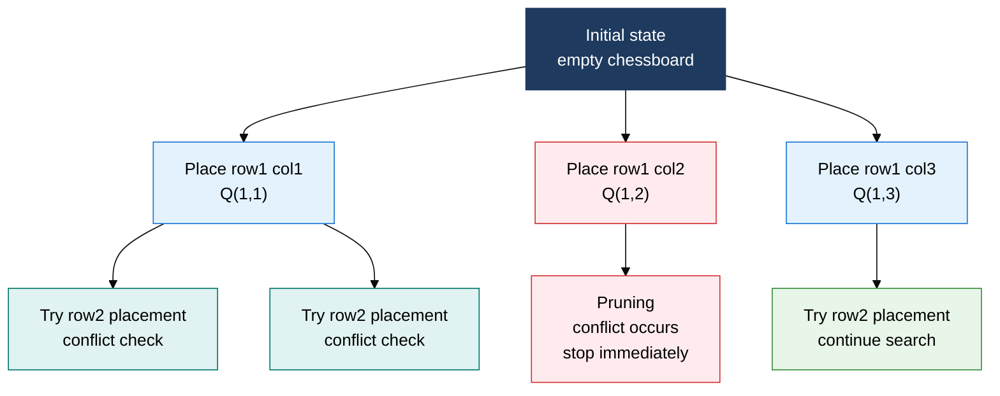

## 1. Overview of greedy and backtracking, algorithms that either aim for a global optimum by picking the current best or prune the search space

**Definition**: A greedy algorithm is a technique that reaches a global optimum by making a locally optimal choice at every step; backtracking is a technique that prunes a state-space tree early along paths with no solution, cutting the cost of exhaustive search.
- A greedy algorithm guarantees an optimal solution only when the two conditions of the greedy-choice property and optimal substructure are proven
- Backtracking is a DFS-based search that reverts on constraint violation, applied to N-Queens, permutation, and combination problems
- Both techniques are simpler to implement than DP, but they differ in applicable problem range and in their optimality guarantees

**Characteristics**:
- **Greedy-choice property**: guarantees that the best choice at the current step, independent of prior choices, is part of the overall optimal solution
- **Pruning**: in backtracking, the search stops immediately once the current path is confirmed unable to contain a solution
- **Complementary relationship**: greedy provides O(N log N)-level speed, while backtracking provides a practical cut of exponential-time search

---

## 2. Core structure of greedy algorithms and backtracking

### A. The two conditions of greedy algorithms, and Huffman coding

```mermaid
%%{init: { 'theme': 'base', 'themeVariables': { 'edgeLabelBackground': '#fff' }}}%%
flowchart LR
    FREQ["Tally character frequency<br/>initialize priority queue"] --> PICK["Extract (dequeue)<br/>2 lowest-frequency nodes"]
    PICK --> MERGE["Sum two nodes<br/>create parent node"]
    MERGE --> INSERT["Insert summed node<br/>into queue (enqueue)"]
    INSERT --> CHECK{"1 node<br/>remaining?"}
    CHECK -->|"No"| PICK
    CHECK -->|"Yes"| TREE["Huffman tree complete<br/>assign prefix codes"]
    TREE --> CODE["High frequency: short code<br/>Low frequency: long code<br/>minimize average code length"]
    style FREQ fill:#E3F2FD,stroke:#1976D2,color:#000
    style PICK fill:#F3E5F5,stroke:#7B1FA2,color:#000
    style MERGE fill:#F3E5F5,stroke:#7B1FA2,color:#000
    style INSERT fill:#FFF3E0,stroke:#F57C00,color:#000
    style CHECK fill:#FFEBEE,stroke:#D32F2F,color:#000
    style TREE fill:#1E3A5F,stroke:#1E3A5F,color:#fff
    style CODE fill:#E8F5E9,stroke:#388E3C,color:#000
```

| Comparison item | Greedy algorithm | Dynamic programming (DP) |
|---|---|---|
| **Selection method** | Locally optimal choice at the current step (no revisiting) | Considers every partial solution before a global choice |
| **Optimality guarantee** | Requires proving greedy-choice property and optimal substructure | Guaranteed when optimal substructure and overlapping subproblems hold |
| **Time complexity** | Generally O(N log N) or better | O(N²) to O(N×W), depending on the problem |
| **Implementation complexity** | Simple (single-direction progression) | Requires table design and deriving a recurrence |
| **Application examples** | Huffman coding, Kruskal's MST, activity-selection problem | Knapsack problem, LCS, edit distance |
| **Failure cases** | Coin change (general coin sets) | Excessive cost on problems where greedy already works |

---

### B. Backtracking, Branch and Bound, and solving N-Queens

| Comparison item | Backtracking | Branch and Bound |
|---|---|---|
| **Search strategy** | DFS-based state-space tree search | BFS or best-first search |
| **Pruning criterion** | Stop on constraint violation (feasibility) | Stop when a lower bound is exceeded (optimality) |
| **Purpose** | Search for a solution meeting the conditions (existence, or all solutions) | Search for a minimum or maximum optimal solution |
| **Applied problems** | N-Queens, permutations/combinations, Sudoku | Traveling Salesman Problem (TSP), 0/1 knapsack optimization |
| **Memory use** | Recursion stack (stores the path) | Search queue, priority queue (stores state) |
| **Performance characteristics** | Worst-case exponential time, practically cut by pruning | Search space shrinks sharply with lower-bound precision |

---

## 3. Expected benefits and practical applications of greedy algorithms and backtracking

| Category | Key benefits | Practical applications |
|---|---|---|
| **Data compression** | Huffman coding generates an optimal prefix code from character frequency, minimizing average code length | Applied to the core entropy-coding stage of practical compression algorithms such as ZIP, DEFLATE, and JPEG |
| **Combinatorial search** | Backtracking's pruning cuts exponential-space search down to a practical level | Implements constraint-based search engines for N-Queens, Sudoku solving, and combinatorial optimization problems |
| **Scheduling, optimization** | Greedy algorithms optimally solve activity-selection and job-scheduling problems in O(N log N) | Applied to CPU scheduling, graph MST (Kruskal, Prim), and network routing path optimization |
| **Algorithm selection** | Chooses among greedy, backtracking, DP, and branch and bound with reasoned justification per problem condition | Used to judge greedy vs. DP by provability in coding tests, and to design practical NP-complete approximation solutions |
