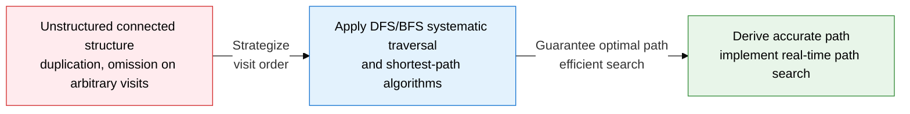
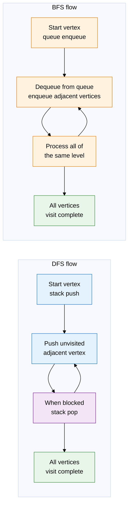
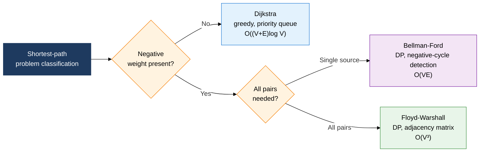

## 1. Overview of graph algorithms, which systematically visit vertices and edges and search for optimal paths

**Definition**: A set of algorithms that systematically traverse a graph's vertices and edges, or find the shortest path between vertices.
- Traversal algorithms (DFS, BFS) record whether each vertex has been visited, so no vertex is missed
- Shortest-path algorithms select the appropriate technique based on edge-weight conditions (whether negative weights exist, whether all pairs are needed)
- Widely used in social network analysis, map route search, compiler dependency analysis, and more

**Characteristics**:
- **Time complexity O(V+E)**: both DFS and BFS visit each vertex and edge once, completing traversal in linear time
- **Shortest-path choice by condition**: applies a different algorithm depending on the presence of negative weights and whether a single source or all pairs is needed
- **Various secondary uses**: DFS is applied to topological sort and cycle detection, BFS to shortest hop count and level-order search

---

## 2. Core structure of graph algorithms

### A. Comparing DFS and BFS traversal strategies

| Comparison item | DFS (depth-first search) | BFS (breadth-first search) |
|---|---|---|
| **Data structure** | Stack, or the recursion call stack | Queue |
| **Search direction** | Follows one direction to the end, then backtracks | Searches level by level, in order of distance from the start |
| **Time complexity** | O(V+E) | O(V+E) |
| **Space complexity** | O(V) — recursion depth or stack size | O(V) — max vertices held in the queue |
| **Shortest path** | Not guaranteed (even unweighted graphs are not guaranteed) | Guarantees the shortest hop count on an unweighted graph |
| **Main uses** | Topological sort, cycle detection, strongly connected components, maze solving | Shortest path (unweighted), level-order search, bipartite graph check |
| **Implementation** | Recursive function or explicit stack | Loop + queue (deque) |

---

### B. Choosing and comparing shortest-path algorithms

| Comparison item | Dijkstra | Bellman-Ford | Floyd-Warshall |
|---|---|---|---|
| **Applicable condition** | No negative-weight edges | Allows negative weights, single source | Allows negative weights, all-pairs shortest path |
| **Algorithm paradigm** | Greedy | Dynamic programming (DP) | Dynamic programming (DP) |
| **Time complexity** | O((V+E) log V) — with a priority queue | O(VE) | O(V³) |
| **Space complexity** | O(V) | O(V) | O(V²) |
| **Negative-cycle detection** | Not possible | Possible — detected by an update on the V-th iteration | Possible — detected by a negative diagonal element |
| **Data structure** | Priority queue (min-heap) | Edge list array | 2D distance matrix |
| **Representative use** | GPS route search, routing protocols (OSPF) | Currency arbitrage (negative exchange-rate cycle detection), Bellman-Ford-based BGP | All-node distance computation, paths including waypoints |

---

## 3. Expected benefits and practical applications of graph traversal and shortest-path algorithms

| Category | Key benefits | Practical applications |
|---|---|---|
| **Search efficiency** | DFS/BFS linear time O(V+E) guarantees complete traversal even on large graphs | Social network friend recommendation (BFS level search), web crawler URL collection (BFS/DFS combined) |
| **Path optimization** | Dijkstra, Bellman-Ford, and Floyd-Warshall accurately derive the optimal path per condition | Navigation shortest path (Dijkstra), network routing protocol (OSPF, BGP) path computation |
| **Anomaly detection** | Negative-cycle detection (Bellman-Ford) automatically identifies abnormal circular structures | Detecting financial currency arbitrage cycles, detecting circular wait in distributed-system deadlocks |
| **Design quality** | Selecting the algorithm that matches the problem condition (negative weights, all-pairs) maximizes performance | Game AI pathfinding (A*-based Dijkstra extension), compiler dependency topological sort (using DFS) |
