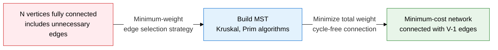
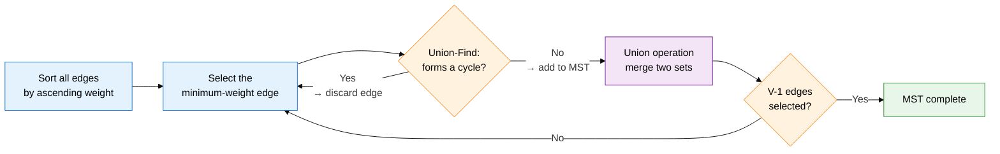
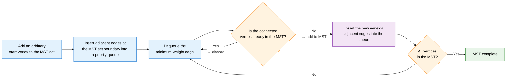

## 1. Overview of MST, a spanning tree that connects all vertices at minimum cost

**Definition**: A spanning tree in a weighted, connected, undirected graph that connects all vertices without a cycle while minimizing the sum of edge weights.
- Consists of exactly V-1 edges connecting V vertices, with no cycle present
- Cut Property: the minimum-weight edge crossing any cut must be included in the MST
- Cycle Property: the largest-weight edge within a cycle is never included in the MST

**Characteristics**:
- **Uniqueness condition**: if every edge weight is distinct, the MST is uniquely determined
- **Greedy validity**: by the cut property, greedily choosing the minimum-weight edge at every step still guarantees a global optimum
- **Two approaches**: choose Kruskal (edge-centric, sparse graphs) or Prim (vertex-centric, dense graphs) to fit the situation

---

## 2. Core structure of minimum spanning trees

### A. Kruskal's algorithm and the Union-Find data structure

| Union-Find operation | Description | Optimization technique | Time complexity |
|---|---|---|---|
| **MakeSet(x)** | Initializes element x as a singleton set | — | O(1) |
| **Find(x)** | Returns the representative (root) of the set containing x | Path compression: links the path directly to the root during Find | O(α(N)) — effectively constant |
| **Union(x, y)** | Merges the two sets containing x and y into one | Union by rank: attaches the smaller tree beneath the larger one | O(α(N)) — effectively constant |
| **Kruskal overall** | Edge sort + V-1 Union-Find operations | Path compression and union by rank applied together | O(E log E) |

---

### B. Prim's algorithm and the basis for MST correctness

| Comparison item | Kruskal's algorithm | Prim's algorithm |
|---|---|---|
| **Approach** | Edge-centric — sort all edges, then select without forming a cycle | Vertex-centric — the MST set expands progressively |
| **Core data structure** | Union-Find (disjoint set) | Priority queue (min-heap) |
| **Time complexity** | O(E log E) — dominated by edge sorting | O((V+E) log V) — dominated by priority-queue operations |
| **Best-suited graph** | Sparse graphs (E is small) | Dense graphs (E close to V²) |
| **Basis for MST correctness** | Cycle property: guarantees exclusion of the maximum-weight edge in a cycle | Cut property: selects the minimum edge crossing the MST set boundary |
| **Implementation complexity** | Simple — sort the edge list, then apply Union-Find | Moderate — requires a decrease-key operation |

---

## 3. Expected benefits and practical applications of minimum spanning trees

| Category | Key benefits | Practical applications |
|---|---|---|
| **Cost optimization** | Mathematically minimizes network connection cost, eliminating resource waste | Minimum-cost design for telecom cable laying, minimum wiring plans for power and water networks |
| **Algorithm selection** | Choosing Kruskal or Prim by graph density achieves optimal performance | Kruskal for sparse networks (router connections), Prim for dense networks (inside a cluster) |
| **Clustering basis** | MST-based clustering efficiently explores data cluster structure | Data-mining cluster analysis (removing the maximum-weight edge from an MST), image segmentation algorithms |
| **Scalability** | Union-Find path compression and union by rank process even large graphs in near-linear time | Community detection on large social graphs, automated distributed-network topology optimization |
