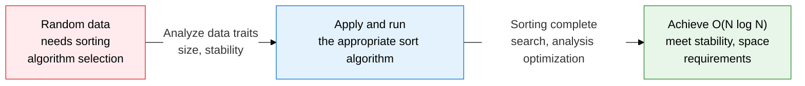
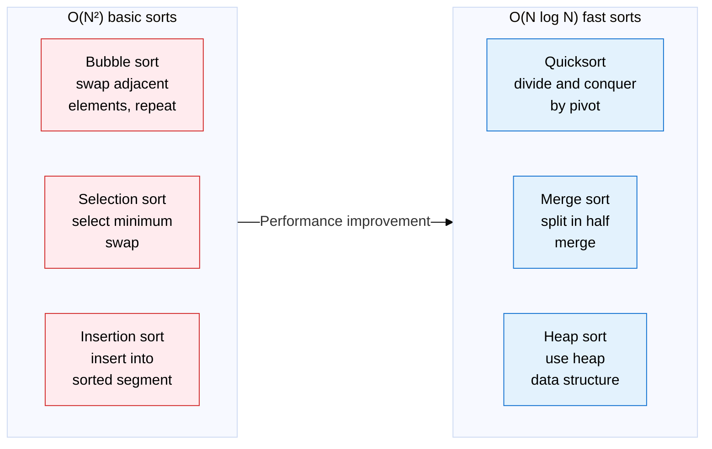
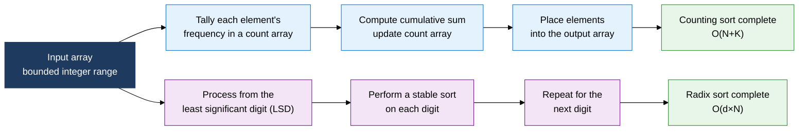

## 1. Overview of sorting algorithms, choosing the optimal sorting strategy for the data's characteristics

**Definition**: An algorithm that rearranges data into a specific order (ascending or descending), classified into comparison-based and non-comparison sorts, chosen by time complexity, space complexity, and stability.
- Comparison-based sorts have a theoretical lower bound of O(N log N), and split further into basic and fast sorts
- Non-comparison sorts (counting, radix) can achieve O(N) under bounded data-range conditions
- In practice, the algorithm is chosen or hybridized based on data size, distribution, and stability requirements

**Characteristics**:
- **Comparison-based lower bound**: the theoretical optimal lower bound for comparison sorting on arbitrary input is mathematically proven to be Ω(N log N)
- **Stability**: the property of preserving the original order of elements with equal keys, important for multi-key sorting
- **In-place**: space-efficient sorting using O(1) extra memory, a practical selection criterion alongside cache locality

---

## 2. Core structure of sorting algorithms

### A. How basic sorts (O(N²)) and fast sorts (O(N log N)) work

| Algorithm | Best time | Average time | Worst time | Space complexity | Stability |
|---|---|---|---|---|---|
| **Bubble sort** | O(N) | O(N²) | O(N²) | O(1) | Stable |
| **Selection sort** | O(N²) | O(N²) | O(N²) | O(1) | Unstable |
| **Insertion sort** | O(N) | O(N²) | O(N²) | O(1) | Stable |
| **Quicksort** | O(N log N) | O(N log N) | O(N²) | O(log N) | Unstable |
| **Merge sort** | O(N log N) | O(N log N) | O(N log N) | O(N) | Stable |
| **Heap sort** | O(N log N) | O(N log N) | O(N log N) | O(1) | Unstable |

---

### B. Counting/radix sort (non-comparison) and algorithm selection criteria

| Comparison item | Comparison-based sort | Non-comparison sort (counting, radix) |
|---|---|---|
| **Time complexity lower bound** | Theoretical lower bound of Ω(N log N) | O(N+K) or O(d×N), linear time possible |
| **Applicable condition** | When any data type with a defined order relation | Integer or finite-range data, when range K is small |
| **Space complexity** | O(1) to O(N) | O(N+K): space waste if K is large |
| **Stability** | Varies by algorithm (merge: stable, quick: unstable) | Both counting and radix sort are stable |
| **Practical selection criteria** | General-purpose data sorting, Java's TimSort, C++ std::sort | Integer score sorting, fixed-digit identifiers (postal codes, phone numbers) |

---

## 3. Expected benefits and practical applications of sorting algorithms

| Category | Key benefits | Practical applications |
|---|---|---|
| **Performance optimization** | O(N log N) fast sorts cut large-dataset processing time by tens of times versus O(N²) | Apply quicksort (average case) or merge sort (when stability is needed) to datasets of millions of records or more |
| **Stability guarantee** | Stable sorts preserve existing order under multi-key sorting, maintaining data integrity | Apply merge sort or TimSort to operations requiring order preservation, such as multi-column DB ORDER BY or transaction-history sorting |
| **Special data handling** | Counting/radix sort achieves O(N) linear time on bounded-integer-range data | Apply counting sort to bounded-range integer data such as grade processing (0-100) or telecom subscriber-number sorting |
| **Algorithm design** | Gains a justified ability to choose a sorting algorithm based on data traits (size, distribution, stability, range) | Understand hybrid sort designs such as Timsort (Python, Java) and Introsort (C++), and implement custom comparators |
