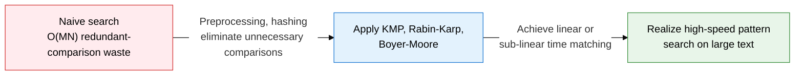
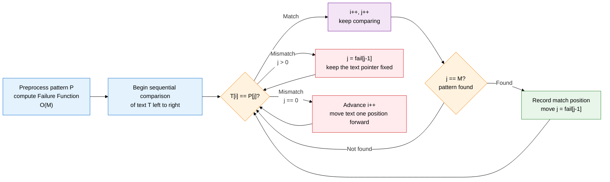
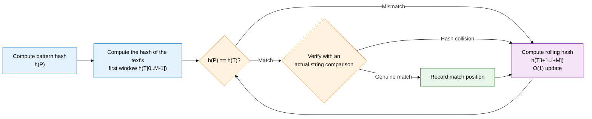

## 1. Overview of string matching algorithms, string search techniques that find a pattern in text quickly

**Definition**: A set of algorithms that find where a pattern of length M appears within a text of length N.
- The naive algorithm has O(MN) worst-case time, and inefficiency worsens as the pattern and text grow longer
- KMP achieves O(M+N) linear time by preprocessing a Failure Function that reuses already-compared information
- Rabin-Karp achieves O(N) average time with a rolling hash; Boyer-Moore achieves sub-linear time with a reverse-comparison heuristic

**Characteristics**:
- **Preprocessing vs. runtime trade-off**: KMP and Boyer-Moore pay a pattern-preprocessing cost to cut search time
- **Hash-based parallel search**: Rabin-Karp's rolling hash extends easily to multi-pattern matching, searching several patterns at once
- **Best practical performance**: Boyer-Moore averages close to O(N/M), making it the most widely used in practical text editors

---

## 2. Core structure of string matching algorithms

### A. The naive algorithm and the KMP algorithm

**KMP Failure Function example — pattern "ABABC"**

| Index j | 0 | 1 | 2 | 3 | 4 |
|---|---|---|---|---|---|
| **Pattern P[j]** | A | B | A | B | C |
| **fail[j]** | 0 | 0 | 1 | 2 | 0 |
| **Meaning** | Prefix/suffix mismatch | Prefix/suffix mismatch | "A" prefix = suffix | "AB" prefix = suffix | Prefix/suffix mismatch |

> fail[j]: the longest length at which a prefix and suffix of P[0..j] coincide (excluding the whole string itself). On a mismatch, the pattern pointer is rolled back by this amount to re-compare without moving the text pointer.

---

### B. The Rabin-Karp and Boyer-Moore algorithms

| Comparison item | Naive | KMP | Rabin-Karp | Boyer-Moore |
|---|---|---|---|---|
| **Preprocessing** | None | Failure Function O(M) | Pattern hash O(M) | Bad Character + Good Suffix table O(M+Σ) |
| **Search time complexity** | O(MN) worst case | O(M+N) — always linear | O(N) average, O(MN) worst (many hash collisions) | O(N/M) average, O(MN) worst |
| **Space complexity** | O(1) | O(M) | O(1) | O(M+Σ) — Σ: alphabet size |
| **Shift amount** | Always advances 1 position | Jumps by the fail value on mismatch | Always slides the window by 1 position | Bad Character: jumps right based on the mismatched character |
| **Core idea** | Sequential comparison at every position | Reuses common prefix/suffix information | O(1)-update sliding-window hash | Compares in reverse from the end of the pattern for maximum jump |
| **Multi-pattern** | Inconvenient | Difficult to extend | Extends easily (combined with Aho-Corasick) | Optimized for a single pattern |
| **Practical use** | Teaching, small-scale search | Stream processing, DNA sequence search | Plagiarism detection, multi-pattern search | Text editor Ctrl+F, grep, virus signatures |

---

## 3. Expected benefits and practical applications of string matching algorithms

| Category | Key benefits | Practical applications |
|---|---|---|
| **Search performance** | KMP and Boyer-Moore cut search time to as low as O(N), versus naive search | Large-scale log-file pattern search (grep), implementing high-speed find-and-replace in text editors |
| **Bioinformatics analysis** | O(M+N) linear time enables fast motif search across millions of bp of DNA or protein sequence | Applied to BLAST-like sequence-search preprocessing and genome-assembly alignment algorithms |
| **Security detection** | Rabin-Karp's multi-pattern extension searches thousands of malicious signatures simultaneously | Applied to IDS/IPS intrusion-detection pattern-matching engines (Snort, Suricata) and antivirus signature scanning |
| **Natural language processing** | Selecting and combining algorithms optimizes preprocessing performance across various text-analysis tasks | Applied to plagiarism-detection systems (Rabin-Karp hash comparison) and accelerating inverted-index construction for search engines |
