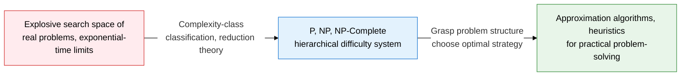
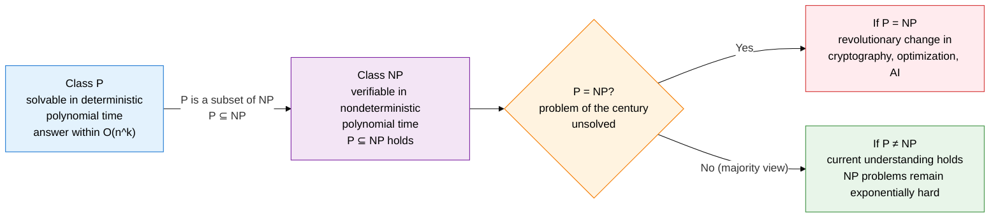
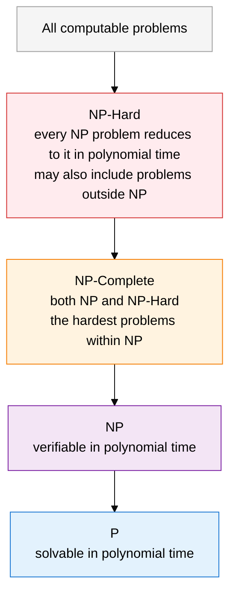

## 1. Overview of P vs. NP computational complexity theory, one of the great unsolved problems of the century

**Definition**: A theoretical framework that mathematically classifies the time and space resource limits needed to solve decision problems, in order to establish the fundamental difficulty of algorithms.
- Scope: defines complexity classes based on decision problems (Yes/No form)
- Key unsolved problem: whether P = NP is one of the seven Millennium Prize Problems named by the Clay Mathematics Institute
- Practical implication: once a problem is identified as NP-Complete, an exact polynomial-time solution is abandoned in favor of approximation or heuristics

**Characteristics**:
- **Hierarchical containment**: strictly orders problem difficulty through the P ⊆ NP ⊆ NP-Hard hierarchy
- **Reducibility**: any NP problem can be transformed into an NP-Complete problem via polynomial reduction
- **Practical design criterion**: proving a problem is NP-Complete becomes the basis for a design decision to switch from an exponential algorithm to approximation, branch and bound, or metaheuristic strategies

---

## 2. Core structure of P vs. NP computational complexity theory

### A. Definitions of the P and NP classes, and the unsolved P vs. NP problem

| Class | Definition | Key condition | Representative examples |
|---|---|---|---|
| **P** | The set of decision problems solvable by a deterministic Turing machine in polynomial time O(n^k) | A solving algorithm exists, polynomial time guaranteed | Sorting, shortest path (Dijkstra), primality testing (AKS), minimum spanning tree |
| **NP** | The set of decision problems verifiable by a nondeterministic Turing machine in polynomial time | Given a candidate answer, whether it is correct can be checked in polynomial time | Hamiltonian path, subset sum, graph coloring, SAT |
| **P ⊆ NP** | Every problem in P also belongs to NP (if it can be solved in P, it can also be verified) | A problem solved in P automatically meets the NP condition | Every example in P also applies to NP |
| **P vs. NP** | The century's unsolved problem of whether P = NP or P ≠ NP is mathematically unproven | Unsolved as of 2025; most researchers presume P ≠ NP | Clay Mathematics Institute Millennium Problem, USD 1 million prize |

---

### B. Definitions of NP-Hard and NP-Complete, their containment relationship, and representative problems

| Class / concept | Definition | Key trait | Representative problems |
|---|---|---|---|
| **NP-Hard** | The set of problems to which every NP problem can be reduced in polynomial time | Need not belong to NP itself; is at least as hard as NP | Halting Problem, general TSP optimization |
| **NP-Complete** | The set of problems that are both in NP and NP-Hard | The hardest problem group within NP, mutually reducible to one another in polynomial time | SAT, 3-SAT, TSP (decision version), Hamiltonian path, graph coloring, clique, subset sum |
| **Polynomial reduction** | A technique that transforms problem A into an input for problem B via a polynomial-time transformation function f, so that solving B solves A | A ≤p B: if B is easy, A is easy; if B is hard, A is hard | Cook-Levin theorem: the original proof that SAT is NP-Complete |
| **3-SAT** | The satisfiability decision problem for a logical formula whose every clause has exactly 3 literals | Reducible from SAT, the starting point for most NP-Complete proofs | Whether some variable assignment makes the whole formula true |
| **TSP (decision version)** | Whether a route visiting all n cities and returning to the start has cost at most k | The optimization version is NP-Hard, the decision version is NP-Complete | Applications in logistics, circuit layout, gene sequence analysis |
| **Graph coloring** | Whether the vertices can be colored with at most k colors so that no two adjacent vertices share a color | NP-Complete for k=3 or more; applications in exam scheduling, frequency allocation | Map four-color problem, wireless channel allocation |
| **Clique** | Whether a complete subgraph of size at least k, in which every vertex is connected to every other, exists in the graph | NP-Complete; applications in social-network and protein-interaction analysis | Detecting core groups in viral marketing |
| **Subset sum** | Whether a subset with a sum of exactly T exists in a set of integers | NP-Complete, a special case of the knapsack problem | Cryptographic primitives (subset-sum cryptography), resource allocation |

---

## 3. Expected benefits and practical applications of understanding P vs. NP computational complexity theory

| Category | Key benefits | Practical applications |
|---|---|---|
| **Algorithm design** | Diagnosing problem difficulty in advance prevents wasted time searching for an unnecessary exact algorithm | After identifying NP-Completeness, switch strategy to approximation algorithms (PTAS, FPTAS), branch and bound, or metaheuristics (GA, SA) |
| **Security, cryptography** | Understand the security basis of RSA and discrete-log-based cryptography, which are built on the P ≠ NP assumption | Establish quantum-resistant cryptography design strategies based on lattice problems (using NP-Hard problems) for the quantum-computing era |
| **Optimization, AI** | Handle NP-Complete combinatorial optimization such as TSP, scheduling, and knapsack within a practical time frame | Applied by combining reinforcement-learning/deep-learning-based heuristics, the LKH algorithm, and integer linear programming (ILP) solvers |
| **Exams, research** | Gain the ability to prove new problems NP-Complete, with a systematic understanding of reduction techniques | Use the Cook-Levin theorem and Karp's 21 NP-Complete problems as reference points for proving reductions on new problems |
