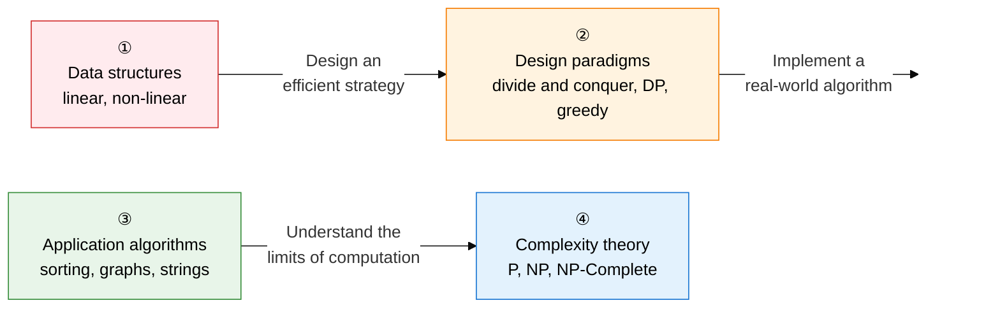

Algorithms and data structures form **"the core computer science competency of finding the best solution within given resources through optimal structures and strategies."**  
This section systematically covers quantitative analysis of time/space complexity, visual explanation of algorithm mechanisms, and comparative argumentation across design paradigms — not just coding ability.

## Learning Roadmap — a 4-stage flow

---

## ① Data Structures

> **"The logical and physical structures used to store and manage data efficiently."**  
> Array vs. linked-list memory comparison, hash collision resolution, AVL/Red-Black tree rebalancing, and priority-queue implementation with heaps are core exam topics.

| Order | Topic | Key terms | Importance |
|:---:|---|---|:---:|
| 1 | [Linear Data Structures](01-data-structures/linear-structures) | Array vs. linked list, stack (LIFO), queue (FIFO), circular queue, deque, hash table, collision resolution (chaining, open addressing) | ★★★ |
| 2 | [Non-linear Data Structures](01-data-structures/nonlinear-structures) | Binary tree traversal (preorder, inorder, postorder), BST skew limitations, AVL/Red-Black rebalancing, max/min heap, graph adjacency matrix vs. list | ★★★ |

**→ Key study points**: Memorize the **per-operation time-complexity table** for arrays (O(1) access, O(N) insertion) versus linked lists (O(N) access, O(1) insertion), and be able to draw the AVL tree's **4 rotation cases (LL, LR, RL, RR)**.

---

## ② Algorithm Design Paradigms

> **"Macro-level problem-solving strategy — the area with the highest exam frequency."**  
> Interpreting Big-O notation, computing the Master Theorem recurrence, comparing divide-and-conquer vs. DP, and the difference between DP Top-Down and Bottom-Up are essential to master.

| Order | Topic | Key terms | Importance |
|:---:|---|---|:---:|
| 3 | [Algorithm Complexity Analysis](02-design-paradigms/complexity-analysis) | Time/space complexity, Big-O/Ω/Θ asymptotic notation, Master Theorem (T(n)=aT(n/b)+f(n)) | ★★★ |
| 4 | [Divide and Conquer](02-design-paradigms/divide-conquer) | The 3 steps of divide, conquer, combine; merge sort O(N log N); quicksort's worst case O(N²) cause and fix; binary search | ★★★ |
| 5 | [Dynamic Programming](02-design-paradigms/dynamic-programming) | Optimal substructure, overlapping subproblems, Top-Down memoization vs. Bottom-Up tabulation, LCS, knapsack problem | ★★★ |
| 6 | [Greedy Algorithms and Backtracking](02-design-paradigms/greedy-backtracking) | Greedy-choice property, optimal substructure, Huffman coding, backtracking pruning, N-Queens | ★★☆ |

**→ Key study points**: Explain the **essential difference** between divide-and-conquer (independent subproblems) and DP (overlapping subproblems) using the Fibonacci example, and be able to describe quicksort's worst case (an already sorted array with the pivot as the first element) along with its fix (random pivot, median).

---

## ③ Application Algorithms

> **"A family of standardized algorithms applied to real-world problems."**  
> The full sorting-algorithm comparison table, the difference between Dijkstra and Bellman-Ford, comparing Kruskal's and Prim's MST, and the KMP Failure Function are heavily tested essay topics.

| Order | Topic | Key terms | Importance |
|:---:|---|---|:---:|
| 7 | [Sorting Algorithms](03-application-algorithms/sorting-algorithms) | Bubble, selection, insertion (O(N²)); quick, merge, heap (O(N log N)); counting, radix sort; stability comparison table | ★★★ |
| 8 | [Graph Traversal and Shortest Path](03-application-algorithms/graph-traversal-shortest) | DFS (stack, recursion) vs. BFS (queue), Dijkstra (no negative weights), Bellman-Ford (negative-cycle detection), Floyd-Warshall (DP all-pairs) | ★★★ |
| 9 | [Minimum Spanning Tree (MST)](03-application-algorithms/minimum-spanning-tree) | Kruskal (edge-centric, Union-Find), Prim (vertex-centric, priority queue), cut property, cycle property | ★★★ |
| 10 | [String Matching Algorithms](03-application-algorithms/string-matching) | KMP Failure Function preprocessing O(M+N), Rabin-Karp rolling hash O(N), comparison with naive O(MN) | ★★☆ |

**→ Key study points**: Memorize the **time complexity (best/average/worst), space complexity, and stability** comparison table for all 8 sorting algorithms, and explain the difference between Dijkstra (no negative weights, O((V+E)logV)) and Bellman-Ford (allows negative weights, O(VE)) along with their **applicable conditions**.

---

## ④ Computational Complexity Theory

> **"A theory that mathematically defines the limits of computer science."**  
> The P vs. NP definition and difference, the NP-Hard vs. NP-Complete relationship, the reduction concept, and NP-Complete examples such as TSP and graph coloring appear occasionally.

| Order | Topic | Key terms | Importance |
|:---:|---|---|:---:|
| 11 | [P vs. NP and Computational Complexity](04-complexity-theory/p-np-complexity) | P (solvable in polynomial time), NP (verifiable in polynomial time), NP-Hard/NP-Complete definitions, reduction, TSP, graph coloring, SAT | ★★☆ |

**→ Key study points**: Remember that P⊆NP is self-evidently true, but **whether P=NP remains unproven**, and be able to draw a Venn diagram showing the **containment relationship** between NP-Complete (both NP and NP-Hard) and NP-Hard (at least as hard as NP, may fall outside NP).

---

## Exam Strategy

| Exam pattern | Key response strategy |
|---|---|
| **Complexity analysis** | Present per-operation complexity in a Big-O table, and derive recursive-algorithm complexity with the Master Theorem |
| **Comparison questions** | Divide-and-conquer vs. DP, Dijkstra vs. Bellman-Ford, Kruskal vs. Prim, an 8-way sorting-algorithm comparison table |
| **Mechanism description** | A step-by-step array/tree change diagram + key pseudo-code + time-complexity proof |
| **Worst-case scenarios** | Conditions for quicksort's O(N²), skewed BST, worst-case O(N) hash collisions — describe cause and fix as a pair |
| **Algorithm selection** | Present the reasoning for choosing the optimal algorithm given the stated conditions (presence of negative weights, all-pairs vs. single source) |
